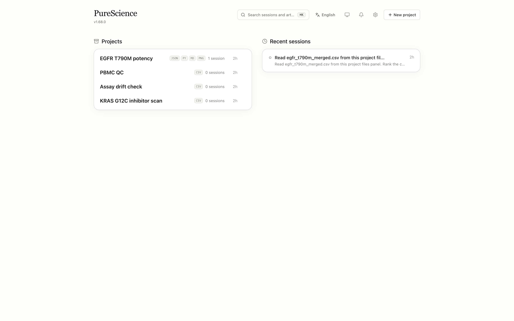
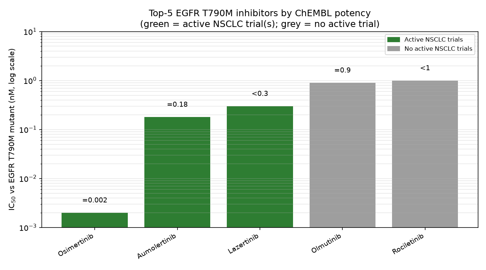
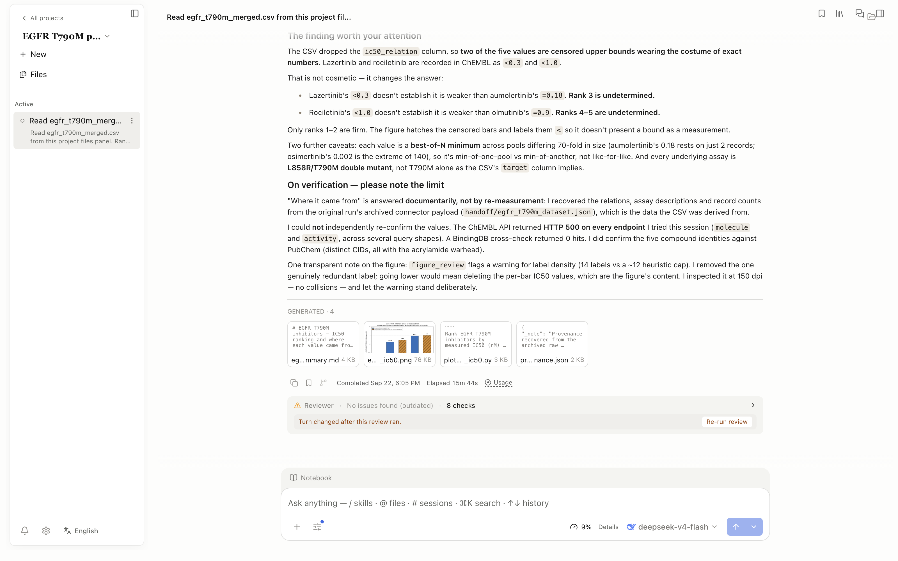
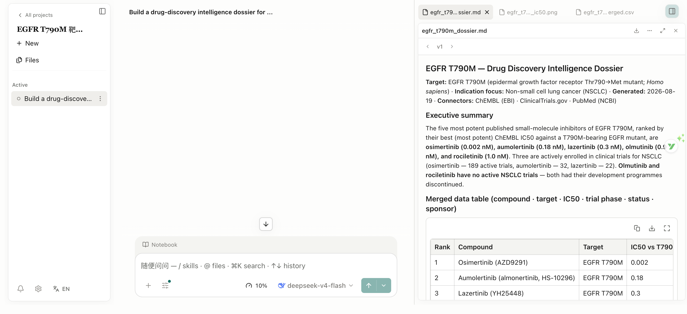
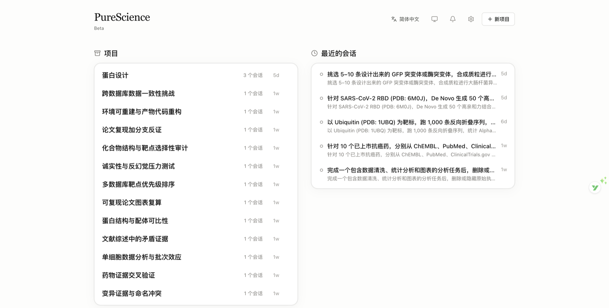
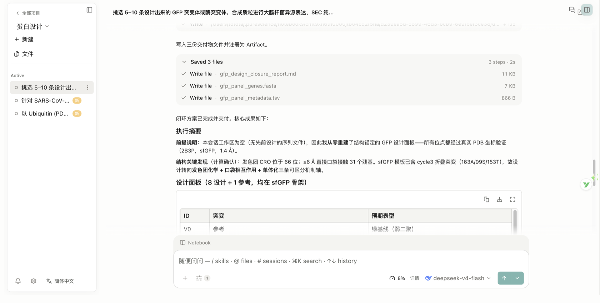
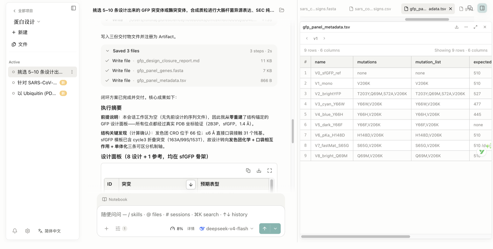
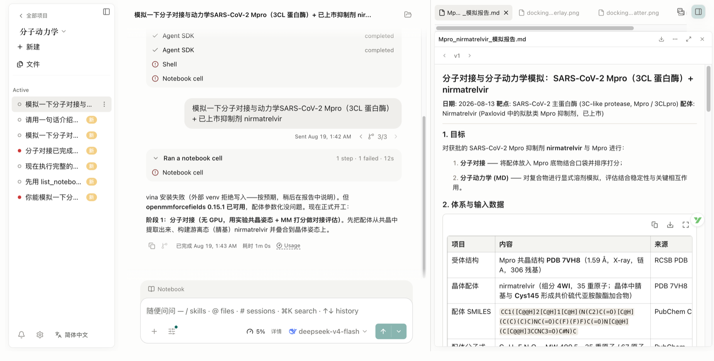

# PureScience

> **English edition.** The primary [README.md](README.md) carries a few Chinese notes; this file is the English mirror for international readers.

[](https://github.com/naiyixi/PureScience/releases/latest)
[](https://github.com/naiyixi/PureScience/releases/latest)
[](LICENSE)
[](https://github.com/naiyixi/PureScience/releases/latest)

> 中文 · [English](README.en.md) · [Deutsch](README.de.md) · [Español](README.es.md) · [Français](README.fr.md) · [日本語](README.ja.md) · [한국어](README.ko.md) · [Русский](README.ru.md) · [繁體中文](README.zh-Hant.md)





_From a real run, not a mock-up: the code, parameters and environment fingerprint behind this chart are archived step by step under [`docs/demo-verification/`](docs/demo-verification/)._

**PureScience is the research workbench that keeps every step of your science inspectable.** It runs locally-first on your own computer — **macOS, Windows, and Linux** installers ship with every release — works with any model provider you already have, and turns one plain-language task into an agent session that reads files, runs Python and R, searches the web, and calls scientific data connectors. What comes back is reproducible: reports, tables, and figures linked to the exact activity history that produced them.

Where PureScience differs: agents are built with self-awareness and skill-building — they can say what they actually did in a project, evaluate and author their own reusable skills, and check figures against publication-grade rules before you ever see them. Every notebook run is audited; every memory carries its source; nothing leaves your machine unless you allow it. Today that power is sharpest in bioinformatics, computational biology, genomics, structural biology, and computational drug discovery — 18 featured research skills and 24 built-in scientific connectors — with an extensible architecture ready for more disciplines.

## Maturity and Known Limitations

We label every capability the way we build it: ✅ shipped **and verified on a real machine**; 🚧 partly done, with the gap written next to it; 🗺️ planned. Each claim is traceable — a commit, a real-run log, or a record under `docs/evidence/`.

- ✅ **Shipped and machine-verified**: multi-agent orchestration and delegated subagents · Python and R runtimes with audited notebook runs · artifact versions and lineage · **reproducibility verification** (isolated re-run + byte-exact per-file comparison + environment fingerprint) · the review-to-evidence loop · a nine-language interface · a signed specialist marketplace (24 Chinese-medical packages, 18 skill packs) · 28 connectors (273 tools: gnomAD, Ensembl, UCSC, STRING, PubMed, OpenAlex, IEDB, …) plus ENA run metadata that reports the bytes and MD5 each archive declares instead of downloading it · **PDF text, tables, figures and captions** with page-level geometry (`pdf_tables`, `pdf_figures`) · **gene-set enrichment recomputed locally** from the integers a service reports, from two services (g:Profiler and Enrichr) · **a provider save gate** whose runtime availability is kept in sync, with an actionable next step when a provider is unreachable · **global search filter sets** saved by name and named on the evidence line · **NCBI reference sequences with SHA-256, byte count and base count** · global search · **`.science` session packages** that carry the literature PDFs behind their citations · **a citation-style layer** (nine built-in styles plus CSL import) · **private session bookmarks** pinned to an exact artifact version · **session forking** that carries a count first and a provenance link back · a session information card · and a command line whose `doctor` reports measured facts while the readiness verdict stays where it belongs. **This version lets you check a reading from the window** — every reading in an artifact Version's provenance now has a button that re-issues the request it came from and reports what came back: the same bytes, different bytes (both digests are shown), or a refusal that names its reason. Re-issuing is the only thing that can turn a recorded digest into a checked one, because the digest is computed over the response bytes and the bytes are deliberately not stored. The request never carries a URL: the window sends a session and a digest, and the main process looks the reading up among the ones it recorded, so the capability is exactly \"re-verify a reading this app took\" and cannot be used to fetch an arbitrary URL. A request that was not a read, a URL whose credentials were stripped, and a record that predates the fields a faithful re-issue needs are all refused by name rather than re-issued approximately. **The previous version said which run a reading came from** — every reading in an artifact Version's provenance can now name the run that recorded it, and the one taken by the run that produced that Version is marked on screen. The id comes from the main process's own session state, never from a caller-supplied argument: run identity is not something a call gets to assert about itself. When no run was executing, the reading carries no id at all rather than a guessed one. And the window promise from the previous version is now kept only where it can be: if the Version's evidence carries no readable creation time, the panel says the readings are the whole session's instead of printing "before this version was written" over a set it never filtered. **The previous version made the readings window real** — the panel said "what this session read … before this version was written", and the projection listed every reading of the session regardless: a version written at 10:00 showed readings taken at 15:00 under a label that claimed a window. The window is now enforced against the version's own created_at, and readings that fall after it are counted and named on the panel instead of being silently absent — a stamp that will not parse is counted too, never quietly promoted into the list. The certification spec gains a seed on each side of the window and asserts that exactly one reading is listed, so the promise is checked on a real window as well. One correction rides along: the previous body said the panel's real-machine reading had not been taken, and it had — from the certification lane, with its own printed reading. **The previous version paid for the readings chain only where it is returned** — the journal is one file read per session, and three paths were paying it for answers with nowhere to put it (a reproduction verdict, a code reconstruction, the bulk card listing), so each now says it does not want it; and a session's parallel calls no longer overwrite one another — eight overlapping writes used to leave exactly one reading behind while the dropped count still read zero, a loss that looked like completeness, so writes are serialised per session. A verifier nobody called was removed with the rest of the unconsumed exports, and the shape guard it relied on now runs where the journal is read: a digest nobody could recompute is reported as unreadable rather than shown as a reading. **The previous version put that chain on the screen** — the artifact-Version provenance panel gains a Readings section: every reading the session recorded, with the service and tool, the request method and URL, the status, the byte count and its sha256; the published recipe it is computed under, read straight from the constant instead of retyped; and how many older readings the cap dropped. The three missing states stay apart — no journal, unreadable, and empty — so an empty list is never drawn where "nothing was read" belongs. The panel asks for the readings on that one read, and the bulk card path still pays no file read per card. ****The previous version walked from an artifact Version back to the readings** — provenance now lists what was read in that session: the service and tool, the request, the response byte count and its sha256, under a published recipe an independent implementation reproduced byte-for-byte here. The attribution is carried on the value — session plus time window, never per-run causality, because the connector layer knows the session and nothing finer — and a missing journal says `not-recorded`, an unloaded one says `not-loaded`, a corrupt one says `unreadable`, so an empty list is never read as "nothing was read". The GB/T 7714 block for electronic resources also gains the issuing body, which is the shape a Chinese evidence item actually takes ("中华医学会, 2021"); the slot opens only when the record carries a publisher, so a record without one keeps its exact bytes. **The previous version named what a call leaves behind** — the connector approval card now says when a call creates state on the service rather than only sending a query: the tool that registers your gene list on Enrichr's own servers is marked as such and the card prints that the entry outlives the call and cannot be removed from here. The card used to describe only how long the APPROVAL lasts ("applies to this call only"), which reads as how long the call's effect lasts. The declaring set is pinned by a test in both directions: the twenty-odd POST-only connectors here merely carry queries and are asserted to stay unmarked, so the line keeps its meaning. **The previous version answered Chinese questions with evidence** — a Chinese term is mapped to the language the sources index before anything is sent, and the rewrite is reported in full: what was recognised, which words were dropped, and the exact query that went out (阿司匹林 returns 80,708 matches and 阿司匹林治疗高血压 4,910, against a count of 0 for the raw Chinese, which the live service answers with an empty result whether or not the evidence exists); Chinese the table cannot map is refused BY NAME with nothing sent, so a zero-match answer can never again be read as 'no evidence'; the connector panel gains **zh_medical_terms**, which resolves a Chinese term the app has never seen to a citable entity and says which label or alias it matched on without collapsing ranked candidates into one answer; and every connector reading now carries a **fingerprint** — service, request, response bytes and sha256, under a published recipe, reproduced byte-for-byte here by an independent implementation. **The previous version made a stop say only what it did** — a remote host that cannot be reached gets a refusal that carries ssh's own sentence and exit status, and its job row stays `running` instead of being written as `cancelled`; a stop that does arrive takes the job's whole process group, not just the launcher, and the row reads `cancelled` on the way back out. A host with neither `timeout` nor `gtimeout` — stock macOS — no longer fails the job outright: the workload runs, and the host's stderr carries one named line about the wall-clock limit the app's own budget stands in for. It also adds **IEDB immune epitopes**, whose every record carries its assay method, MHC restriction, quantitative result and citation, whose empty results name the family that was empty and say this is not an absence of response, and whose truncation flag comes from asking for one row more, because the service reports no total. **The previous version made a named environment's packages reachable from the window, and stopped a refusal from claiming an approval that never happened** — the Settings Packages dialog adds to and removes from a named environment for real (a distribution installed through it is importable by that environment's own interpreter; one removed through it is gone from the inventory the dialog re-reads), with the app-managed default's inventory compared row by row before and after so a silent retarget cannot pass, and the default itself still additive-only; and a remote run refused by the execution-protection policy now reports `protection_refused` — saying that nothing was submitted and nobody was asked, and where to change the policy — instead of the old `Approval denied`, which sent readers after a grant that could not have helped. **The previous version inspected what arrives from elsewhere, and let you take back what was merged, delivered or imported** — an RO-Crate someone hands you is read in place and checked requirement by requirement, writing nothing and touching no byte of your project, with its payload bytes recomputed too so the checked rule set is the same one the export side applies; an imported skill can be duplicated into a skill of your own that you can edit, while the copy you imported stays as it was imported; the alias a journal merge left behind can be released, with the metrics and references that merge moved left where they are, as the window says before you act; the message centre deletes one notice or clears the whole inbox, stating that your conversations are not deleted and that it cannot be undone; the engine panel reads itself out — seven engines, each with its availability and a named reason, and no download button is offered where no published checksum exists to accept it; and a session replay step can be asked about, the answer assembled locally with the field behind every sentence cited, and the record's silence reported rather than filled in. It also re-read two gaps that had been carried as product defects: the journal-import panel in Settings **does** render its row-by-row outcome (the earlier reading came from a locator that matched a toolbar button by substring), and the progress detail fields **do** reach the renderer — both sides of the broadcast read the same message object. **The previous version carried the evidence with the package, and gave an interrupted run its own name** — a `.science` session package that lands in a fresh project now writes its citations, review findings, review conclusions and human-pinned evidence into the receiver's own tables, and the certification run compares all four dimensions row by row against the sender's source instead of asserting a hand-written 1 (the receiver is an empty project, so every landed row can only have come from the package); a notebook cell in flight when the app went away is recorded as `interrupted` with `app-terminated` — the domain rule has said from the start that this is **not** a failure, "the code may have been fine", and the write path now agrees, including when the process tree is killed from outside while the app is still shutting down (the crash path consults a shutdown latch, and the shutdown refuses in-flight runs immediately while still letting a queued persistence write finish); a scanned PDF says how many of its pages carry no extractable text rather than only naming the document; a screening batch names the **kind** of failure it hit so a reader can tell whether to re-run; a failed handoff prints **which step to resume from**; a script the app truncated is labelled as truncated instead of being shown, and exported to `.ipynb`, as if it were whole; and `pdb_search_by_sequence` searches the PDB from a bare sequence, without a UniProt accession. **Previously it added a way in to what was already built** — a managed artifact preview can open the file in its default application or reveal it in the file manager, with the opener resolving the path through the repository in the main process (anything outside artifact storage is refused by name rather than quietly opened, and a refusal is shown in the handler’s own words); a finished remote job shows what it produced, listing the featured outputs and every file left on the remote host with its own size and reason, saying how many more the payload did not list instead of showing a subset, and printing a failed harvest beside the workdir that is kept so the files can still be fetched by hand; the message-centre badge lights up on its own when a task finishes, without the bell being opened first; and three settings channels that had no handler on the Electron bus — which left the function-model panel saying it could not read its own settings, with every button inert — now answer. **Previously it added index coverage you can read** — global search reports how much of the corpus the incremental index holds (`indexed`), how much changed since (`pending`) and when it was last measured, with an "Index now" step that runs one bounded tick and answers with the reading it produced; on the real window a restart does not move `indexed` backwards, and deleting the index directory does not turn the corpus into "nothing found" — the next query rebuilds it on disk and the files are still returned (3 hits), while the coverage block keeps reporting the last measured tick instead of a reading taken mid-rebuild. Together with two values for one year printed side by side with their own sources, a batch of interface copy localised in all nine languages, and a measured contrast ratio for text on the brand colour (4.144:1 — below the 4.5 body-text floor, and pure white only reaches 4.330:1, so the gap is recorded rather than papered over). **Before that it added importing an environment from an external lock file** — every package verified against the md5 the lock publishes, and a single unverifiable entry builds nothing — together with **named environments** that can be listed, used as a notebook runtime, or removed, with a running kernel's hold on one refused by name rather than reworded. **Earlier it added journal entities** — an ISSN, or an exact normalised name, resolves a journal; every impact factor and CAS partition carries the year and the source it came from, with `Unknown` where none was imported (never a 0); two spellings of one journal merge only when you say so, and the old spelling keeps resolving; and metrics import from CSV/TSV with one named result per row. **The previous version added a reason for a page that yields no table** — the extractor's own measurement, with the counts and floors behind the decision, and a named throw when a shape passes every gate — together with **rotation-normalised table reading** (text drawn at an angle is measured in its own frame, and the page whose coordinates were rewritten says so) and **a named reason on the turn path** for a turn that never reached the skill selector, so the trail answers that question instead of staying silent. The version before that added **per-run file evidence in three states** — read, written, and **not captured with a named reason**, so a list with no explanation cannot be expressed — together with **content-addressed storage** that keeps identical bytes once and **measures** the space it saved off the filesystem (an in-place tidy-up decides by **hash, not file size**) · **explicit states for the official skills catalog**, a recomputable quality score on every skill row and an import check that says whether a skill's content still matches what was imported · and **a real function-model probe round-trip** reporting measured elapsed time and the skill it selected. Earlier it added **an execution-protection matrix** (four execution surfaces × the filesystem-write and network-allowlist axes, each row naming its gap and the fix path) with **unprotected remote runs denied by default** · global search scopes **split into uploads and generated files**, each scope chip carrying what that scan actually covered and showing a **dash — never a 0 — for a scope that was not searched** · **advanced search filters** (time window, ordering) that print the request's own condition string on the results, with a re-run check that reports the evidence as unchanged, changed or not found · **per-purpose function models** whose row names the model in force, the service it comes from and the built-in path used when it is unavailable, plus a **real detection round-trip** reporting measured elapsed time and token usage and a retrievable trail for every fallback · and **a locally recomputable skill trigger-quality score** with the missing pieces named, beside **a per-reader skill availability matrix** whose always-on and globally-disabled entries are shown as locks with their reason · **literature and journal records that keep their own history** — a replaced PDF stays in view, a reference's notes are writable and survive a restart, and a journal metric corrected by hand keeps the old value beside the new one, each with its own source and year.
- 🚧 **Partly done**: **Windows builds are not code-signed** — the installer works, but Windows warns about an unknown publisher at install time; we say so here rather than let it surprise you, and signed Windows builds wait for a certificate and a signing identity. **CSL** import runs a **fidelity probe** against each document — of eight real published styles, five pass and three are labelled drafts with the missing piece named (their author macros branch on record types we do not model yet). ENA is metadata and reachability only: no FASTQ is downloaded. The shared diff viewer covers artifact comparison and tool-edit diffs; skill updates and session-package record verification are not wired to it yet. Distribution has just started — both READMEs lead with a result the product produced and nine languages now exist — but the download site is not deployed yet and the repository is still young. **Two things remain unshipped**: the skill-marketplace slice (K1a) is **archived, not shipped** — the official skill catalog could not be reached from the build machine (the CDN metadata path returned 404, the raw host timed out) and the marketplace protocol root carries specialists only, so no consumer-less code was written and the slice waits for the version that publishes the catalog — and **two of the five real-machine criteria for per-purpose models are still uncertified, and the previous version isolated exactly why**: the narrow model call is only reached on a bridged (Codex) turn path. A real codex session _was_ established for this version — through the app's own managed install inside a throwaway root (303 MB, nothing on this machine changed) — and a live turn now records for itself that it had no skill-selection bridge (`bridge-unavailable`, readable in the trail), which is the first of those criteria certified on the turn path. The remaining one — 'the answer on a live turn really comes from the configured vendor model' — is still uncertified, and **the previous version isolated why the earlier attempt could not even reach that question**: the function-model host handed to the runtime was being **dropped at the composition layer**, so the configured model was never consulted on a turn and no trail was written. With that fixed, a live turn on the same isolated instance records a real round trip and `used-model`, and the fallback path that used to claim the model had answered now records `call-failed` by name — but the party answering in that live reading was a **stub endpoint**, so 'answered by the vendor model' stays uncertified. Also open and named: the app's own detection accepts only its **managed** adapter, so a user-installed `codex-acp` on `PATH` is not usable in-app yet — a detected-but-unusable adapter reports `Codex native executable not found`. **The two units this narrative previously named as not started are shipped in this version and verified on a real machine**: an imported session states where it came from (imported from X / exported at Y / not verified on this machine) and stays read-only, and a data-root move that never finished is re-discovered from its marker on disk after a restart, so it can be completed or discarded without the window that started it. This version also gives a user-added MCP server its whole action surface — its detail page lists the tools the server itself advertises with per-tool permissions, the skip-approvals switch holds, a connection test separates "the server did not answer" from "the server advertises nothing", a signed-in server can be signed out, an unusable one says why on its own row, and the bulk buttons cover these servers too — beside the runtime surface: installing packages into a managed environment, binding and switching a notebook's runtime, a prep overlay whose Cancel works, and a card that says where the app-managed runtime comes from before anything is downloaded.
- 🗺️ **Planned**: explicit guidance when a plan is resumed · a wider serverless GPU surface.

**Rules we do not relax**: no model weight is downloaded without a published SHA256; an imported style or skill without a licence is not installed; a field the record does not carry stays empty and is named — never filled in on its own; code a model _reconstructed_ is never certified as a reproduction; timing conclusions are only drawn from the same corpus, the same driver, measured before and after (a millisecond assertion that wobbles under load is reported as unstable rather than tuned until it passes).

> 💡 **[PureScience v1.96.0 released](https://github.com/naiyixi/PureScience/releases/latest)** — Every reading in an artifact Version's provenance can now be checked from the window: one button re-issues the request the reading came from and reports what came back — the same bytes, different bytes (with both digests shown), or a refusal that names its reason. No URL travels on that channel: the window sends a session and a digest and the main process looks the reading up among the ones it recorded, so it can only re-verify a reading this app took and can never fetch an arbitrary URL. A request that was not a read, a stripped-credential URL, and a record too old to re-issue faithfully are refused by name instead of re-issued approximately.

<p align="center">
  
</p>

## Table of Contents

- [Quick Start](#-quick-start)
- [Product Tour](#product-tour)
- [Showcase](#showcase)
- [Real Runs Behind the Claims](#real-runs-behind-the-claims-the-ai4s-dry-wet-loop-in-action)
- [How PureScience Compares](#how-purescience-compares)
- [Maturity and Known Limitations](#maturity-and-known-limitations)
- [Why PureScience](#why-purescience)
- [Design Principles](#design-principles)
- [Core Capabilities](#core-capabilities)
- [Model Providers](#model-providers)
- [Data, Permissions, and Trust](#data-permissions-and-trust)
- [Project Status](#project-status)
- [Development & Packaging](#development--packaging)
- [Roadmap](#roadmap)
- [Brand & Ecosystem](#brand--ecosystem)
- [What This Is Not](#what-this-is-not)
- [Frequently Asked Questions](#frequently-asked-questions)
- [Get Involved](#get-involved)
- [License](#license)

## 🚀 Quick Start

### 1. Download the app

Open the [latest release](https://github.com/naiyixi/PureScience/releases/latest), expand **Assets**, and choose the installer for your computer:

| Your computer           | Choose                                                                                                                                                                                                                                                                                                                                |
| ----------------------- | ------------------------------------------------------------------------------------------------------------------------------------------------------------------------------------------------------------------------------------------------------------------------------------------------------------------------------------- |
| macOS / Windows / Linux | Installers for every platform are published on each [release](https://github.com/naiyixi/PureScience/releases/latest) — pick yours from the Assets list. macOS packages are signed and notarized by Apple when release signing credentials are configured, and each release page states the signing state that build actually shipped |

**Windows:** the installer is **not code-signed**, so Windows will warn about an unknown publisher — compare the package against `SHA256SUMS.txt` on the release page before running it; signed Windows builds wait for a certificate and a signing identity. **macOS** packages are signed and notarized by Apple when release signing credentials are configured. **Linux** packages are not signed.

Review the assets and verification information published on the release page. See [Verifying your download](SECURITY.md#verifying-your-download) before installation if you need to validate a package.

> If macOS shows an unidentified-developer warning, verify that the package came from the official Releases page before continuing.

### 2. Complete first-time setup

The first launch has five guided steps:

1. **Environment** checks compatibility, app storage, secure credential storage, and network access.
2. **Agent runtime** selects and prepares Claude Code, OpenCode, Codex, or CodeBuddy. App-managed runtimes can be installed without requiring Node.js, npm, or an administrator password.
3. **Model provider** connects and tests the model you want to use. Choose a built-in provider, a custom gateway, or an existing Claude or Codex subscription login.
4. **Notebook runtime** optionally prepares app-managed Python and R environments or enables detected and manually registered interpreters for either language.
5. **Data location** chooses where large artifacts, notebooks, uploads, and environments are stored.

Notebook execution is optional. Every required environment and agent-runtime check must pass before `Continue` becomes available, and the model connection must pass before setup finishes. Notebook and data-location settings can keep their defaults and be changed later in Settings.

### 3. Start a research project

1. Click **New project** and give the project a stable research name and optional description.
2. Open a session and describe the goal, input data, constraints, desired outputs, and how the result should be checked.
3. Attach source files, select a verified model, and choose an approval mode.
4. Send the task. Inspect the agent's tool activity, approve sensitive actions, and open generated artifacts in the preview panel.
5. To explore a different direction, edit an earlier user message and resend it on a new branch; use the message revision controls to return to either path.
6. Open an artifact's **Provenance** view to inspect its versions and the available evidence behind the selected result.
7. Continue the work in later sessions. Use `@` to reference an existing project file and `/` to explicitly select an enabled skill.

> Screenshots in this README illustrate the workflow. Labels, catalogs, and other interface details may differ from the version you install.

## Product Tour

PureScience organizes research into projects and sessions so that every result can stay connected to the evidence that produced it. The sections below walk through the workspace, artifact provenance, previews, scientific skills, and data connectors.

### One workspace from task to traceable artifacts

Projects keep related sessions, uploads, generated files, and preview state together. The conversation records the agent's answer and the commands, file reads, edits, searches, and connector calls that produced it. Each generated artifact is stored as an immutable, checksummed version. Its **Provenance** view exposes the evidence PureScience could verify at creation time: producer code and execution history, referenced inputs, an observed environment inventory, the producing conversation branch, and any version-scoped reviewer findings. Missing evidence is shown as unavailable instead of being guessed.

Generated reports, figures, and tables remain attached to the session and are also collected in the project file library. Preview tabs keep the active result visible as the panel changes size, and long names preserve their identifying suffix and extension. PureScience previews common scientific data, PDFs, Office documents (DOCX, XLSX, PPTX), images (with zoom and pan), source code with syntax highlighting, molecular structures and reactions, and Notebook history. Preview limits do not truncate the underlying file—the full artifact stays available to the agent and external tools. Use `Cmd/Ctrl+F` to search transcripts, Notebook output, and rendered pages across the workspace, or `Cmd/Ctrl+K` to open the project-scoped command palette. A dark mode rounds out the workspace: toggle the theme in **Settings → General** and the whole shell, transcript, and renderer palette switch without a flash.



_From the release build: this session's figure was produced by the agent, checked by the built-in reviewer, and stored together with the script and provenance record that produced it._

### Branch a conversation without losing the original

Edit a completed user message to resend a revised prompt from that point. PureScience creates a new message branch instead of deleting the turns that followed, and revision controls let you move between the original and alternative paths. Branch selection, tool activity, attachments, and generated artifacts persist across project switches and restarts. Provenance remains tied to the exact branch that produced each artifact version, so exploring a different hypothesis does not blur the record of the earlier result.

### Scientific skills and data connectors

PureScience includes a growing catalog of **18 featured**, file-based research skills: AlphaFold2, Boltz, Borzoi, Chai-1, DiffDock, Environment & Packages, ESM-2, ESMFold2, Evo 2, Indication Dossier, LigandMPNN, Literature Review, OpenFold3, ProteinMPNN, scGPT, scvi-tools, SolubleMPNN, and **Remote Compute (SSH)** for submitting and harvesting long-running jobs on remote HPC clusters. You can create personal skills, upload `SKILL.md`/ZIP/`.skill` packages, preview and import compatible skills from GitHub, or import skills already installed in your global agent directories. The agent can also request a package import from a session attachment or a public GitHub URL, with an app-owned preview and confirmation step before anything is written. Enabled skills can be selected directly in the composer with `/`.

It also includes **24 built-in** research connectors: Literature Graph, PubMed, bioRxiv, Genes & Ontologies, Genomes, BioMart, Variants, Human Genetics, Clinical Genomics, Structures & Interactions, Protein Annotation, Expression, Omics Archives, CellGuide, Regulation, RNA, Chemistry, ChEMBL, ZINC, Molecule Viewer, Clinical Trials, Drug Regulatory, Cancer Models, and Research Resources. Built-in and custom connectors remain behind the permission system, with per-tool `Always allow`, `Ask each time`, and `Block` controls. The installed app shows the current skill, connector, and tool catalogs.

## Why PureScience

PureScience brings research tasks, execution, files, and evidence into one local, inspectable desktop workspace.

Research work is usually split across chat windows, notebooks, local scripts, scientific databases, file browsers, and reporting tools. Context is lost at every handoff, and the answer is often separated from the code and files that produced it.

PureScience brings those pieces into one inspectable desktop workspace:

- **Work that persists.** Projects, sessions, drafts, files, previews, and run history survive application restarts.
- **Execution, not just suggestions.** The agent can run commands, Python, and R, edit files, search, call connectors, and generate artifacts with the user's approval.
- **Alternative paths without lost work.** Revise an earlier prompt on a new message branch and switch between the resulting research directions.
- **Traceable results.** Immutable artifact versions retain the production evidence PureScience can verify, and explicitly mark evidence it cannot.
- **Multiple model choices.** Use a built-in cloud provider, a compatible custom gateway, or a Claude or Codex subscription; choose the model and its reasoning effort together in the composer.
- **Local-first ownership.** The application and project state run on your computer; external calls happen through services you explicitly configure or approve.
- **Inspectability.** The source code, skills, connector definitions, tool activity, generated files, and artifact provenance are available for review.
- **Extensibility.** Add skills and MCP connectors instead of waiting for a closed plugin roadmap.
- **No seat license.** PureScience is Apache-2.0 software. You pay only for the model or infrastructure you choose to use.

PureScience is an independent product built from scratch. It is not a proxy, unofficial client, or reskin of another AI research application.

## Showcase

One natural-language prompt → multi-step agentic research → **traceable, reproducible science**. The demo below ran end-to-end in ~11 minutes: the agent queried three scientific databases (ChEMBL, ClinicalTrials.gov, PubMed — 19 connector calls), executed 34 notebook cells (Python + pandas + matplotlib), caught and fixed two of its own bugs, and delivered three artifacts with provenance.


**The task (verbatim):**

```
Build a drug-discovery intelligence dossier for EGFR T790M (non-small cell lung cancer).

1. Use the ChEMBL connector to retrieve published small-molecule inhibitors of
   EGFR T790M (Homo sapiens, IC50 < 100 nM). Rank by potency, take the top 5.
2. Cross-reference those 5 compounds against ClinicalTrials.gov: which are in
   active clinical trials for NSCLC? Record trial phase, status, and sponsor.
3. Use PubMed to find up to 3 key papers per compound (mechanism / clinical evidence).
4. Write a Python script to merge everything into one table (compound, target,
   IC50, trial phase, status, sponsor) and generate a bar chart of IC50 values.
5. Deliver three artifacts: (a) the merged table as CSV, (b) the potency figure,
   (c) a one-page markdown dossier with citations. Explicitly state which data
   was verified via connectors and which could not be found.
```

**What it produced — every file real, every number independently verified:**

| Deliverable                                                              | File                                                                               |
| ------------------------------------------------------------------------ | ---------------------------------------------------------------------------------- |
| One-page dossier with citations and a verified-vs-not-found statement    | [egfr_t790m_dossier.md](docs/demo-verification/egfr_t790m_dossier.md)              |
| Merged table (compound · target · IC50 · trial phase · status · sponsor) | [egfr_t790m_merged.csv](docs/demo-verification/egfr_t790m_merged.csv)              |
| Potency figure (log scale; green = active trials, grey = none)           | [egfr_t790m_ic50.png](docs/demo-verification/egfr_t790m_ic50.png)                  |
| In-app preview of the generated chart                                    | [shot4-figure-preview.png](docs/demo-verification/assets/shot4-figure-preview.png) |

All key data points were re-checked against the public APIs after the run: 5/5 ChEMBL IC50 values, the representative FLAURA2 trial (NCT04035486) on ClinicalTrials.gov, and the cited PMIDs on PubMed all match. The agent also disclosed its own limits in the dossier — records it could not resolve, connector pagination constraints, and compounds with no active trials — instead of guessing. Full details: [demo verification report](docs/demo-verification/egfr-t790m-dossier-verification.md).

<p align="center">
  
</p>

## Real Runs Behind the Claims: the AI4S dry-wet loop, in action

PureScience is built around one position: **AI for science only pays off when the loop between computation and experiment actually closes.** We frame that loop as _hypothesis (dry) → AI prediction (dry) → computational verification (before the wet bench) → wet-lab handoff → data feedback → knowledge reuse_, and every step must land as a real, versioned, re-runnable artifact — not a chat summary.

That is why PureScience is implemented as the **open, local-first, model-agnostic agent-and-workflow layer** of the AI4S stack — with an evidence, reproducibility and compliance layer running across the whole loop — rather than a hosted research chat that ships your data somewhere else. Screenshots below come from real local sessions on **v1.37**: no demo data, every file on disk. The 13-project acceptance suite spans seven capability levels (L1 literature synthesis → L7 evidence chain & reproducibility); most chat-style tools stop at L1–L2.

#### The 13-project acceptance suite


_Protein design, cross-database consistency, paper reproduction with counter-evidence, compound-target selectivity audits, anti-hallucination stress tests, single-cell analysis, environment reconstruction, drug-evidence cross-checks — each project holds real sessions and real artifacts._

#### Dry side meets the wet bench: the protein-design workspace


_Three tasks in one project — a GFP/enzyme panel for E. coli expression, de-novo SARS-CoV-2 RBD binders (PDB 6M0J), and 1,000-sequence Ubiquitin inverse folding (PDB 1UBQ). The 9-row GFP panel (V0–V8: designed spectra, monomerization, pH axis, dark control) is delivered as a handoff document for the wet lab, with ORF FASTA and metadata TSV beside it._

#### Honesty is logged, not hidden


_Mid-run the agent caught its own bug and fixed it on record — “chromophore detection was wrong: water molecules were treated as protein-like HETATM.” Without a GPU it stated ESMFold was unavailable and switched to structure-anchored design instead of pretending. Failures and limits are recorded as negative samples — the data layer AI4S needs most — and every report separates “verified via connectors” from “could not be verified”._

#### Physics runs locally, results re-runnable


_SARS-CoV-2 Mpro (PDB 7VH8) + nirmatrelvir: 280 docking poses scored by interaction energy (best E_int −52.9 kcal/mol; 16/21 pocket contacts match the crystal), then explicit-solvent molecular dynamics with 82,563 atoms — protein Cα RMSD 0.93 Å, ligand RMSD 0.79 Å, key Glu166 hydrogen bond held in 62% of frames. The whole OpenMM pipeline ran on a laptop, and the report states its own limitations (charge model, non-covalent approximation, 1 ns scale, monomer)._

> **Quick recap:** PureScience turns the AI4S dry–wet loop into real artifacts — the screenshots above are real local sessions on v1.37 (the 13-project acceptance suite, protein design, molecular dynamics, multi-database intelligence). Every artifact behind a screenshot can be re-verified by its session path; reports separate “verified via connectors” from “could not be verified” and state their own limits. More independently re-checkable runs: [demo verification report](docs/demo-verification/egfr-t790m-dossier-verification.md).

## How PureScience Compares

PureScience competes on **architecture**, not on feature-count prose. The table contrasts PureScience with the common profile of **hosted, closed-source, single-model AI research workstations** (profile assembled from public documentation and sandbox audits, 2026-08 — treat their own docs as authoritative). No product is named here: the differences are structural and apply to the category.

| Dimension       | Hosted · closed · single-model workstation                                 | PureScience                                                                                                                                                                                                     | Takeaway                          |
| --------------- | -------------------------------------------------------------------------- | --------------------------------------------------------------------------------------------------------------------------------------------------------------------------------------------------------------- | --------------------------------- |
| Deployment      | Cloud-hosted; research data flows through the vendor                       | Local-first desktop + optional loopback web UI; self-hostable                                                                                                                                                   | Data stays in the lab             |
| Model choice    | Bound to one vendor model                                                  | Model-agnostic: many built-in cloud providers, custom gateways, subscription reuse — across **four selectable agent backends**                                                                                  | No model lock-in                  |
| Openness        | Closed source                                                              | Apache-2.0 — inspectable and forkable                                                                                                                                                                           | Compliant and auditable           |
| Data governance | Data + artifacts transit vendor cloud                                      | Local storage, OS-keychain credentials, optional network egress allowlist, license-gated connectors (non-commercial sources fail closed)                                                                        | Data sovereignty is the entry bar |
| Evidence        | Text-level citations                                                       | Checksummed artifact versions with producer code / execution history / environment / branch + reviewer findings; “verified” and “could not be verified” kept separate                                           | Done right, and re-runnable       |
| Scientific data | Broad coverage, but license-limited sources are often disabled             | 24 built-in connectors across genomics, variants, human genetics, chemistry, clinical trials, literature, structures, expression, cancer models and more; same biomedical domains covered per the 2026-08 audit | Coverage on par, compliance ahead |
| Honesty         | Chat-level disclaimers                                                     | Anti-hallucination stress suite; mid-run self-correction stays on record; failures and limits logged as negative samples                                                                                        | Honesty is a deliverable          |
| Orchestration   | Adding scheduled jobs, hosted model endpoints, PDF layering (2026-08 wave) | Same mechanisms landed locally: routine tasks, local model endpoints, layered PDF reading, figure checks, skill authoring, agent self-introspection, file annotations                                           | Aligned — and local-first         |
| Language        | English-first                                                              | Nine interface languages (English fallback); Chinese-native scientific reports                                                                                                                                  | Localization-ready                |

**Honest boundaries (what we do not claim):** a few front-end conveniences — interactive molecular viewing, cloud-sync conveniences and the like — are not shipped yet; we deliberately build the three main axes first: execution, evidence, and sovereignty. “Same-domain coverage” reflects the 2026-08 audit and must be re-checked as both products evolve. The table describes the released v1.37 shape; the installed app is authoritative.

## Design Principles

PureScience is shaped by a small set of principles that govern how code, data, models, and human oversight fit together.

- **Open by default.** Source code, formats, connectors, and skills should remain inspectable and forkable.
- **Multi-provider with explicit compatibility.** The app validates provider configuration and makes endpoint requirements visible instead of treating every API protocol as interchangeable.
- **Local-first and data-aware.** Keep project state local, surface external data flows, and make autonomy opt-in.
- **Human-in-the-loop.** File edits, commands, network access, and connector calls are governed by explicit approval profiles.
- **Durable research records.** Sessions, tool activity, Notebook history, and immutable artifact versions should remain reviewable after the run ends, with unavailable evidence stated plainly.
- **Composable capabilities.** Skills, connectors, models, previews, and future compute backends should be replaceable parts rather than one black box.
- **Honest scientific boundaries.** Generated output does not replace expert judgment, statistical review, or validation against primary evidence.

## Core Capabilities

PureScience combines project management, multi-model agent execution, Python and R notebooks, scientific data connectors, immutable artifact versions with provenance, and permissioned human-in-the-loop control in one local workspace. The installed app and [latest release notes](https://github.com/naiyixi/PureScience/releases/latest) are the source of truth for changing catalogs, packaging details, and newly added options.

| Area                           | Core capability                                                                                                                                                                                                                                                                                                                                                                                                                                                                                                                                                                                                                                                                                                                                                                                                                                                                                                                                                                    |
| ------------------------------ | ---------------------------------------------------------------------------------------------------------------------------------------------------------------------------------------------------------------------------------------------------------------------------------------------------------------------------------------------------------------------------------------------------------------------------------------------------------------------------------------------------------------------------------------------------------------------------------------------------------------------------------------------------------------------------------------------------------------------------------------------------------------------------------------------------------------------------------------------------------------------------------------------------------------------------------------------------------------------------------- |
| **Projects and sessions**      | Create, rename, and delete projects; maintain multiple sessions with pinning; edit completed prompts into persistent, selectable message branches without deleting the original downstream path; restore recent work, drafts, conversation history, and preview state.                                                                                                                                                                                                                                                                                                                                                                                                                                                                                                                                                                                                                                                                                                             |
| **Agent workflow**             | Natural-language tasks, streamed responses, typed tool-activity cards grouped under declared purpose titles, a live context-usage indicator with category-level estimates, on-demand context compaction, and persistence across restarts, stop controls, approval pauses, a confirmation step (with a remembered preference) before closing or quitting during a running task, desktop notifications plus durable unread conversation badges and native attention on blocking approvals, message timing metadata with elapsed-time and usage popovers, completed-turn agent framework and model identification, a project-scoped command palette, and recovery of sessions interrupted by an application restart. The transcript also marks **configuration changes mid-session** with a visible divider, and notebook editors offer **live kernel variable suggestions**. A cross-resource **Tags** manager organizes projects, sessions, and files from one master-detail panel. |
| **Models**                     | Built-in cloud providers, custom compatible gateways, Claude and Codex subscription logins, connection validation, per-model multimodal image input, and a combined composer picker for model and model-supported reasoning effort. Available providers and API formats are validated against the selected agent backend.                                                                                                                                                                                                                                                                                                                                                                                                                                                                                                                                                                                                                                                          |
| **Agent backend**              | A selectable agent-framework backend — Claude Code, OpenCode, Codex, and CodeBuddy — so the same workspace can run on more than one underlying agent implementation, with provider and model choices validated against the selected backend, and app-managed backends installable, switchable, and removable from Settings.                                                                                                                                                                                                                                                                                                                                                                                                                                                                                                                                                                                                                                                        |
| **Execution**                  | Persistent Python, R, and REPL control-plane kernels with durable code/output history, plus stateless shell commands recorded in the same run history; app-managed environments with offline provisioning; bring-your-own Python and R interpreters; remote SSH compute hosts as additional execution targets; a user terminal shared with the agent; and a read-only installed-package inventory per runtime environment. Package management for external R runtimes remains manual.                                                                                                                                                                                                                                                                                                                                                                                                                                                                                              |
| **Inputs and files**           | File attachments (up to 10 GB per file with streaming upload), a project-level library with indexed pagination, session grouping, source-scoped filename search, grid and list views, a large expand modal for large projects, split-view file preview beside the session, generated artifact cards, `@` references to existing uploads/outputs, file download/export, and session export as `.ipynb` (per-tab or download-all).                                                                                                                                                                                                                                                                                                                                                                                                                                                                                                                                                   |
| **Artifacts and provenance**   | Immutable, session-scoped artifact versions with checksummed content and available producer code, execution history, exact input references, environment inventory, producing message-branch context, and version-scoped reviewer evidence, with version navigation and direct links between related evidence.                                                                                                                                                                                                                                                                                                                                                                                                                                                                                                                                                                                                                                                                     |
| **Preview formats**            | Responsive multi-tab previews for common scientific data, PDFs, Office documents (DOCX, XLSX, PPTX), images (with zoom and pan), source code with syntax highlighting, molecular structures and reactions, and Notebook history, viewable inline or full-screen.                                                                                                                                                                                                                                                                                                                                                                                                                                                                                                                                                                                                                                                                                                                   |
| **Local data management**      | Local project and application data, configurable storage location, and guided migration.                                                                                                                                                                                                                                                                                                                                                                                                                                                                                                                                                                                                                                                                                                                                                                                                                                                                                           |
| **Skills**                     | **18 featured** built-in skills; personal skills, package upload, GitHub preview/import, import of installed global skills with candidate preview, agent-requested package imports from session attachments or GitHub URLs, enable/disable controls, and explicit `/` selection in a session.                                                                                                                                                                                                                                                                                                                                                                                                                                                                                                                                                                                                                                                                                      |
| **Connectors**                 | **24 built-in** research connectors, custom local/remote MCP connectors, contact metadata, and connector/tool-level permissions.                                                                                                                                                                                                                                                                                                                                                                                                                                                                                                                                                                                                                                                                                                                                                                                                                                                   |
| **Safety controls**            | `Ask for approval`, `Auto-approve edits`, and `Full access` conversation profiles; approval dialogs with code previews and call/conversation decisions; durable global, project, and session-scoped allow grants with filtering, per-row and family revoke, and Undo; plus per-connector and per-tool policies.                                                                                                                                                                                                                                                                                                                                                                                                                                                                                                                                                                                                                                                                    |
| **Memory**                     | A structured, cross-session memory with categories and notes: an always-visible composer to capture facts, per-category save guidance and auto-recall controls, recall injection into every agent session (bounded blocks), and an agent-facing save tool so the model can persist durable preferences mid-conversation — the panel, the recall path, and the write path form one closed loop.                                                                                                                                                                                                                                                                                                                                                                                                                                                                                                                                                                                     |
| **Credentials**                | A unified, encrypted credential store for 8 scientific services (AWS, GitHub, Google Cloud, Azure, Modal, NVIDIA, OpenAlex, literature access) plus custom entries: secrets are OS-keychain encrypted at rest, the renderer only ever sees masked hints, editing keeps the existing secret unless retyped, deletion is confirmation-gated, and GitHub credentials get a real connectivity test.                                                                                                                                                                                                                                                                                                                                                                                                                                                                                                                                                                                    |
| **Network egress allowlist**   | An optional network-restriction mode for notebook, REPL and shell child processes: when enabled, they are routed through a local filtering proxy that only reaches the enabled scientific domain groups (literature, genomics, structures & chemistry, clinical, bioinformatics, code & package repositories) plus your custom domains — everything else is refused, keeping data kernels sandboxed.                                                                                                                                                                                                                                                                                                                                                                                                                                                                                                                                                                               |
| **External compute endpoints** | Run jobs beyond your own machines: configure Modal serverless-GPU endpoints (jobs execute in a GPU container via the modal CLI) and NVIDIA NIM inference endpoints (OpenAI-compatible model calls) — each bound to a credential from the Credentials panel so secrets never live in the compute config. The dispatcher routes by provider id, so a job submitted to a Modal or NIM target runs end-to-end like any SSH job.                                                                                                                                                                                                                                                                                                                                                                                                                                                                                                                                                        |
| **Review and verification**    | An opt-in reviewer that audits a completed turn against its own transcript, execution log, and artifacts, reports pass/warn/fail findings, and can run a bounded fix loop to correct them.                                                                                                                                                                                                                                                                                                                                                                                                                                                                                                                                                                                                                                                                                                                                                                                         |
| **Distribution and support**   | Installers for macOS (Apple Silicon and Intel), Windows, and Linux are published with every release, plus update guidance, local diagnostics, and community links. macOS builds are Developer ID signed and notarized by Apple when release signing credentials are configured; the signing state a given release actually shipped is stated on that release's page and in its release certification record (`macSignature`).                                                                                                                                                                                                                                                                                                                                                                                                                                                                                                                                                      |
| **Localization**               | Nine interface languages with English fallback (English, German, Spanish, French, Japanese, Korean, Russian, Simplified Chinese, Traditional Chinese), a full terminology audit across the UI, and Chinese-native formatting for scientific reports and documentation.                                                                                                                                                                                                                                                                                                                                                                                                                                                                                                                                                                                                                                                                                                             |

## Model Providers

PureScience is model-agnostic at the product level: connect it to major cloud LLM providers, a custom gateway, or reuse an existing Claude or Codex subscription. Provider availability currently depends on the selected agent backend and the API protocols it supports. There are four ways to connect a model:

| Provider mode                | How it works                                                                                                                                                                                                                                                                                                                     |
| ---------------------------- | -------------------------------------------------------------------------------------------------------------------------------------------------------------------------------------------------------------------------------------------------------------------------------------------------------------------------------- |
| **Built-in cloud providers** | Choose from the provider list shown by the installed app and authenticate with the requested key.                                                                                                                                                                                                                                |
| **Custom Gateway**           | Supply a compatible Base URL, API Key, and exact model ID. The default API format (Messages, Chat Completions, or Responses) is derived from the active agent framework, so a new custom gateway is compatible out of the box.                                                                                                   |
| **Codex Subscription**       | Select the Codex agent framework first, then you can select Codex subscription in provider type                                                                                                                                                                                                                                  |
| **Claude Subscription**      | Sign in with a Claude subscription in two modes: **shared** (a browser login that stores credentials in your default `~/.claude` profile) or **isolated** (an app-managed `claude setup-token` run under an app-owned `CLAUDE_CONFIG_DIR`, fully isolated from `~/.claude/`, with a browser flow plus a paste-a-token fallback). |

The legacy **Local Claude** provider has been removed. Previously stored Local Claude entries are
dropped during upgrade; add **Claude Subscription** and authenticate with shared browser login or
the isolated `claude setup-token` flow instead.

Built-in cloud vendors currently include OpenAI, Anthropic, Grok (xAI), DeepSeek, Zhipu AI (GLM) with a dedicated GLM Coding Plan endpoint, Kimi (Moonshot), MiniMax, StepFun with a dedicated Step Plan subscription endpoint, Xiaomi MIMO, SenseNova, Volcengine Ark, Bailian (Alibaba Cloud) with a dedicated Bailian for Plan subscription endpoint, and the OpenRouter aggregation gateway, among others; some are region-specific.

Provider vendors, available models, and regional endpoints can evolve independently of this README. Treat the provider picker and connection test in the installed app as the source of truth.

## Data, Permissions, and Trust

PureScience stores project data, settings, artifact versions, and provenance evidence on the local computer. API Keys are kept locally and use the operating system's secure credential storage when it is available. Logs are local and are not uploaded automatically.

External data flow is still possible and should be reviewed:

- Model requests send the prompt and necessary context to the selected model provider.
- Web searches and remote connectors send their displayed parameters to external services.
- Local connectors may execute trusted commands on the computer.
- Attachments, `@` references, logs, and generated reports may contain sensitive research data.

Choose the narrowest permission profile that fits the task:

| Mode                 | Behavior                                                                         | Recommended use                                           |
| -------------------- | -------------------------------------------------------------------------------- | --------------------------------------------------------- |
| `Ask for approval`   | Asks before edits, commands, network, and connector calls                        | New workflows, sensitive data, unfamiliar scripts         |
| `Auto-approve edits` | Automatically allows workspace edits; asks for commands, network, and connectors | Trusted file-editing work with controlled external access |
| `Full access`        | Automatically allows edits, commands, network, and connectors                    | Clearly scoped, fully trusted, unattended work            |

Review connector parameters and tool activity before approving them. Never include API Keys, access tokens, patient identifiers, unpublished data, or sensitive local paths in screenshots or public issue logs.

## Project Status

PureScience is available as a released desktop application and is actively developed. Recent releases have focused on reproducible artifacts, workspace extensibility, and session reliability.

- **v0.8.0** established immutable artifact versioning and inspectable provenance as shipped foundations.
- **v0.9.0** added personal specialist agents with scoped capabilities, scoped permission management, conversation and artifact export, TIFF previews, collapsible side panels, and per-turn token usage.
- **v0.9.1** added mobile remote access through Remote.It, conversational specialist customization, and message timing metadata.
- **v0.9.2** added immediate specialist handoff, completed-turn agent and model identification, context-usage persistence across restarts, and Windows renderer crash recovery.
- **v0.10.0** adds a project-scoped command palette, code syntax highlighting in previews and notebook cells, read-only package inventories per runtime environment, conversational skill imports from GitHub URLs, direct file preview beside the session, and Bailian as a built-in model provider.
- **v0.10.1** adds branching a conversation into a new session, GitHub skill search by keyword, specialist package import/export with contribution channels, and session-age metadata in the artifact list, while keeping oversized data files out of model context and hardening branch replay, reviewer correction provenance, and Codex prompt-runtime ownership.
- **v0.11.0** adds review-gated session plans with durable execution contracts, hot-switching ACP models and providers without reconnecting the agent process, agent-aware context replay that respects each framework's context path, prompt history navigation in the composer, session link favicons, and a settings keyboard shortcut, while hardening Windows auto-update and local RPC, logger data redaction, artifact provenance binding, and notebook process-group cleanup.
- **v0.11.1** adds on-demand artifact code reconstruction, live permission profile changes during a running turn, project and session archiving with undo, MCP connector OAuth and portable configuration import/export, tool-activity elapsed time in the transcript, persistent plan call records, and branded loading indicators, while hardening Windows runtime recovery, session-plan turn completion, and cross-platform release certification.
- **v1.31 – v1.37** completes the orchestration-and-evidence wave: routine scheduled tasks (5–1440 min, auto-pause on repeated failure), locally hosted model endpoints (sha256-whitelisted lifecycle scripts, readiness probing), layered PDF reading (outline → keyword scan → on-demand pages, zero context cost for a 50-page paper), publication-grade figure checks, agent skill authoring and self-introspection (read-only, project-scoped queries), file annotations, license-gated access to non-commercial data sources, folded-context search with immutable chunks, memory provenance with superseded markers, and a review checklist aggregated across turns.
- **v1.37.0** adds a fourth agent backend (**CodeBuddy**) alongside Claude Code, OpenCode, and Codex; **nine interface languages** with English fallback; a cross-resource **Tags** manager; live kernel variable suggestions in notebook editors; and a config-change divider in the transcript. See the release note at the top of this file and the [latest release notes](https://github.com/naiyixi/PureScience/releases/latest).

Deterministic reconstruction, portable environment restoration, and full-fidelity session replay remain on the roadmap.

Independent acceptance runs and re-verification notes are summarized in the [benchmark notes](docs/BENCHMARK.md).

For version-specific features, provider and catalog changes, platform packaging, and recent fixes, use the [latest release notes](https://github.com/naiyixi/PureScience/releases/latest) and the installed app. For a maintained shipped/partial/planned breakdown, see the [Capability Map](ROADMAP.md#capability-map).

PureScience assists execution and record-keeping; researchers remain responsible for methods, interpretation, privacy, and scientific validity.

## Development & Packaging

PureScience is an Electron application built with React, TypeScript, Prisma/SQLite, and an ACP-based agent runtime.

Prerequisites for source development:

- Node.js LTS or newer with npm
- Git
- Python 3 only if you want Notebook execution

```bash
git clone https://github.com/naiyixi/PureScience.git
cd purescience
npm install
npm run dev
```

`npm install` automatically generates the Prisma client and installs Electron native dependencies. `npm run dev` builds the Electron main/preload bundles, starts the renderer, and opens the desktop app. Development data is isolated under `~/.purescience-project`.

Useful commands:

| Command                | Purpose                                  |
| ---------------------- | ---------------------------------------- |
| `npm run dev`          | Start the development application        |
| `npm run dev:web`      | Dev app + localhost web UI (127.0.0.1)   |
| `npm run dev:headless` | Dev backend + web UI, no Electron window |
| `npm run lint`         | Run ESLint                               |
| `npm run typecheck`    | Type-check main and renderer code        |
| `npm test`             | Run the Vitest suite                     |
| `npm run build`        | Type-check and build the application     |
| `npm run build:web`    | Build the optional localhost web UI      |
| `npm run build:mac`    | Package macOS builds                     |
| `npm run build:win`    | Package Windows builds                   |
| `npm run build:linux`  | Package Linux builds                     |

Packaged output is written under `dist/`.

### Localhost web and headless modes

The desktop backend can optionally serve the same renderer to a browser on the local computer. This
feature is off by default and binds only to `127.0.0.1`.

```bash
npm run build:web
npm run dev:web
```

Open the authenticated URL printed by the application. Use `npm run dev:headless` to start the
backend, tray, agent runtime, and localhost web service without opening an Electron window.
Set `PURESCIENCE_WEB_PORT` to choose a port (default `44100`). Explicitly quitting the
application still shuts down agent and Notebook processes normally.

### Mobile remote access

The same localhost web UI can be reached from a phone or tablet through Remote.It pairing. Pair
a browser with a six-digit PureScience code, approve it once on the desktop, and the workspace
stays reachable without exposing the loopback server directly. Browser trust is revocable, and
mode changes or service shutdown immediately invalidate active remote sessions.

### Headless CLI and SDK

The headless CLI and zero-dependency Node.js SDK use the same local daemon, projects, sessions,
credentials, and permissions as the desktop and web interfaces. Detailed usage lives with the
publishable package so there is one command reference to maintain:

- [CLI guide](packages/purescience/CLI.md) - installation, service lifecycle, task automation,
  artifacts, output formats, and exit codes
- [SDK package overview](packages/purescience/README.md) - Node.js quick start and package entry point

## Brand & Ecosystem

PureScience is an **independent, original open-source project** — its own codebase, data model,
interface, and roadmap, developed openly for the benefit of all researchers. It is not a fork or
a downstream derivative of any other product.

- Website: [purescience.work](https://purescience.work)
- Changelog (release code names): [CHANGELOG.md](CHANGELOG.md)
- GitHub: [naiyixi/PureScience](https://github.com/naiyixi/PureScience)
- Cite / archive with a DOI: [Zenodo archiving runbook](docs/ZENODO-ARCHIVE.md)
- **Cite PureScience v1.43.0:** [DOI 10.5281/zenodo.22441075](https://doi.org/10.5281/zenodo.22441075)

## Roadmap

The product roadmap and capability status are maintained in [ROADMAP.md](ROADMAP.md). This README intentionally does not duplicate the moving list of priorities or release targets.

## What This Is Not

PureScience is a research execution and record-keeping tool, not a generic chat wrapper, unofficial client, or substitute for scientific review.

- **Not just a chat UI.** The product is organized around persistent projects, execution, files, artifacts, and reviewable tool activity.
- **Not an unofficial client for another product.** It is an independent implementation with its own codebase, data model, interface, and roadmap.
- **Not a replacement for scientific judgment.** Outputs still require domain review, statistical validation, and verification against primary sources.

## Frequently Asked Questions

### **Q: What should I do the first time I open PureScience?**

A: Complete the five setup steps: **Environment**, **Agent runtime**, **Model provider**, **Notebook runtime**, and **Data location**. Fix required rows marked `Action needed`, install or repair the selected agent if offered, and test the model connection. Notebook setup and a custom data location are optional.

### **Q: What is an API Key, and where do I get one?**

A: An API Key is a secret credential issued by a model provider. Create or copy one from that provider's developer/API console. The provider may bill requests made with the key. Treat it like a password: never share it or commit it to a repository.

### **Q: Do I need an API Key?**

A: Not if you reuse an existing subscription login — a Claude subscription through shared browser login or an isolated app-managed `claude setup-token` flow, or a ChatGPT/Codex subscription login on the Codex backend. Built-in cloud providers and custom gateways require their own keys.

### **Q: Which model providers can I use?**

A: Open the provider picker during setup or under `Settings → Model` for the choices supported by your installed app and selected agent backend. You can use a built-in cloud provider, a compatible Custom Gateway, a Claude subscription through shared or isolated login, or a Codex subscription on the Codex backend.

### **Q: Why does the model connection test fail?**

A: Check the API Key for missing characters or spaces, verify the Base URL and region, use the provider's exact model ID, and confirm network access and account balance. For a Claude subscription, retry the shared browser login or refresh the isolated `claude setup-token` credential, depending on the selected mode.

### **Q: Why is `Continue` disabled during setup?**

A: The current step has not met its required condition. Fix any environment row marked `Action needed`, install or repair the selected agent runtime, or validate the model provider, depending on the active step. Notebook setup is optional and only affects Notebook execution.

### **Q: Setup is complete. How do I start a research task?**

A: Create or open a project, start a session, attach any source files, and describe the goal, constraints, expected output, and validation criteria. Use `@` to reference a project file and `/` to select an enabled skill.

### **Q: How do I run jobs on a remote HPC cluster?**

A: Enable the **Remote Compute (SSH)** skill under **Settings → Skills**, register your cluster under **Settings → Compute**, then start a session and select the skill with `/remote-compute-ssh`. The skill handles host registration, short commands via SSH, and fully async job submission — the app automatically starts an analysis turn when the job finishes, so you never write a polling loop.

### **Q: Is there a command-line interface?**

A: Yes. Install it in one click from **Settings → General → Command line tool → Install command** (adds `purescience` to your PATH; no separate Node.js needed). The CLI controls the local service and submits research tasks without opening a browser:

```bash
# Start the service in the background
purescience start --no-open

# Create a project and run a task, wait for completion
purescience project create "Systematic review"
purescience run --project "Systematic review" \
  --prompt-file ./task.md \
  --approval-profile auto \
  --skill literature-review \
  --wait --json

# Download a generated artifact
purescience artifacts list <session-id> --json
purescience artifacts download <artifact-id> --output ./report.md
```

See the [CLI guide](packages/purescience/CLI.md) for the full command reference, JSON/JSONL output formats, exit codes, and headless service options.

### **Q: How do I inspect where a generated result came from?**

A: Open the generated artifact and choose **Provenance**. Select a version to inspect the content identity and the available producer code, execution history, inputs, environment inventory, producing conversation context, and reviewer evidence. Evidence PureScience could not verify is marked unavailable.

### **Q: Can I revise an earlier request without losing the conversation that followed?**

A: Yes. Edit a completed user message and resend it to create a new branch from that point. The original later turns remain available, and the revision arrows beside the message switch between the alternative paths.

### **Q: Does my research data stay on my computer?**

A: Projects, sessions, files, settings, and configured credentials are stored locally by default. Content needed for model requests, web searches, or connector calls may still be sent to the external service you selected, so review sensitive inputs and provider policies before running a task.

## Get Involved

| Channel                                                                  | Use it for                                                              |
| ------------------------------------------------------------------------ | ----------------------------------------------------------------------- |
| [GitHub Issues](https://github.com/naiyixi/PureScience/issues)           | Bugs, reproducible failures, and concrete feature proposals             |
| [GitHub Discussions](https://github.com/naiyixi/PureScience/discussions) | Design questions, roadmap proposals, and longer technical conversations |
| [X / @zerolink_ai](https://x.com/zerolink_ai)                            | Release announcements and build-in-public updates                       |

Before opening a public issue, remove API Keys, tokens, private file paths, unpublished data, patient identifiers, and other sensitive material from logs and screenshots. See [CONTRIBUTING.md](CONTRIBUTING.md) for the development workflow.

> ⭐ **Star the repo:** If this project has been helpful, we'd greatly appreciate a star on GitHub. Starring the repository encourages continued development. It only takes a second, but it has a meaningful impact on the project.

## License

Apache License 2.0 — see [LICENSE](LICENSE).
