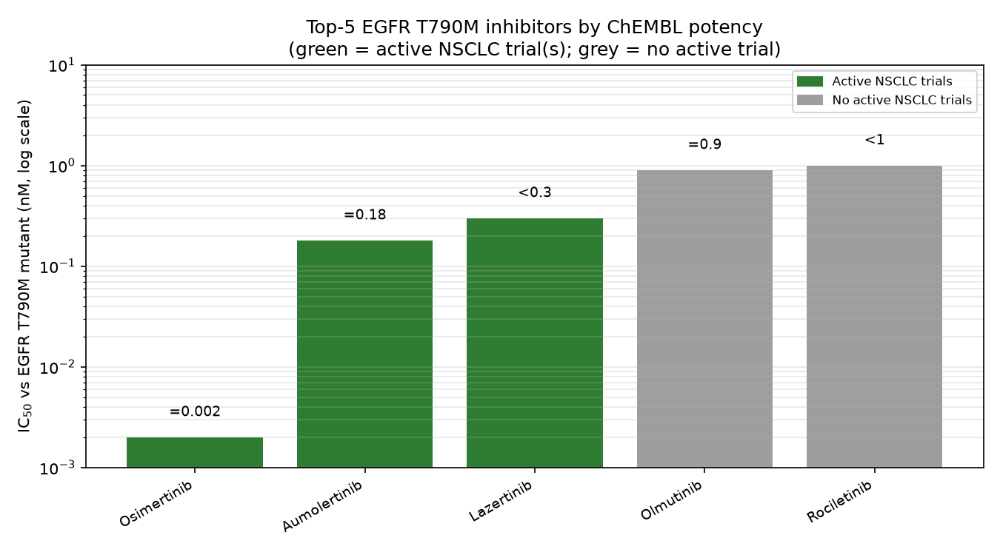
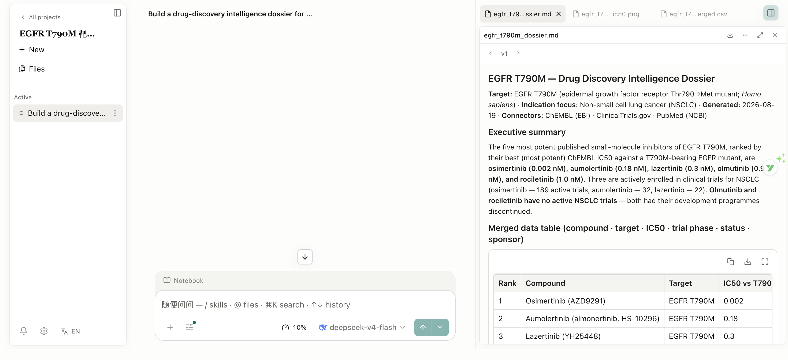
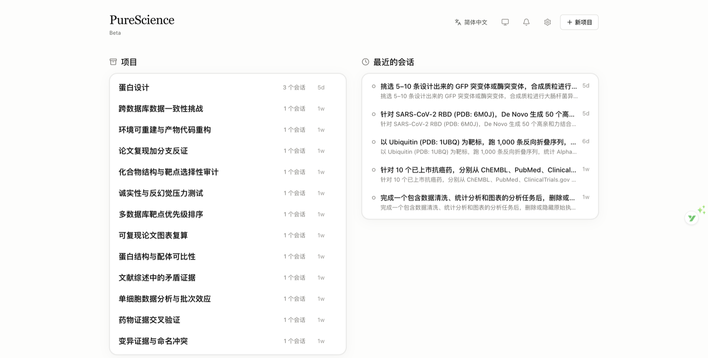
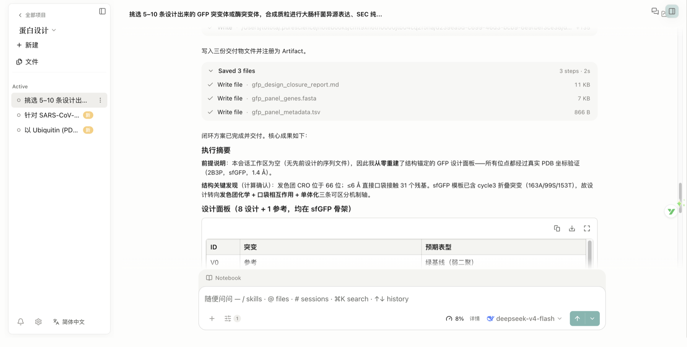
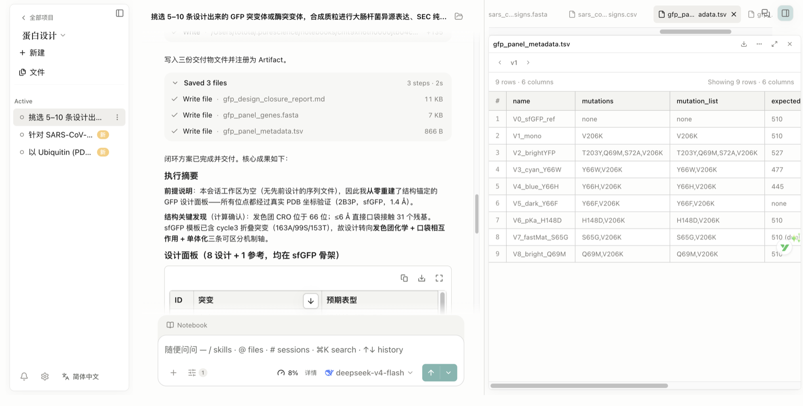
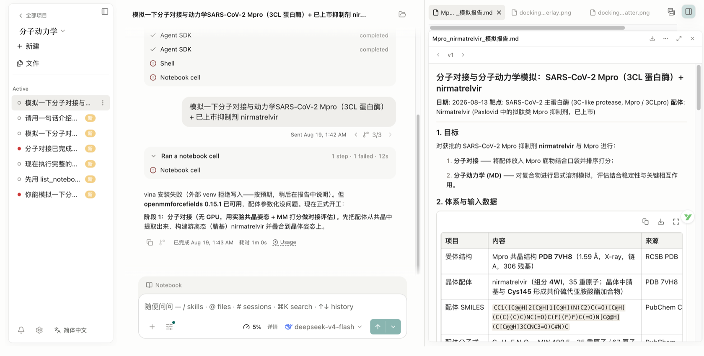

# PureScience

[](https://github.com/naiyixi/PureScience/releases/latest)
[](https://github.com/naiyixi/PureScience/releases/latest)
[](LICENSE)

**PureScience is an open-source, local-first, model-agnostic, self-hosted AI research workbench for reproducible scientific discovery.** Built for researchers, it runs on your own computer — currently shipped for **macOS (Apple Silicon)**, with Windows and Linux releases in progress. Create a project, describe a task in plain language, and let the AI agent read files, run Python and R code, search the web, call scientific data connectors, and return reproducible reports, tables, and figures linked to an inspectable activity history in one workspace.

PureScience currently includes 18 featured research skills and 24 built-in scientific connectors, with its strongest coverage in bioinformatics, computational biology, biomedical research, genomics, structural biology, and computational drug discovery—and an extensible architecture designed to support more scientific disciplines over time.

> 💡 **[PureScience v1.38.0 released](https://github.com/naiyixi/PureScience/releases/latest)** — 独立开源的科研 AI 工作台：Agent 自省（agent 可用 host_query 对应用数据库做只读自省——SELECT-only + 表白名单 + 项目隔离三重防护，查项目/审查/发现/计算任务/产物状态，回答「我在这个项目里做过什么」；内置 self-awareness 技能）；技能自举（agent 可用 skill_eval 评估技能描述可触发质量——首句自包含/动作词/具体主题/关键词/长度五项打分，弱开头与空泛词给出改写建议，≥8 分再落盘；skill_list/skill_read 检视技能库防重复造轮子；与 create_skill 组成评估→创建→检查→迭代循环）；出版级图表正确性（agent 画图前可用 figure_review 做五条纯规则复查——数据保真（排除的行不得渗入摘要统计）/标签经济/色彩串线/按数据形态选图/渲染自检，结构化面板输入、违规清单输出、修完 error 重跑；内置 figure-style 技能）；PDF 分层阅读（agent 可用 pdf_open 注册论文——主进程解析文本 + 书签目录逐页持久化、零上下文占用，pdf_outline 看目录、pdf_scan 词频扫描定位、pdf_pages 按需取页，50 页论文不再整篇读入）；文件注解（agent 可用 annotation_set 给项目文件打带标签的备注——todo/question/important/note/review 五种标签，路径相对项目根，同标签自动替换，可选 file_sha256 锚定内容版本；文件面板行内注解弹窗可视化查看/添加/删除）；模型 runbook 扩充（生物模型本地托管通用模式——FastAPI 包装 + 幂等启停 + 就绪路由 + 权重缓存，附 fair-esm2 与 esmfold2 示例）；本地模型服务（agent 可用 endpoint_register 注册本地模型服务器——名称 + 回环地址 + 幂等启停脚本 + 就绪路由，主进程守护生命周期：首次脚本集需批准（sha256 白名单）、启动后探测就绪才放行、凭据经环境变量注入永不见明文；设置 → 本地模型面板可视化管理；内置 llama.cpp 本地推理 runbook）；定时任务（agent 可用 routine_configure 编排周期任务——自包含指令 + 5–1440 分钟间隔，到点自动派发为全新任务运行，连续 3 次失败自动暂停，设置 → 定时任务面板可视化管理）；数据源许可门控（非商业用途限制的数据源如 CADD 在商业模式下 fail-closed 拒绝，合规边界调用期强制）；任务并发上限（全局可配置，超限拒绝新任务，完成自动释放）；Deny-first 网络防护（内置外泄域名黑名单——云元数据凭据端点永远 403，deny 优先于 allow，白名单关闭也生效）；写入审计（notebook 新增审计面板——每次代码/Shell 执行的创建/修改/删除文件一目了然，可筛选）；记忆溯源（记忆笔记携带来源证据——agent 保存时记录来自哪个会话/产物，面板显示来源标签；被取代的笔记标记「已取代」且不再自动回忆）；科学数据补齐（新增 CADD 变异危害评分、DepMap 癌细胞系依赖性、PanglaoDB 单细胞标记基因——「变异」「表达」「癌症模型」connector 全面增强）；可检索长上下文（上下文压缩不再丢弃原文——折叠窗口持久化为不可变 chunk，agent 可用 summary_query 检索逐字细节、boundary 标记任务边界，审查工具新增 Folded context 折叠时间线）；核验清单（审查工具跨 review 聚合全部 warn/fail 声明，一键标记已解决）；第三方许可证面板（设置 → 关于，依赖许可证摘要）；会话未读续接引导（侧栏「新」徽标 + 自动已读）；模型选择器不可用原因本地化；中文翻译覆盖度全量审计（234 处硬编码英文补齐、术语「专才」全界面统一、en/zh 1826 键完全对齐）；MCP 标准配置导入导出（Claude Desktop / Cursor / 裸 mcpServers.json 多形态直接导入，导出凭证脱敏）；Grok 三协议全通（Claude Code 经本地 Messages→Responses 桥 + OpenCode + Codex）；DeepSeek V4 Pro 原生 Responses 直连；模型目录扩充（OpenCode Zen / Go 精选网关 + 腾讯 TokenHub）；GitHub 认证技能导入；注解图片版补全；跨资源目录标签与收藏；技能面板重设计；run-marks 轮次导航轨与按轮次导出；会话式技能创建；@path 本地文件夹授权；消息中心事件源；安全加固批次；结构化澄清工作流；Serverless GPU 与模型端点、统一凭据管理、完整记忆体系、官方专才市场、可追溯产物、MCP 连接瞬断自愈、多智能体编排、生物医学技能包、全界面中文适配。**更新日记（含版本代号）见 [CHANGELOG](CHANGELOG.md)**；官网：[purescience.work](https://purescience.work)

<p align="center">
  
</p>

## Table of Contents

- [Quick Start](#-quick-start)
- [Product Tour](#product-tour)
- [Showcase](#showcase)
- [Real Runs Behind the Claims](#real-runs-behind-the-claims-the-ai4s-dry-wet-loop-in-action)
- [How PureScience Compares](#how-purescience-compares)
- [Why PureScience](#why-purescience)
- [Design Principles](#design-principles)
- [Core Capabilities](#core-capabilities)
- [Model Providers](#model-providers)
- [Data, Permissions, and Trust](#data-permissions-and-trust)
- [Project Status](#project-status)
- [Development & Packaging](#development--packaging)
- [Roadmap](#roadmap)
- [Brand & Ecosystem](#brand--ecosystem)
- [What This Is Not](#what-this-is-not)
- [Frequently Asked Questions](#frequently-asked-questions)
- [Get Involved](#get-involved)
- [License](#license)

## 🚀 Quick Start

### 1. Download the app

Open the [latest release](https://github.com/naiyixi/PureScience/releases/latest), expand **Assets**, and choose the installer for your computer:

| Your computer                       | Choose                                                        |
| ----------------------------------- | ------------------------------------------------------------- |
| macOS — Apple Silicon (M1 or newer) | The macOS DMG for Apple Silicon / ARM64（当前发布版）          |
| macOS — Intel / Windows / Linux     | 构建与发布进行中，敬请期待（可在 [Releases](https://github.com/naiyixi/PureScience/releases) 关注更新） |

Review the assets and verification information published on the release page. See [Verifying your download](SECURITY.md#verifying-your-download) before installation if you need to validate a package.

> If macOS shows an unidentified-developer warning, verify that the package came from the official Releases page before continuing.

### 2. Complete first-time setup

The first launch has five guided steps:

1. **Environment** checks compatibility, app storage, secure credential storage, and network access.
2. **Agent runtime** selects and prepares Claude Code, OpenCode, Codex, or CodeBuddy. App-managed runtimes can be installed without requiring Node.js, npm, or an administrator password.
3. **Model provider** connects and tests the model you want to use. Choose a built-in provider, a custom gateway, or an existing Claude or Codex subscription login.
4. **Notebook runtime** optionally prepares app-managed Python and R environments or enables detected and manually registered interpreters for either language.
5. **Data location** chooses where large artifacts, notebooks, uploads, and environments are stored.


Notebook execution is optional. Every required environment and agent-runtime check must pass before `Continue` becomes available, and the model connection must pass before setup finishes. Notebook and data-location settings can keep their defaults and be changed later in Settings.

### 3. Start a research project

1. Click **New project** and give the project a stable research name and optional description.
2. Open a session and describe the goal, input data, constraints, desired outputs, and how the result should be checked.
3. Attach source files, select a verified model, and choose an approval mode.
4. Send the task. Inspect the agent's tool activity, approve sensitive actions, and open generated artifacts in the preview panel.
5. To explore a different direction, edit an earlier user message and resend it on a new branch; use the message revision controls to return to either path.
6. Open an artifact's **Provenance** view to inspect its versions and the available evidence behind the selected result.
7. Continue the work in later sessions. Use `@` to reference an existing project file and `/` to explicitly select an enabled skill.

> Screenshots in this README illustrate the workflow. Labels, catalogs, and other interface details may differ from the version you install.

## Product Tour

PureScience organizes research into projects and sessions so that every result can stay connected to the evidence that produced it. The sections below walk through the workspace, artifact provenance, previews, scientific skills, and data connectors.

### One workspace from task to traceable artifacts

Projects keep related sessions, uploads, generated files, and preview state together. The conversation records the agent's answer and the commands, file reads, edits, searches, and connector calls that produced it. Each generated artifact is stored as an immutable, checksummed version. Its **Provenance** view exposes the evidence PureScience could verify at creation time: producer code and execution history, referenced inputs, an observed environment inventory, the producing conversation branch, and any version-scoped reviewer findings. Missing evidence is shown as unavailable instead of being guessed.


Generated reports, figures, and tables remain attached to the session and are also collected in the project file library. Preview tabs keep the active result visible as the panel changes size, and long names preserve their identifying suffix and extension. PureScience previews common scientific data, PDFs, Office documents (DOCX, XLSX, PPTX), images (with zoom and pan), source code with syntax highlighting, molecular structures and reactions, and Notebook history. Preview limits do not truncate the underlying file—the full artifact stays available to the agent and external tools. Use `Cmd/Ctrl+F` to search transcripts, Notebook output, and rendered pages across the workspace, or `Cmd/Ctrl+K` to open the project-scoped command palette. A dark mode rounds out the workspace: toggle the theme in **Settings → General** and the whole shell, transcript, and renderer palette switch without a flash.

### Branch a conversation without losing the original

Edit a completed user message to resend a revised prompt from that point. PureScience creates a new message branch instead of deleting the turns that followed, and revision controls let you move between the original and alternative paths. Branch selection, tool activity, attachments, and generated artifacts persist across project switches and restarts. Provenance remains tied to the exact branch that produced each artifact version, so exploring a different hypothesis does not blur the record of the earlier result.

### Scientific skills and data connectors

PureScience includes a growing catalog of **18 featured**, file-based research skills: AlphaFold2, Boltz, Borzoi, Chai-1, DiffDock, Environment & Packages, ESM-2, ESMFold2, Evo 2, Indication Dossier, LigandMPNN, Literature Review, OpenFold3, ProteinMPNN, scGPT, scvi-tools, SolubleMPNN, and **Remote Compute (SSH)** for submitting and harvesting long-running jobs on remote HPC clusters. You can create personal skills, upload `SKILL.md`/ZIP/`.skill` packages, preview and import compatible skills from GitHub, or import skills already installed in your global agent directories. The agent can also request a package import from a session attachment or a public GitHub URL, with an app-owned preview and confirmation step before anything is written. Enabled skills can be selected directly in the composer with `/`.

It also includes **24 built-in** research connectors: Literature Graph, PubMed, bioRxiv, Genes & Ontologies, Genomes, BioMart, Variants, Human Genetics, Clinical Genomics, Structures & Interactions, Protein Annotation, Expression, Omics Archives, CellGuide, Regulation, RNA, Chemistry, ChEMBL, ZINC, Molecule Viewer, Clinical Trials, Drug Regulatory, Cancer Models, and Research Resources. Built-in and custom connectors remain behind the permission system, with per-tool `Always allow`, `Ask each time`, and `Block` controls. The installed app shows the current skill, connector, and tool catalogs.


## Why PureScience

PureScience brings research tasks, execution, files, and evidence into one local, inspectable desktop workspace.

Research work is usually split across chat windows, notebooks, local scripts, scientific databases, file browsers, and reporting tools. Context is lost at every handoff, and the answer is often separated from the code and files that produced it.

PureScience brings those pieces into one inspectable desktop workspace:

- **Work that persists.** Projects, sessions, drafts, files, previews, and run history survive application restarts.
- **Execution, not just suggestions.** The agent can run commands, Python, and R, edit files, search, call connectors, and generate artifacts with the user's approval.
- **Alternative paths without lost work.** Revise an earlier prompt on a new message branch and switch between the resulting research directions.
- **Traceable results.** Immutable artifact versions retain the production evidence PureScience can verify, and explicitly mark evidence it cannot.
- **Multiple model choices.** Use a built-in cloud provider, a compatible custom gateway, or a Claude or Codex subscription; choose the model and its reasoning effort together in the composer.
- **Local-first ownership.** The application and project state run on your computer; external calls happen through services you explicitly configure or approve.
- **Inspectability.** The source code, skills, connector definitions, tool activity, generated files, and artifact provenance are available for review.
- **Extensibility.** Add skills and MCP connectors instead of waiting for a closed plugin roadmap.
- **No seat license.** PureScience is Apache-2.0 software. You pay only for the model or infrastructure you choose to use.

PureScience is an independent product built from scratch. It is not a proxy, unofficial client, or reskin of another AI research application.

## Showcase

One natural-language prompt → multi-step agentic research → **traceable, reproducible science**. The demo below ran end-to-end in ~11 minutes: the agent queried three scientific databases (ChEMBL, ClinicalTrials.gov, PubMed — 19 connector calls), executed 34 notebook cells (Python + pandas + matplotlib), caught and fixed two of its own bugs, and delivered three artifacts with provenance.



**The task (verbatim):**

```
Build a drug-discovery intelligence dossier for EGFR T790M (non-small cell lung cancer).

1. Use the ChEMBL connector to retrieve published small-molecule inhibitors of
   EGFR T790M (Homo sapiens, IC50 < 100 nM). Rank by potency, take the top 5.
2. Cross-reference those 5 compounds against ClinicalTrials.gov: which are in
   active clinical trials for NSCLC? Record trial phase, status, and sponsor.
3. Use PubMed to find up to 3 key papers per compound (mechanism / clinical evidence).
4. Write a Python script to merge everything into one table (compound, target,
   IC50, trial phase, status, sponsor) and generate a bar chart of IC50 values.
5. Deliver three artifacts: (a) the merged table as CSV, (b) the potency figure,
   (c) a one-page markdown dossier with citations. Explicitly state which data
   was verified via connectors and which could not be found.
```

**What it produced — every file real, every number independently verified:**

| Deliverable | File |
|---|---|
| One-page dossier with citations and a verified-vs-not-found statement | [egfr_t790m_dossier.md](docs/demo-verification/egfr_t790m_dossier.md) |
| Merged table (compound · target · IC50 · trial phase · status · sponsor) | [egfr_t790m_merged.csv](docs/demo-verification/egfr_t790m_merged.csv) |
| Potency figure (log scale; green = active trials, grey = none) | [egfr_t790m_ic50.png](docs/demo-verification/egfr_t790m_ic50.png) |
| In-app preview of the generated chart | [shot4-figure-preview.png](docs/demo-verification/assets/shot4-figure-preview.png) |

All key data points were re-checked against the public APIs after the run: 5/5 ChEMBL IC50 values, the representative FLAURA2 trial (NCT04035486) on ClinicalTrials.gov, and the cited PMIDs on PubMed all match. The agent also disclosed its own limits in the dossier — records it could not resolve, connector pagination constraints, and compounds with no active trials — instead of guessing. Full details: [demo verification report](docs/demo-verification/egfr-t790m-dossier-verification.md).

<p align="center">
  
</p>

## Real Runs Behind the Claims: the AI4S dry-wet loop, in action

PureScience is built around one position: **AI for science only pays off when the loop between computation and experiment actually closes.** We frame that loop as *hypothesis (dry) → AI prediction (dry) → computational verification (before the wet bench) → wet-lab handoff → data feedback → knowledge reuse*, and every step must land as a real, versioned, re-runnable artifact — not a chat summary.

That is why PureScience is implemented as the **open, local-first, model-agnostic agent-and-workflow layer** of the AI4S stack — with an evidence, reproducibility and compliance layer running across the whole loop — rather than a hosted research chat that ships your data somewhere else. Screenshots below come from real local sessions on **v1.37**: no demo data, every file on disk. The 13-project acceptance suite spans seven capability levels (L1 literature synthesis → L7 evidence chain & reproducibility); most chat-style tools stop at L1–L2.

#### 13 项能力验收项目（The 13-project acceptance suite）

*Protein design, cross-database consistency, paper reproduction with counter-evidence, compound-target selectivity audits, anti-hallucination stress tests, single-cell analysis, environment reconstruction, drug-evidence cross-checks — each project holds real sessions and real artifacts.*

#### 干湿交接：蛋白设计工作区（Dry side meets the wet bench）

*Three tasks in one project — a GFP/enzyme panel for E. coli expression, de-novo SARS-CoV-2 RBD binders (PDB 6M0J), and 1,000-sequence Ubiquitin inverse folding (PDB 1UBQ). The 9-row GFP panel (V0–V8: designed spectra, monomerization, pH axis, dark control) is delivered as a handoff document for the wet lab, with ORF FASTA and metadata TSV beside it.*

#### 诚实性即产物：失败与局限照实入库（Honesty is logged, not hidden）

*Mid-run the agent caught its own bug and fixed it on record — “chromophore detection was wrong: water molecules were treated as protein-like HETATM.” Without a GPU it stated ESMFold was unavailable and switched to structure-anchored design instead of pretending. Failures and limits are recorded as negative samples — the data layer AI4S needs most — and every report separates “verified via connectors” from “could not be verified”.*

#### 物理计算本地跑通，结果可复算（Physics runs locally, results re-runnable）

*SARS-CoV-2 Mpro (PDB 7VH8) + nirmatrelvir: 280 docking poses scored by interaction energy (best E_int −52.9 kcal/mol; 16/21 pocket contacts match the crystal), then explicit-solvent molecular dynamics with 82,563 atoms — protein Cα RMSD 0.93 Å, ligand RMSD 0.79 Å, key Glu166 hydrogen bond held in 62% of frames. The whole OpenMM pipeline ran on a laptop, and the report states its own limitations (charge model, non-covalent approximation, 1 ns scale, monomer).*

> **中文速览**：PureScience 把 AI4S 干湿闭环跑成真实产物——以上截图均为 v1.37 本机实跑（13 项能力验收 + 蛋白设计 / 分子动力学 / 多库情报真实会话），每个截图对应的产物文件均可按会话路径复核；报告自带「已验证 / 无法核实」分离与局限声明。更多可复核的独立验证见 [demo verification report](docs/demo-verification/egfr-t790m-dossier-verification.md)。

## How PureScience Compares

PureScience competes on **architecture**, not on feature-count prose. The table contrasts PureScience with the common profile of **hosted, closed-source, single-model AI research workstations** (profile assembled from public documentation and sandbox audits, 2026-08 — treat their own docs as authoritative). No product is named here: the differences are structural and apply to the category.

| Dimension | Hosted · closed · single-model workstation | PureScience | 一句话 |
|---|---|---|---|
| Deployment | Cloud-hosted; research data flows through the vendor | Local-first desktop + optional loopback web UI; self-hostable | 数据不出实验室 |
| Model choice | Bound to one vendor model | Model-agnostic: many built-in cloud providers, custom gateways, subscription reuse — across **four selectable agent backends** | 不锁模型 |
| Openness | Closed source | Apache-2.0 — inspectable and forkable | 合规可审计 |
| Data governance | Data + artifacts transit vendor cloud | Local storage, OS-keychain credentials, optional network egress allowlist, license-gated connectors (non-commercial sources fail closed) | 数据主权是准入门槛 |
| Evidence | Text-level citations | Checksummed artifact versions with producer code / execution history / environment / branch + reviewer findings; “verified” and “could not be verified” kept separate | 做得对且能重做 |
| Scientific data | Broad coverage, but license-limited sources are often disabled | 24 built-in connectors across genomics, variants, human genetics, chemistry, clinical trials, literature, structures, expression, cancer models and more; same biomedical domains covered per the 2026-08 audit | 覆盖持平 + 合规反超 |
| Honesty | Chat-level disclaimers | Anti-hallucination stress suite; mid-run self-correction stays on record; failures and limits logged as negative samples | 诚实性即产物 |
| Orchestration | Adding scheduled jobs, hosted model endpoints, PDF layering (2026-08 wave) | Same mechanisms landed locally: routine tasks, local model endpoints, layered PDF reading, figure checks, skill authoring, agent self-introspection, file annotations | 对齐并本地化 |
| Language | English-first | Nine interface languages (English fallback); Chinese-native scientific reports | 本地化就绪 |

**诚实边界（我们不宣称什么）**：交互式分子查看、云同步类便利功能等少数前端体验暂未提供——我们刻意先做执行—证据—主权三条主轴；“同域覆盖”基于 2026-08 的审计结论，双方版本演进后需复核；本表为 v1.37 已发布形态，安装版应用内的目录与界面为准。

## Design Principles

PureScience is shaped by a small set of principles that govern how code, data, models, and human oversight fit together.

- **Open by default.** Source code, formats, connectors, and skills should remain inspectable and forkable.
- **Multi-provider with explicit compatibility.** The app validates provider configuration and makes endpoint requirements visible instead of treating every API protocol as interchangeable.
- **Local-first and data-aware.** Keep project state local, surface external data flows, and make autonomy opt-in.
- **Human-in-the-loop.** File edits, commands, network access, and connector calls are governed by explicit approval profiles.
- **Durable research records.** Sessions, tool activity, Notebook history, and immutable artifact versions should remain reviewable after the run ends, with unavailable evidence stated plainly.
- **Composable capabilities.** Skills, connectors, models, previews, and future compute backends should be replaceable parts rather than one black box.
- **Honest scientific boundaries.** Generated output does not replace expert judgment, statistical review, or validation against primary evidence.

## Core Capabilities

PureScience combines project management, multi-model agent execution, Python and R notebooks, scientific data connectors, immutable artifact versions with provenance, and permissioned human-in-the-loop control in one local workspace. The installed app and [latest release notes](https://github.com/naiyixi/PureScience/releases/latest) are the source of truth for changing catalogs, packaging details, and newly added options.

| Area                         | Core capability                                                                                                                                                                                                                                                                                                                                                                                                                                                                                                                                                                                                                                                                                                   |
| ---------------------------- | ----------------------------------------------------------------------------------------------------------------------------------------------------------------------------------------------------------------------------------------------------------------------------------------------------------------------------------------------------------------------------------------------------------------------------------------------------------------------------------------------------------------------------------------------------------------------------------------------------------------------------------------------------------------------------------------------------------------- |
| **Projects and sessions**    | Create, rename, and delete projects; maintain multiple sessions with pinning; edit completed prompts into persistent, selectable message branches without deleting the original downstream path; restore recent work, drafts, conversation history, and preview state.                                                                                                                                                                                                                                                                                                                                                                                                                                            |
| **Agent workflow**           | Natural-language tasks, streamed responses, typed tool-activity cards grouped under declared purpose titles, a live context-usage indicator with category-level estimates, on-demand context compaction, and persistence across restarts, stop controls, approval pauses, a confirmation step (with a remembered preference) before closing or quitting during a running task, desktop notifications plus durable unread conversation badges and native attention on blocking approvals, message timing metadata with elapsed-time and usage popovers, completed-turn agent framework and model identification, a project-scoped command palette, and recovery of sessions interrupted by an application restart. The transcript also marks **configuration changes mid-session** with a visible divider, and notebook editors offer **live kernel variable suggestions**. A cross-resource **Tags** manager organizes projects, sessions, and files from one master-detail panel. |
| **Models**                   | Built-in cloud providers, custom compatible gateways, Claude and Codex subscription logins, connection validation, per-model multimodal image input, and a combined composer picker for model and model-supported reasoning effort. Available providers and API formats are validated against the selected agent backend.                                                                                                                                                                                                                                                                                                                                                                                         |
| **Agent backend**            | A selectable agent-framework backend — Claude Code, OpenCode, Codex, and CodeBuddy — so the same workspace can run on more than one underlying agent implementation, with provider and model choices validated against the selected backend, and app-managed backends installable, switchable, and removable from Settings. |
| **Execution**                | Persistent Python, R, and REPL control-plane kernels with durable code/output history, plus stateless shell commands recorded in the same run history; app-managed environments with offline provisioning; bring-your-own Python and R interpreters; remote SSH compute hosts as additional execution targets; a user terminal shared with the agent; and a read-only installed-package inventory per runtime environment. Package management for external R runtimes remains manual.                                                                                                                                                                                                                             |
| **Inputs and files**         | File attachments (up to 10 GB per file with streaming upload), a project-level library with indexed pagination, session grouping, source-scoped filename search, grid and list views, a large expand modal for large projects, split-view file preview beside the session, generated artifact cards, `@` references to existing uploads/outputs, file download/export, and session export as `.ipynb` (per-tab or download-all).                                                                                                                                                                                                                                                                                  |
| **Artifacts and provenance** | Immutable, session-scoped artifact versions with checksummed content and available producer code, execution history, exact input references, environment inventory, producing message-branch context, and version-scoped reviewer evidence, with version navigation and direct links between related evidence.                                                                                                                                                                                                                                                                                                                                                                                                    |
| **Preview formats**          | Responsive multi-tab previews for common scientific data, PDFs, Office documents (DOCX, XLSX, PPTX), images (with zoom and pan), source code with syntax highlighting, molecular structures and reactions, and Notebook history, viewable inline or full-screen.                                                                                                                                                                                                                                                                                                                                                                                                                                                  |
| **Local data management**    | Local project and application data, configurable storage location, and guided migration.                                                                                                                                                                                                                                                                                                                                                                                                                                                                                                                                                                                                                          |
| **Skills**                   | **18 featured** built-in skills; personal skills, package upload, GitHub preview/import, import of installed global skills with candidate preview, agent-requested package imports from session attachments or GitHub URLs, enable/disable controls, and explicit `/` selection in a session.                                                                                                                                                                                                                                                                                                                                                                                                                     |
| **Connectors**               | **24 built-in** research connectors, custom local/remote MCP connectors, contact metadata, and connector/tool-level permissions.                                                                                                                                                                                                                                                                                                                                                                                                                                                                                                                                                                                  |
| **Safety controls**          | `Ask for approval`, `Auto-approve edits`, and `Full access` conversation profiles; approval dialogs with code previews and call/conversation decisions; durable global, project, and session-scoped allow grants with filtering, per-row and family revoke, and Undo; plus per-connector and per-tool policies.                                                                                                                                                                                                                                                                                                                                                                                                   |
| **Memory**                   | A structured, cross-session memory with categories and notes: an always-visible composer to capture facts, per-category save guidance and auto-recall controls, recall injection into every agent session (bounded blocks), and an agent-facing save tool so the model can persist durable preferences mid-conversation — the panel, the recall path, and the write path form one closed loop.                                                                                                                                                                                                                                                                                                                          |
| **Credentials**              | A unified, encrypted credential store for 8 scientific services (AWS, GitHub, Google Cloud, Azure, Modal, NVIDIA, OpenAlex, literature access) plus custom entries: secrets are OS-keychain encrypted at rest, the renderer only ever sees masked hints, editing keeps the existing secret unless retyped, deletion is confirmation-gated, and GitHub credentials get a real connectivity test.                                                                                                                                                                                                                                                                                                                          |
| **Network egress allowlist** | An optional network-restriction mode for notebook, REPL and shell child processes: when enabled, they are routed through a local filtering proxy that only reaches the enabled scientific domain groups (literature, genomics, structures & chemistry, clinical, bioinformatics, code & package repositories) plus your custom domains — everything else is refused, keeping data kernels sandboxed.                                                                                                                                                                                                                                                                                                                          |
| **External compute endpoints** | Run jobs beyond your own machines: configure Modal serverless-GPU endpoints (jobs execute in a GPU container via the modal CLI) and NVIDIA NIM inference endpoints (OpenAI-compatible model calls) — each bound to a credential from the Credentials panel so secrets never live in the compute config. The dispatcher routes by provider id, so a job submitted to a Modal or NIM target runs end-to-end like any SSH job.                                                                                                                                                                                                                                                                                                                          |
| **Review and verification**  | An opt-in reviewer that audits a completed turn against its own transcript, execution log, and artifacts, reports pass/warn/fail findings, and can run a bounded fix loop to correct them.                                                                                                                                                                                                                                                                                                                                                                                                                                                                                                                        |
| **Distribution and support** | Installer for macOS (Apple Silicon; Windows and Linux releases in progress), plus update guidance, local diagnostics, and community links. |
| **Localization**             | Nine interface languages with English fallback (English, German, Spanish, French, Japanese, Korean, Russian, Simplified Chinese, Traditional Chinese), a full terminology audit across the UI, and Chinese-native formatting for scientific reports and documentation. |

## Model Providers

PureScience is model-agnostic at the product level: connect it to major cloud LLM providers, a custom gateway, or reuse an existing Claude or Codex subscription. Provider availability currently depends on the selected agent backend and the API protocols it supports. There are four ways to connect a model:

| Provider mode                | How it works                                                                                                                                                                                                                                                                                                                     |
| ---------------------------- | -------------------------------------------------------------------------------------------------------------------------------------------------------------------------------------------------------------------------------------------------------------------------------------------------------------------------------- |
| **Built-in cloud providers** | Choose from the provider list shown by the installed app and authenticate with the requested key.                                                                                                                                                                                                                                |
| **Custom Gateway**           | Supply a compatible Base URL, API Key, and exact model ID. The default API format (Messages, Chat Completions, or Responses) is derived from the active agent framework, so a new custom gateway is compatible out of the box.                                                                                                   |
| **Codex Subscription**       | Select the Codex agent framework first, then you can select Codex subscription in provider type                                                                                                                                                                                                                                  |
| **Claude Subscription**      | Sign in with a Claude subscription in two modes: **shared** (a browser login that stores credentials in your default `~/.claude` profile) or **isolated** (an app-managed `claude setup-token` run under an app-owned `CLAUDE_CONFIG_DIR`, fully isolated from `~/.claude/`, with a browser flow plus a paste-a-token fallback). |

The legacy **Local Claude** provider has been removed. Previously stored Local Claude entries are
dropped during upgrade; add **Claude Subscription** and authenticate with shared browser login or
the isolated `claude setup-token` flow instead.

Built-in cloud vendors currently include OpenAI, Anthropic, Grok (xAI), DeepSeek, Zhipu AI (GLM) with a dedicated GLM Coding Plan endpoint, Kimi (Moonshot), MiniMax, StepFun with a dedicated Step Plan subscription endpoint, Xiaomi MIMO, SenseNova, Volcengine Ark, Bailian (Alibaba Cloud) with a dedicated Bailian for Plan subscription endpoint, and the OpenRouter aggregation gateway, among others; some are region-specific.

Provider vendors, available models, and regional endpoints can evolve independently of this README. Treat the provider picker and connection test in the installed app as the source of truth.

## Data, Permissions, and Trust

PureScience stores project data, settings, artifact versions, and provenance evidence on the local computer. API Keys are kept locally and use the operating system's secure credential storage when it is available. Logs are local and are not uploaded automatically.

External data flow is still possible and should be reviewed:

- Model requests send the prompt and necessary context to the selected model provider.
- Web searches and remote connectors send their displayed parameters to external services.
- Local connectors may execute trusted commands on the computer.
- Attachments, `@` references, logs, and generated reports may contain sensitive research data.

Choose the narrowest permission profile that fits the task:

| Mode                 | Behavior                                                                         | Recommended use                                           |
| -------------------- | -------------------------------------------------------------------------------- | --------------------------------------------------------- |
| `Ask for approval`   | Asks before edits, commands, network, and connector calls                        | New workflows, sensitive data, unfamiliar scripts         |
| `Auto-approve edits` | Automatically allows workspace edits; asks for commands, network, and connectors | Trusted file-editing work with controlled external access |
| `Full access`        | Automatically allows edits, commands, network, and connectors                    | Clearly scoped, fully trusted, unattended work            |

Review connector parameters and tool activity before approving them. Never include API Keys, access tokens, patient identifiers, unpublished data, or sensitive local paths in screenshots or public issue logs.

## Project Status

PureScience is available as a released desktop application and is actively developed. Recent releases have focused on reproducible artifacts, workspace extensibility, and session reliability.

- **v0.8.0** established immutable artifact versioning and inspectable provenance as shipped foundations.
- **v0.9.0** added personal specialist agents with scoped capabilities, scoped permission management, conversation and artifact export, TIFF previews, collapsible side panels, and per-turn token usage.
- **v0.9.1** added mobile remote access through Remote.It, conversational specialist customization, and message timing metadata.
- **v0.9.2** added immediate specialist handoff, completed-turn agent and model identification, context-usage persistence across restarts, and Windows renderer crash recovery.
- **v0.10.0** adds a project-scoped command palette, code syntax highlighting in previews and notebook cells, read-only package inventories per runtime environment, conversational skill imports from GitHub URLs, direct file preview beside the session, and Bailian as a built-in model provider.
- **v0.10.1** adds branching a conversation into a new session, GitHub skill search by keyword, specialist package import/export with contribution channels, and session-age metadata in the artifact list, while keeping oversized data files out of model context and hardening branch replay, reviewer correction provenance, and Codex prompt-runtime ownership.
- **v0.11.0** adds review-gated session plans with durable execution contracts, hot-switching ACP models and providers without reconnecting the agent process, agent-aware context replay that respects each framework's context path, prompt history navigation in the composer, session link favicons, and a settings keyboard shortcut, while hardening Windows auto-update and local RPC, logger data redaction, artifact provenance binding, and notebook process-group cleanup.
- **v0.11.1** adds on-demand artifact code reconstruction, live permission profile changes during a running turn, project and session archiving with undo, MCP connector OAuth and portable configuration import/export, tool-activity elapsed time in the transcript, persistent plan call records, and branded loading indicators, while hardening Windows runtime recovery, session-plan turn completion, and cross-platform release certification.
- **v1.31 – v1.37** completes the orchestration-and-evidence wave: routine scheduled tasks (5–1440 min, auto-pause on repeated failure), locally hosted model endpoints (sha256-whitelisted lifecycle scripts, readiness probing), layered PDF reading (outline → keyword scan → on-demand pages, zero context cost for a 50-page paper), publication-grade figure checks, agent skill authoring and self-introspection (read-only, project-scoped queries), file annotations, license-gated access to non-commercial data sources, folded-context search with immutable chunks, memory provenance with superseded markers, and a review checklist aggregated across turns.
- **v1.37.0** adds a fourth agent backend (**CodeBuddy**) alongside Claude Code, OpenCode, and Codex; **nine interface languages** with English fallback; a cross-resource **Tags** manager; live kernel variable suggestions in notebook editors; and a config-change divider in the transcript. See the release note at the top of this file and the [latest release notes](https://github.com/naiyixi/PureScience/releases/latest).

Deterministic reconstruction, portable environment restoration, and full-fidelity session replay remain on the roadmap.

For version-specific features, provider and catalog changes, platform packaging, and recent fixes, use the [latest release notes](https://github.com/naiyixi/PureScience/releases/latest) and the installed app. For a maintained shipped/partial/planned breakdown, see the [Capability Map](ROADMAP.md#capability-map).

PureScience assists execution and record-keeping; researchers remain responsible for methods, interpretation, privacy, and scientific validity.

## Development & Packaging

PureScience is an Electron application built with React, TypeScript, Prisma/SQLite, and an ACP-based agent runtime.

Prerequisites for source development:

- Node.js LTS or newer with npm
- Git
- Python 3 only if you want Notebook execution

```bash
git clone https://github.com/naiyixi/PureScience.git
cd purescience
npm install
npm run dev
```

`npm install` automatically generates the Prisma client and installs Electron native dependencies. `npm run dev` builds the Electron main/preload bundles, starts the renderer, and opens the desktop app. Development data is isolated under `~/.purescience-project`.

Useful commands:

| Command                | Purpose                                  |
| ---------------------- | ---------------------------------------- |
| `npm run dev`          | Start the development application        |
| `npm run dev:web`      | Dev app + localhost web UI (127.0.0.1)   |
| `npm run dev:headless` | Dev backend + web UI, no Electron window |
| `npm run lint`         | Run ESLint                               |
| `npm run typecheck`    | Type-check main and renderer code        |
| `npm test`             | Run the Vitest suite                     |
| `npm run build`        | Type-check and build the application     |
| `npm run build:web`    | Build the optional localhost web UI      |
| `npm run build:mac`    | Package macOS builds                     |
| `npm run build:win`    | Package Windows builds                   |
| `npm run build:linux`  | Package Linux builds                     |

Packaged output is written under `dist/`.

### Localhost web and headless modes

The desktop backend can optionally serve the same renderer to a browser on the local computer. This
feature is off by default and binds only to `127.0.0.1`.

```bash
npm run build:web
npm run dev:web
```

Open the authenticated URL printed by the application. Use `npm run dev:headless` to start the
backend, tray, agent runtime, and localhost web service without opening an Electron window.
Set `PURESCIENCE_WEB_PORT` to choose a port (default `44100`). Explicitly quitting the
application still shuts down agent and Notebook processes normally.

### Mobile remote access

The same localhost web UI can be reached from a phone or tablet through Remote.It pairing. Pair
a browser with a six-digit PureScience code, approve it once on the desktop, and the workspace
stays reachable without exposing the loopback server directly. Browser trust is revocable, and
mode changes or service shutdown immediately invalidate active remote sessions.

### Headless CLI and SDK

The headless CLI and zero-dependency Node.js SDK use the same local daemon, projects, sessions,
credentials, and permissions as the desktop and web interfaces. Detailed usage lives with the
publishable package so there is one command reference to maintain:

- [CLI guide](packages/purescience/CLI.md) - installation, service lifecycle, task automation,
  artifacts, output formats, and exit codes
- [SDK package overview](packages/purescience/README.md) - Node.js quick start and package entry point

## Brand & Ecosystem

PureScience is an **independent, original open-source project** — its own codebase, data model,
interface, and roadmap, developed openly for the benefit of all researchers. It is not a fork or
a downstream derivative of any other product.

- 官网 / Website: [purescience.work](https://purescience.work)
- 更新日记（含版本代号）/ Changelog: [CHANGELOG.md](CHANGELOG.md)
- GitHub: [naiyixi/PureScience](https://github.com/naiyixi/PureScience)

## Roadmap

The product roadmap and capability status are maintained in [ROADMAP.md](ROADMAP.md). This README intentionally does not duplicate the moving list of priorities or release targets.


## What This Is Not

PureScience is a research execution and record-keeping tool, not a generic chat wrapper, unofficial client, or substitute for scientific review.

- **Not just a chat UI.** The product is organized around persistent projects, execution, files, artifacts, and reviewable tool activity.
- **Not an unofficial client for another product.** It is an independent implementation with its own codebase, data model, interface, and roadmap.
- **Not a replacement for scientific judgment.** Outputs still require domain review, statistical validation, and verification against primary sources.

## Frequently Asked Questions

### **Q: What should I do the first time I open PureScience?**

A: Complete the five setup steps: **Environment**, **Agent runtime**, **Model provider**, **Notebook runtime**, and **Data location**. Fix required rows marked `Action needed`, install or repair the selected agent if offered, and test the model connection. Notebook setup and a custom data location are optional.

### **Q: What is an API Key, and where do I get one?**

A: An API Key is a secret credential issued by a model provider. Create or copy one from that provider's developer/API console. The provider may bill requests made with the key. Treat it like a password: never share it or commit it to a repository.

### **Q: Do I need an API Key?**

A: Not if you reuse an existing subscription login — a Claude subscription through shared browser login or an isolated app-managed `claude setup-token` flow, or a ChatGPT/Codex subscription login on the Codex backend. Built-in cloud providers and custom gateways require their own keys.

### **Q: Which model providers can I use?**

A: Open the provider picker during setup or under `Settings → Model` for the choices supported by your installed app and selected agent backend. You can use a built-in cloud provider, a compatible Custom Gateway, a Claude subscription through shared or isolated login, or a Codex subscription on the Codex backend.

### **Q: Why does the model connection test fail?**

A: Check the API Key for missing characters or spaces, verify the Base URL and region, use the provider's exact model ID, and confirm network access and account balance. For a Claude subscription, retry the shared browser login or refresh the isolated `claude setup-token` credential, depending on the selected mode.

### **Q: Why is `Continue` disabled during setup?**

A: The current step has not met its required condition. Fix any environment row marked `Action needed`, install or repair the selected agent runtime, or validate the model provider, depending on the active step. Notebook setup is optional and only affects Notebook execution.

### **Q: Setup is complete. How do I start a research task?**

A: Create or open a project, start a session, attach any source files, and describe the goal, constraints, expected output, and validation criteria. Use `@` to reference a project file and `/` to select an enabled skill.

### **Q: How do I run jobs on a remote HPC cluster?**

A: Enable the **Remote Compute (SSH)** skill under **Settings → Skills**, register your cluster under **Settings → Compute**, then start a session and select the skill with `/remote-compute-ssh`. The skill handles host registration, short commands via SSH, and fully async job submission — the app automatically starts an analysis turn when the job finishes, so you never write a polling loop.

### **Q: Is there a command-line interface?**

A: Yes. Install it in one click from **Settings → General → Command line tool → Install command** (adds `purescience` to your PATH; no separate Node.js needed). The CLI controls the local service and submits research tasks without opening a browser:

```bash
# Start the service in the background
purescience start --no-open

# Create a project and run a task, wait for completion
purescience project create "Systematic review"
purescience run --project "Systematic review" \
  --prompt-file ./task.md \
  --approval-profile auto \
  --skill literature-review \
  --wait --json

# Download a generated artifact
purescience artifacts list <session-id> --json
purescience artifacts download <artifact-id> --output ./report.md
```

See the [CLI guide](packages/purescience/CLI.md) for the full command reference, JSON/JSONL output formats, exit codes, and headless service options.

### **Q: How do I inspect where a generated result came from?**

A: Open the generated artifact and choose **Provenance**. Select a version to inspect the content identity and the available producer code, execution history, inputs, environment inventory, producing conversation context, and reviewer evidence. Evidence PureScience could not verify is marked unavailable.

### **Q: Can I revise an earlier request without losing the conversation that followed?**

A: Yes. Edit a completed user message and resend it to create a new branch from that point. The original later turns remain available, and the revision arrows beside the message switch between the alternative paths.

### **Q: Does my research data stay on my computer?**

A: Projects, sessions, files, settings, and configured credentials are stored locally by default. Content needed for model requests, web searches, or connector calls may still be sent to the external service you selected, so review sensitive inputs and provider policies before running a task.

## Get Involved

| Channel                                                                  | Use it for                                                              |
| ------------------------------------------------------------------------ | ----------------------------------------------------------------------- |
| [GitHub Issues](https://github.com/naiyixi/PureScience/issues)           | Bugs, reproducible failures, and concrete feature proposals             |
| [GitHub Discussions](https://github.com/naiyixi/PureScience/discussions) | Design questions, roadmap proposals, and longer technical conversations |
| [X / @zerolink_ai](https://x.com/zerolink_ai)                                | Release announcements and build-in-public updates                       |

Before opening a public issue, remove API Keys, tokens, private file paths, unpublished data, patient identifiers, and other sensitive material from logs and screenshots. See [CONTRIBUTING.md](CONTRIBUTING.md) for the development workflow.

> ⭐ **Star the repo:** If this project has been helpful, we'd greatly appreciate a star on GitHub. Starring the repository encourages continued development. It only takes a second, but it has a meaningful impact on the project.

## License

Apache License 2.0 — see [LICENSE](LICENSE).

