# PureScience 极限压测证据库（2026-09-04 → 09-07 · 30 题全量）

> 30 道对抗性研发压测题的全量证据：每题一个案例文件夹（裁决研报 + 数值求解器 + 图件 + 数据），每题的会话截图与产物图在此页直接可见；本页另给出**逐题一句话裁决**（中文 + English，均为真实研报结论的摘要）。正文见仓库根 [README](../../README.md)。

| 数据 | 值 |
|---|---|
| 项目数 | 30（2026-09-04 → 09-07，本机 `~/.purescience-project`） |
| 硬件 | 单一 Apple M2 · 8 GB 内存 · 无集群 |
| 产物形态 | 每案例 3–19 件：中文裁决研报（自带 Data-Gap 清单）、数值求解器、出版级图件、数据表 |
| 诚实性规范 | 「已验证 / 无法核实」分离；无实测值不参与裁决；诱导性前提被驳回时在报告中注明 |

## Wave 0 · 方法论地基（09-04）

### 01. foundation ultra stress
> 题目：极限压力测试题　·　2026-09-04 20:59:38

**一句话裁决**：KRAS G12D 多模态情报：数值逐条实时核验；文献与注册库冲突以现行记录为准（如把“已进入临床”纠正为 TERMINATED 试验 NCT05737706），无法证实项显式登记。

*Multi-source KRAS G12D dossier with real-time verification: registry records override literature claims (a trial described as recruiting is corrected to its TERMINATED status), every unverifiable mapping explicitly logged.*

产物：[求解器 `01_build_merged_evidence.py`](cases/01-foundation-ultra-stress/01_build_merged_evidence.py) · [求解器 `02_make_kras_figure.py`](cases/01-foundation-ultra-stress/02_make_kras_figure.py) · [图 `kras_figure.png`](cases/01-foundation-ultra-stress/kras_figure.png) · [数据 `merged_kras_evidence.csv`](cases/01-foundation-ultra-stress/merged_kras_evidence.csv) · [归档(字节一致) `report.md.gz`](cases/01-foundation-ultra-stress/report.md.gz)

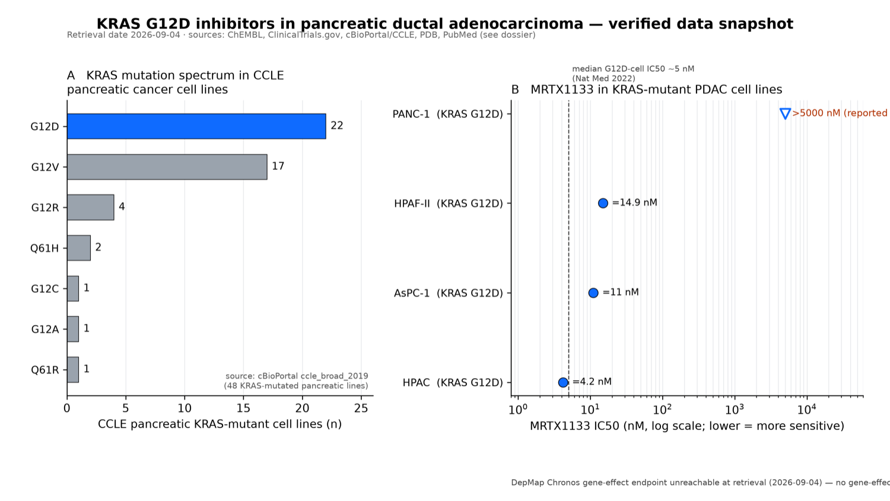

---

### 02. enzyme directed evolution
> 题目：酶工程定向进化——干湿闭环压力测试　·　2026-09-04 22:16:35

**一句话裁决**：干湿统计管线能从带噪+异常值湿数据独立恢复干结论（60-min ANOVA F=18.6, p≈2.3e-5，保留 2 个异常值结论仍稳健）；如实声明湿数据为仿真 ground truth。

*A dry-wet statistical pipeline recovers the dry conclusion from noisy wet data with outliers retained (60-min ANOVA F=18.6, p≈2.3e-5 stays robust); the simulated nature of the wet data is disclosed, not hidden.*

产物：[数据 `96_well_plate_layout.json`](cases/02-enzyme-directed-evolution/96_well_plate_layout.json) · [图 `final_figure_RFU.png`](cases/02-enzyme-directed-evolution/final_figure_RFU.png) · [报告 `final_report.md`](cases/02-enzyme-directed-evolution/final_report.md) · [报告 `pipetting_scheme.md`](cases/02-enzyme-directed-evolution/pipetting_scheme.md) · [数据 `primers.csv`](cases/02-enzyme-directed-evolution/primers.csv) · [数据 `wet_data_raw.csv`](cases/02-enzyme-directed-evolution/wet_data_raw.csv) · [归档(字节一致) `wet_protocol_manuscript.md.gz`](cases/02-enzyme-directed-evolution/wet_protocol_manuscript.md.gz) · [数据 `wet_sim_parameters.json`](cases/02-enzyme-directed-evolution/wet_sim_parameters.json)

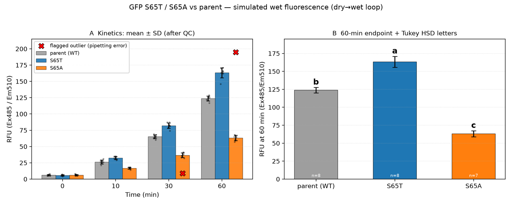

---

### 03. anti hypothesis selfcorr
> 题目：反事实验证与自我纠正（Anti-Hypothesis Test）　·　2026-09-04 22:43:24

**一句话裁决**：反事实验证：生成真值 KRAS=−0.85·TP53；相关（r=−0.86）与 OLS（R²=0.874）一致恢复负向关系，"KRAS 正向驱动 TP53"被拒绝。

*Counterfactual audit: with the generative rule KRAS=−0.85·TP53, correlation (r=−0.86) and OLS (R²=0.874) both recover the negative relation — the claim "KRAS positively drives TP53" is rejected.*

产物：[图 `correlation.png`](cases/03-anti-hypothesis-selfcorr/correlation.png) · [归档(字节一致) `expression_analysis.py.gz`](cases/03-anti-hypothesis-selfcorr/expression_analysis.py.gz) · [数据 `raw_expression.csv`](cases/03-anti-hypothesis-selfcorr/raw_expression.csv)

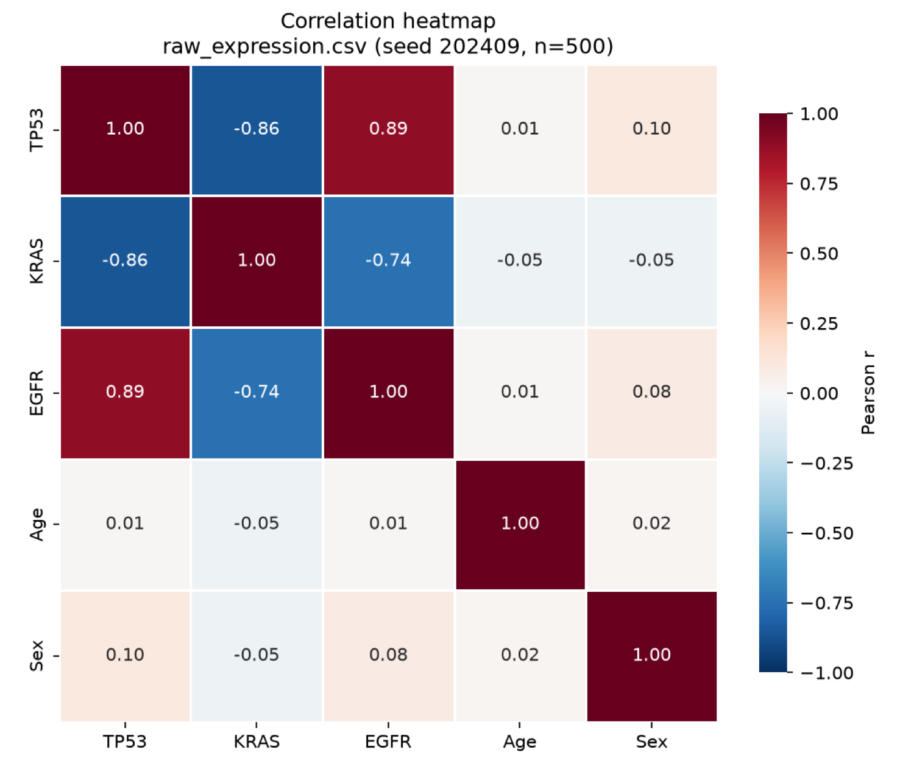

---

### 04. selfplay automl
> 题目：自我博弈的 AutoML 调试循环（Self-Play AutoML）　·　2026-09-04 23:00:50

**一句话裁决**：自我博弈两代分类器 ROC-AUC 差 4.4e-5、McNemar p=1.0：无显著差异，诚实建议保留 v1，拒绝为“迭代”而换版。

*Self-play v2 vs v1: ROC-AUC delta 4.4e-5, McNemar p=1.0 — no significant gain, so the honest recommendation is to keep v1 instead of churning a release.*

产物：[求解器 `classifier_v1.py`](cases/04-selfplay-automl/classifier_v1.py) · [求解器 `classifier_v2.py`](cases/04-selfplay-automl/classifier_v2.py) · [图 `figure_roc_comparison.png`](cases/04-selfplay-automl/figure_roc_comparison.png) · [数据 `model_comparison.json`](cases/04-selfplay-automl/model_comparison.json)

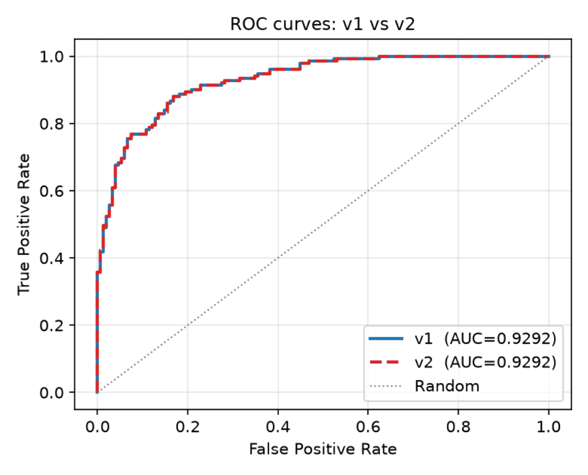

---

### 05. adc bystander ifp adjudication
> 题目：矛盾文献仲裁与因果反转测试　·　2026-09-04 23:16:51

**一句话裁决**：“T-DM1 换可裂解连接子即等同 T-DXd”不成立：化学手柄/赖氨酸 DAR≈3.5/释放产物通透性三层独立失败；不可定位实测值全部入 Data-Gap 清单。

*"Swap T-DM1's linker and get T-DXd" fails on three independent layers — payload chemistry, lysine DAR≈3.5, release-product permeability; every unlocatable experimental value goes to the Data-Gap list.*

产物：[求解器 `adc_bystander_diffusion_model.py`](cases/05-adc-bystander-ifp-adjudication/adc_bystander_diffusion_model.py) · [图 `bystander_diffusion_model.png`](cases/05-adc-bystander-ifp-adjudication/bystander_diffusion_model.png) · [数据 `bystander_model_assumptions.json`](cases/05-adc-bystander-ifp-adjudication/bystander_model_assumptions.json) · [数据 `payload_properties_comparison.csv`](cases/05-adc-bystander-ifp-adjudication/payload_properties_comparison.csv) · [报告 `report.md`](cases/05-adc-bystander-ifp-adjudication/report.md)

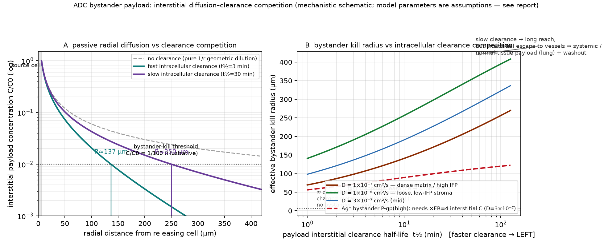

---

### 06. ferroptosis glioma statistics
> 题目：跨学科生信数据逆向对齐与假阳性清洗　·　2026-09-04 23:40:44

**一句话裁决**：多因素调整使 SLC7A11 假性风险 HR 2.49→0.97（P=0.771）：非共线性数值假象，而是 IDH/1p19q/分级的结构性混杂；并捕获 WHO Ⅲ“保护→危险”的逆向混杂（0.40→2.05）。

*Adjusting for IDH1/1p19q/grade collapses SLC7A11's apparent HR from 2.49 to 0.97 (P=0.771) — confounding structure, not collinearity; a Simpson's-paradox reversal (WHO III 0.40→2.05) is caught and explained.*

产物：[求解器 `ferroptosis_glioma_model.py`](cases/06-ferroptosis-glioma-statistics/ferroptosis_glioma_model.py) · [图 `forest_ferroptosis_glioma.png`](cases/06-ferroptosis-glioma-statistics/forest_ferroptosis_glioma.png) · [归档(字节一致) `report.md.gz`](cases/06-ferroptosis-glioma-statistics/report.md.gz) · [数据 `results_audit_slc7a11.csv`](cases/06-ferroptosis-glioma-statistics/results_audit_slc7a11.csv) · [数据 `results_multivariable.csv`](cases/06-ferroptosis-glioma-statistics/results_multivariable.csv) · [数据 `results_summary.json`](cases/06-ferroptosis-glioma-statistics/results_summary.json) · [数据 `results_univariable.csv`](cases/06-ferroptosis-glioma-statistics/results_univariable.csv) · [数据 `results_vif.csv`](cases/06-ferroptosis-glioma-statistics/results_vif.csv) · [数据 `sim_cohort.csv`](cases/06-ferroptosis-glioma-statistics/sim_cohort.csv)

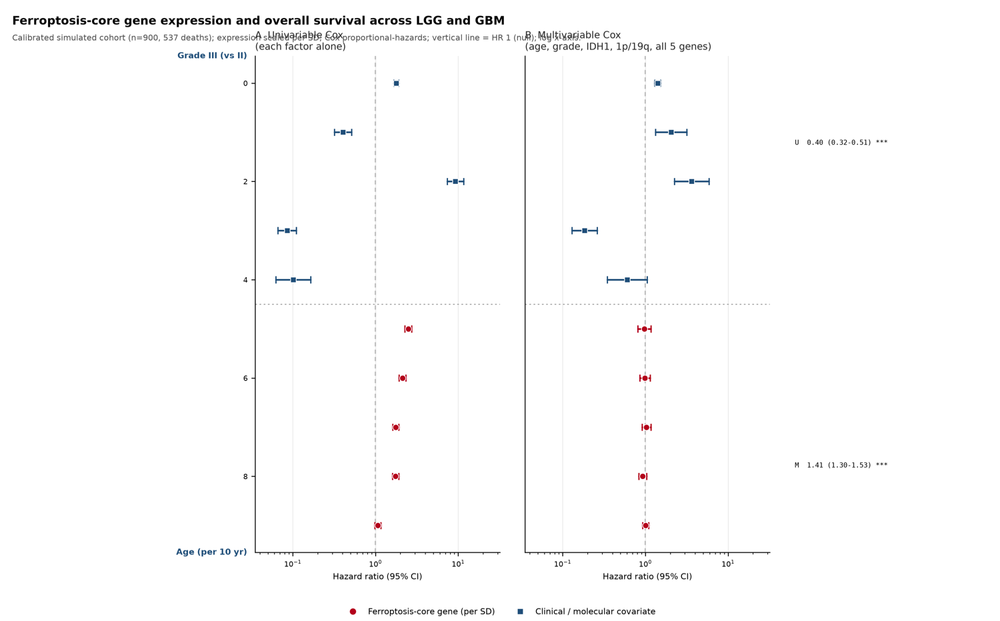

---

### 07. thalidomide imid chirality
> 题目：反向工程药物设计中的化学合成与立体选择性陷阱　·　2026-09-05 08:11:10

**一句话裁决**：单一 (R)-对映体给药在给药间隔尺度必然失守（C3′–H 去质子化→体内快速消旋）；要击败翻转只能改分子（加固手性中心），不能改剂型/纯度。

*Enantiopure (R)-thalidomide cannot survive one dosing interval — C3′–H deprotonation drives rapid in-vivo racemization; beating racemization means changing the molecule, not the formulation.*

产物：[数据 `imids_feature_matrix.csv`](cases/07-thalidomide-imid-chirality/imids_feature_matrix.csv) · [图 `imids_structures.png`](cases/07-thalidomide-imid-chirality/imids_structures.png) · [报告 `report.md`](cases/07-thalidomide-imid-chirality/report.md)

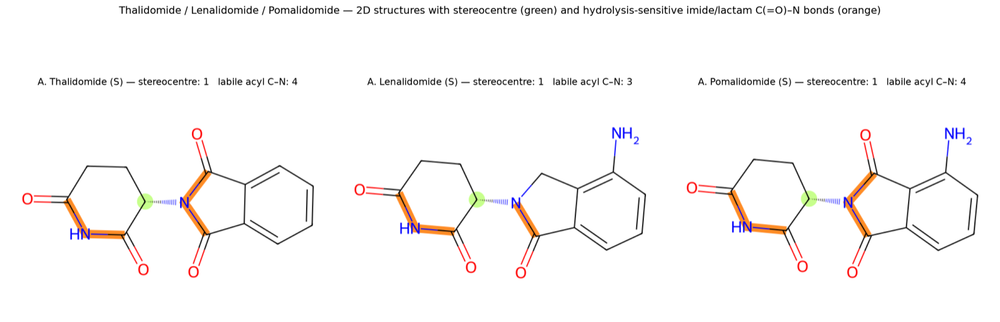

---

## Wave 1 · 化学弹头与分子机器（09-05 上半）

### 08. ecoli pca metabolic thermo
> 题目：合成生物学与代谢通量平衡的“热力学与毒性盲区”　·　2026-09-05 11:54:34

**一句话裁决**：“热力学阻遏”真身是 TAL 底物饥饿；外排（AaeXAB）只把毒搬出胞——无 ISPR/两相/pH≥7 控制仍回漏并耗 PMF；外排+体系级去毒缺一不可。

*The real bottleneck is not product thermodynamics but tyrosine-precursor starvation; efflux only moves the toxin out of the cell — without ISPR/two-phase/pH control it leaks back and drains PMF. Both layers are required.*

产物：[图 `fig_thermo.png`](cases/08-ecoli-pca-metabolic-thermo/fig_thermo.png) · [求解器 `metabolic_flux_ode_sim.py`](cases/08-ecoli-pca-metabolic-thermo/metabolic_flux_ode_sim.py) · [报告 `report.md`](cases/08-ecoli-pca-metabolic-thermo/report.md) · [数据 `sim_summary.csv`](cases/08-ecoli-pca-metabolic-thermo/sim_summary.csv)

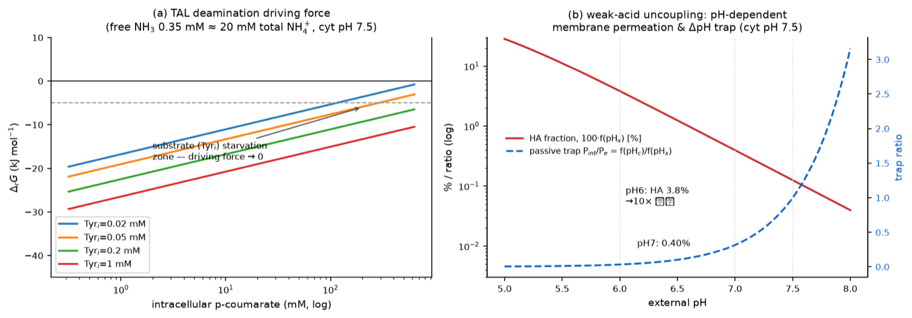

---

### 09. protac hook effect
> 题目：PROTAC 三元复合物非单调结合动力学与“钩状效应（Hook Effect）”建模　·　2026-09-05 12:25:13

**一句话裁决**：Hook 峰位≈√(Kd1·Kd2)，与协同性 α 无关（α 只调幅度/窗口）；"超短刚性 linker 消除 Hook"被数学必然性、SAR（PEG-2 最差）与结构证据三条独立路径证伪。

*Hook peak position ≈√(Kd1·Kd2) is independent of cooperativity; the "ultra-short rigid linker kills the Hook" claim is falsified three independent ways — mass-balance mathematics, SAR (PEG-2 worst), and structural evidence.*

产物：[图 `fig_hook_kinetics.png`](cases/09-protac-hook-effect/fig_hook_kinetics.png) · [求解器 `protac_hook_kinetics.py`](cases/09-protac-hook-effect/protac_hook_kinetics.py) · [报告 `report.md`](cases/09-protac-hook-effect/report.md)

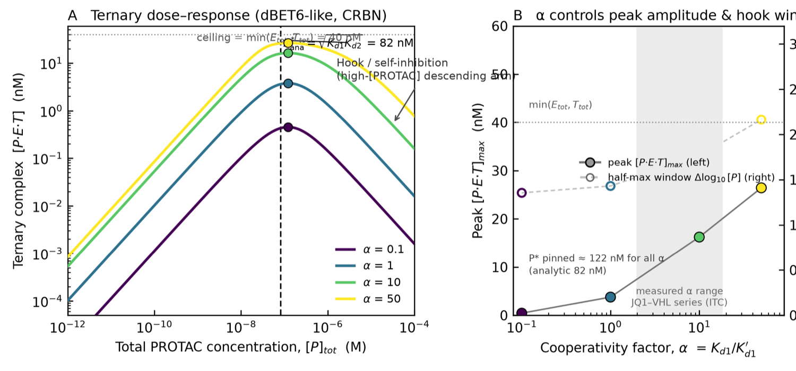

---

### 10. cd8 pseudotime dissociation
> 题目：空间转录组与单细胞伪时序（Pseudotime）反向因果审查　·　2026-09-05 12:55:35

**一句话裁决**：解离应激把 15% 污染细胞 100% 推入“终末”分支（占其 48%）；基因过滤/回归校正把 F1 0.52→0.96；并以表观遗传证据证伪“Tpex/Tex 纯属假象”的激进假说。

*Dissociation stress routes 100% of stressed cells into the terminal branch (48% of it); filtering/regression restores F1 0.52→0.96, and epigenetic evidence refutes the radical "exhaustion subsets are pure artifacts" claim.*

产物：[图 `fig1_pseudotime_drift_terminal.png`](cases/10-cd8-pseudotime-dissociation/fig1_pseudotime_drift_terminal.png) · [图 `fig3_module_kinetics_raw_vs_corrected.png`](cases/10-cd8-pseudotime-dissociation/fig3_module_kinetics_raw_vs_corrected.png) · [数据 `metrics_terminal_transfer.csv`](cases/10-cd8-pseudotime-dissociation/metrics_terminal_transfer.csv) · [数据 `per_cell_pseudotime.csv`](cases/10-cd8-pseudotime-dissociation/per_cell_pseudotime.csv) · [报告 `report.md`](cases/10-cd8-pseudotime-dissociation/report.md) · [数据 `sim_cd8t_counts.csv`](cases/10-cd8-pseudotime-dissociation/sim_cd8t_counts.csv) · [数据 `sim_cd8t_metadata.csv`](cases/10-cd8-pseudotime-dissociation/sim_cd8t_metadata.csv)

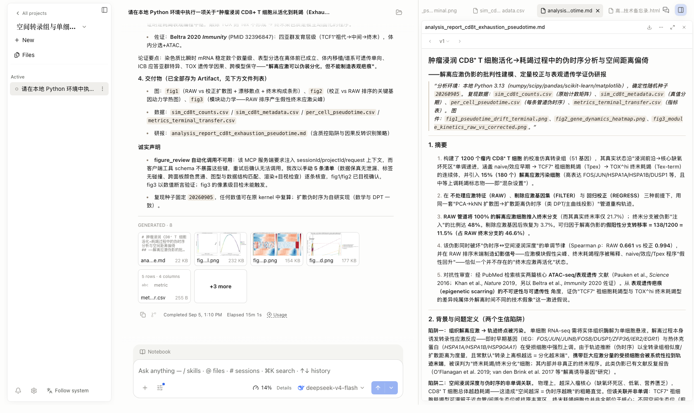

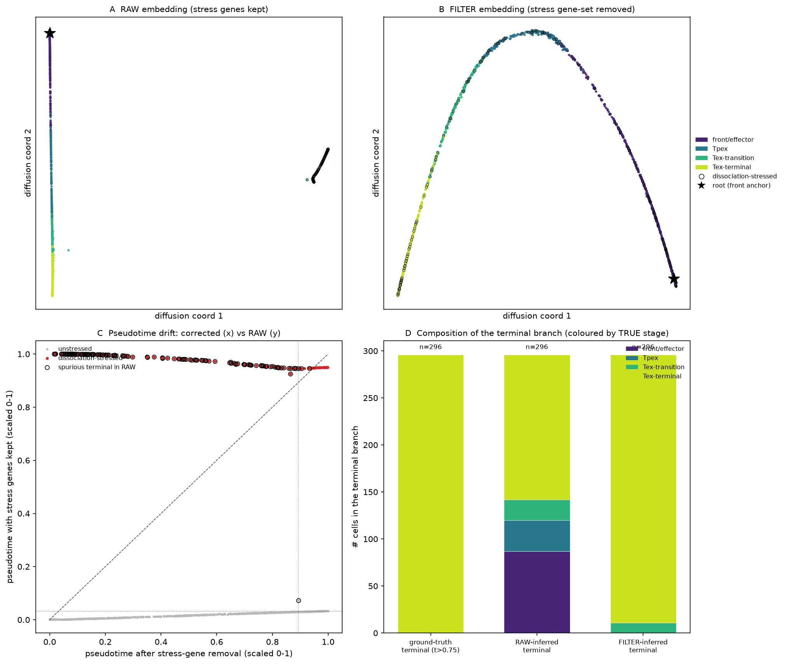

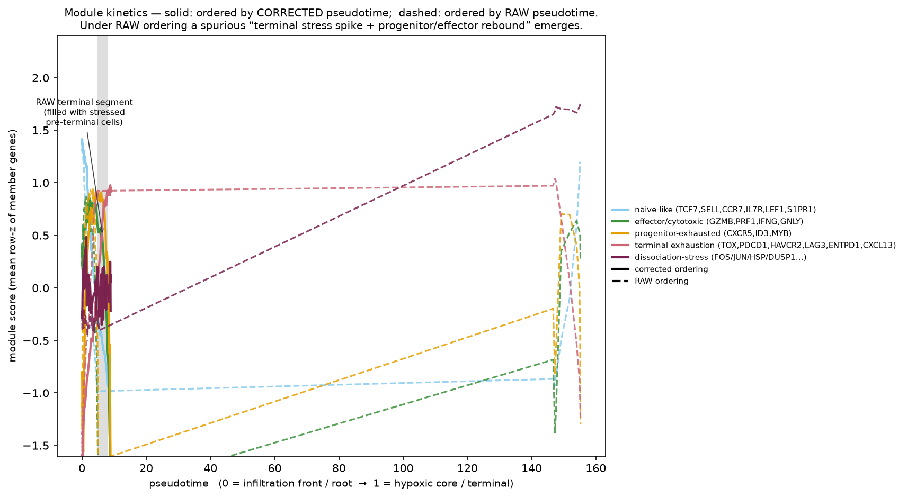

---

### 11. mab viscosity formulation
> 题目：复杂生物制剂（抗体/双抗）配方热力学稳定性与自聚集相分离审查　·　2026-09-05 13:12:26

**一句话裁决**：黏度悬崖的判据是 B22/kD 而非浓度；pI8.5/pH6 下 150 mM NaCl 在机制、热力学与证伪逻辑三层不成立且方向反了；正解是 Arg·HCl+表面活性剂+状态空间再设计。

*Viscosity cliffs are governed by B22/kD, not concentration; at pI 8.5 / pH 6 the "add 150 mM NaCl" fix fails on mechanism, thermodynamics and logic alike — the industry path is Arg·HCl, surfactant, and formulation-state redesign.*

产物：[图 `figure_viscosity_explosion_B22.png`](cases/11-mab-viscosity-formulation/figure_viscosity_explosion_B22.png) · [求解器 `mab_viscosity_B22_simulation.py`](cases/11-mab-viscosity-formulation/mab_viscosity_B22_simulation.py)

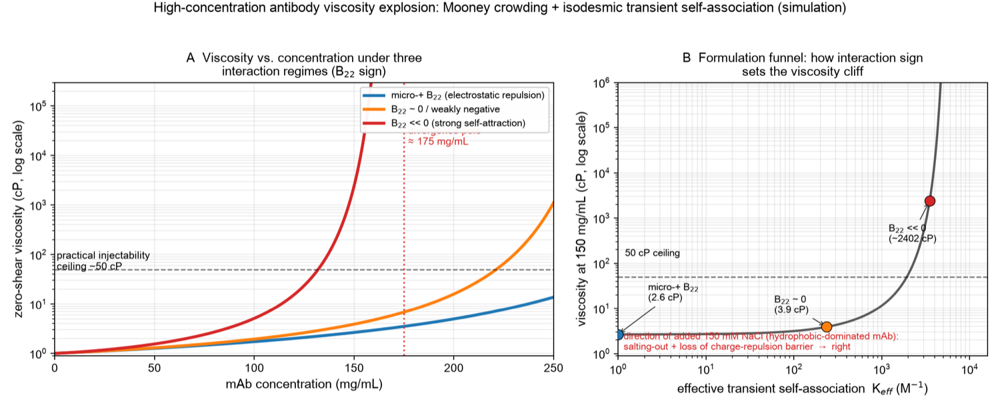

---

### 12. tci thiol trojan
> 题目：靶向共价抑制剂（TCI）的二次活化与亲电弹头“跨室相移”竞争（药物化学与反应动力学）　·　2026-09-05 13:35:55

**一句话裁决**：胞质 GSH 可逆≠安全：<1% 单体借 D-SG/D-SCoA 载体入线粒体，在碱性基质中转为动力学陷阱，对 PDH/Trx2 造成准不可逆损伤——表观高选择性可与蓄积毒性共存。

*Cytosolic reversibility is not safety: under 1% of monomer rides D-SG/D-SCoA shuttles into mitochondria, where alkaline pH turns reversible adducts into kinetic traps — apparent selectivity coexists with accumulating mitochondrial damage.*

产物：[报告 `report.md`](cases/12-tci-thiol-trojan/report.md) · [图 `tci_fig5_trojan_retention.png`](cases/12-tci-thiol-trojan/tci_fig5_trojan_retention.png) · [数据 `tci_model_summary.csv`](cases/12-tci-thiol-trojan/tci_model_summary.csv) · [求解器 `tci_thiol_exchange_kinetics.py`](cases/12-tci-thiol-trojan/tci_thiol_exchange_kinetics.py) · [图 `tci_timeseries.png`](cases/12-tci-thiol-trojan/tci_timeseries.png)

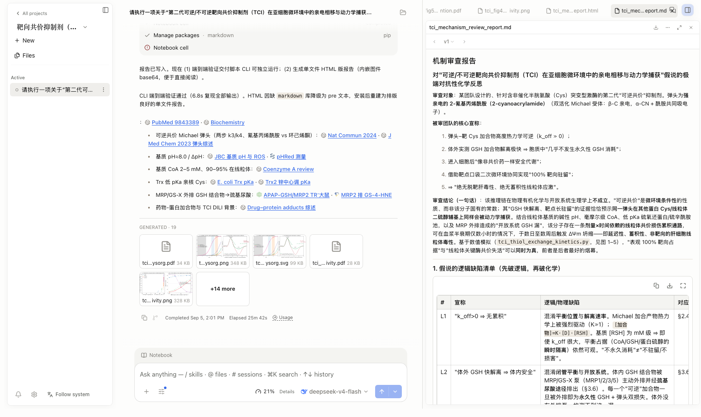

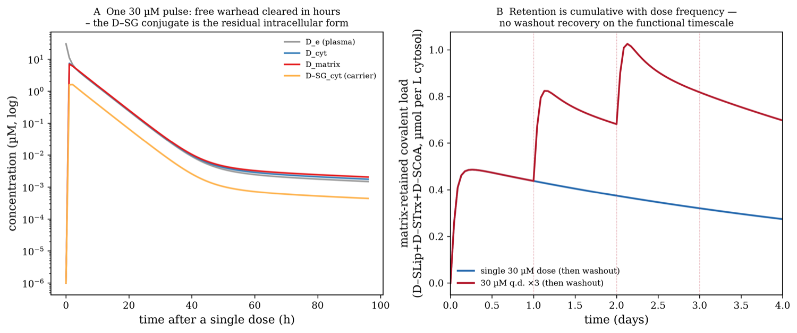

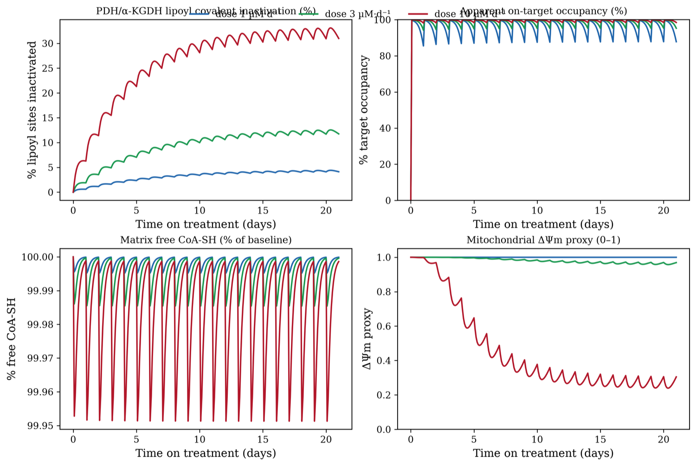

---

### 13. mrna lnp endosomal
> 题目：mRNA-LNP 复杂制剂的跨相转变、内体逃逸“几何受阻”与刚性膜熔合悖论（生物物理与纳米流体）　·　2026-09-05 14:03:10

**一句话裁决**：DSPC→DOPE 全替换 + pKa 6.8：极限负曲率让 HII 相在 PEG 脱落前内塌，把 mRNA 锁死在脱水晶畴（逃逸 ~0.001% 级）；真正逃逸窗在晚期内体 pH 6.0–6.2 与 PEG 脱落的竞速。

*Full DOPE replacement + pKa 6.8 collapses the particle into HII before PEG sheds, locking mRNA in dehydrated domains (~0.001% escape); the real window is the late-endosome pH 6.0–6.2 race against PEG loss.*

产物：[图 `fig1_geometry_packing_vs_pH.png`](cases/13-mrna-lnp-endosomal/fig1_geometry_packing_vs_pH.png) · [图 `fig3_fusion_barrier_landscape.png`](cases/13-mrna-lnp-endosomal/fig3_fusion_barrier_landscape.png) · [求解器 `lnp_endosomal_escape_thermodynamics.py`](cases/13-mrna-lnp-endosomal/lnp_endosomal_escape_thermodynamics.py) · [报告 `report.md`](cases/13-mrna-lnp-endosomal/report.md) · [数据 `table_formulation_metrics.csv`](cases/13-mrna-lnp-endosomal/table_formulation_metrics.csv) · [数据 `table_packing_parameter.csv`](cases/13-mrna-lnp-endosomal/table_packing_parameter.csv) · [数据 `table_ph_sweep.csv`](cases/13-mrna-lnp-endosomal/table_ph_sweep.csv)

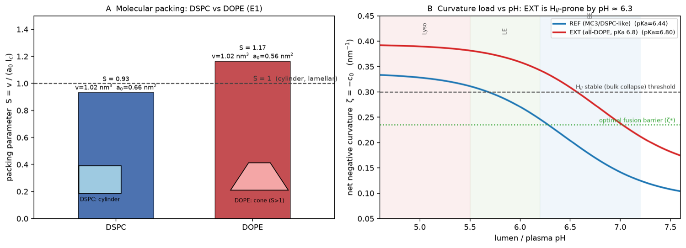

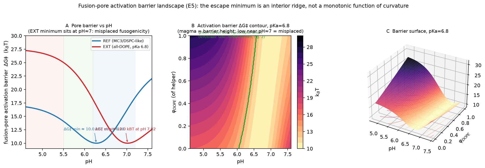

---

### 14. crispr epigenetic spreading
> 题目：合成表观遗传学：CRISPR-dCas9 靶向 DNA 甲基化编辑中的“表观连锁漂移”与非靶向染色质塌陷（表观基因组学与非平衡态物理）　·　2026-09-05 15:03:05

**一句话裁决**：“精准/永久/封闭”共用同一条自促正反馈通路：要么约 10 代内回退失效，要么波前扩散并（依 CTCF 边界 β*≈0.70）演化为 TAD 级沉默；线性 18 代→3D 跳跃 2 代殖民。

*"Precise, permanent, confined" share one autocatalytic path — editing either reverts within ~10 divisions or spreads as a bistable wavefront (CTCF barrier threshold β*≈0.70); 3D looping colonizes distal loci in 2 generations vs 18 in 1D.*

产物：[求解器 `epigenetic_spreading_lattice_sim.py`](cases/14-crispr-epigenetic-spreading/epigenetic_spreading_lattice_sim.py) · [图 `fig1_methylation_heatmap.png`](cases/14-crispr-epigenetic-spreading/fig1_methylation_heatmap.png) · [图 `fig2_regime_phase_diagram.png`](cases/14-crispr-epigenetic-spreading/fig2_regime_phase_diagram.png) · [报告 `report.md`](cases/14-crispr-epigenetic-spreading/report.md) · [数据 `simulation_metrics.json`](cases/14-crispr-epigenetic-spreading/simulation_metrics.json)

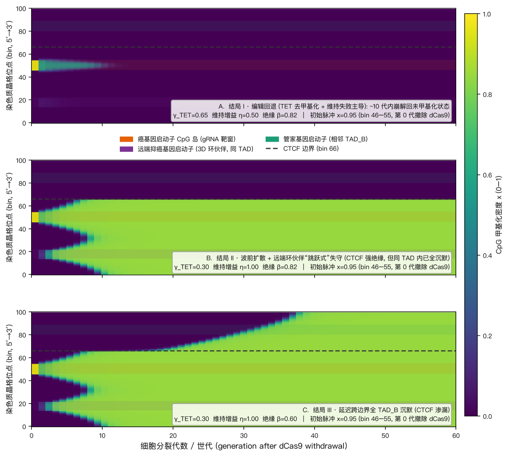

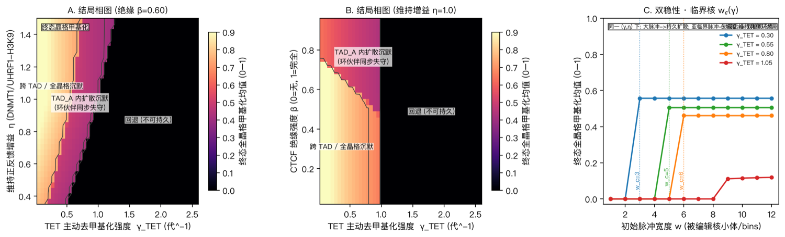

---

## Wave 2 · 非平衡动力学与活体系统（09-05 下半）

### 15. tpd futile ubiquitination
> 题目：类泛素化（PROTAC/分子胶）系统的非热力学稳态耗散与“无益泛素链（Futile Polyubiquitination）”动力学塌陷　·　2026-09-05 15:50:17

**一句话裁决**：超紧密结合（koff≈1e-5）锁死底物取样→链长冻结在 ~1.0；24 h 内 ~5000 次无效催化、无益指数 4.3e5、Dmax<1%；高效降解需要 Goldilocks 停留窗（1.4–1000 s）。

*Too-tight binding (koff≈1e-5 s⁻¹) freezes substrate sampling and chain length near 1.0; ~5,000 futile catalytic attempts per day, futility index 4.3e5, Dmax<1%. Efficient degradation needs the Goldilocks residence window (1.4–1000 s).*

产物：[图 `fig1_degradation_heatmap.png`](cases/15-tpd-futile-ubiquitination/fig1_degradation_heatmap.png) · [图 `fig2_chain_species_timecourse.png`](cases/15-tpd-futile-ubiquitination/fig2_chain_species_timecourse.png) · [报告 `report.md`](cases/15-tpd-futile-ubiquitination/report.md) · [求解器 `tpd_ubiquitination_futile_cycle.py`](cases/15-tpd-futile-ubiquitination/tpd_ubiquitination_futile_cycle.py)

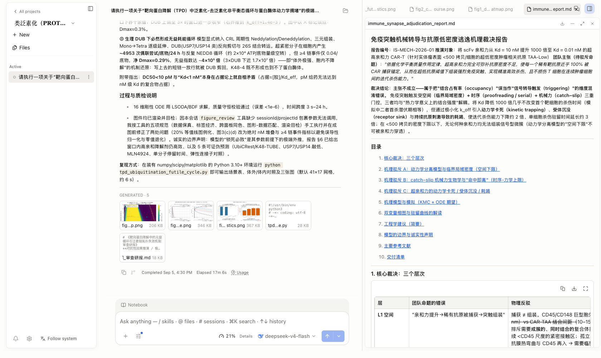

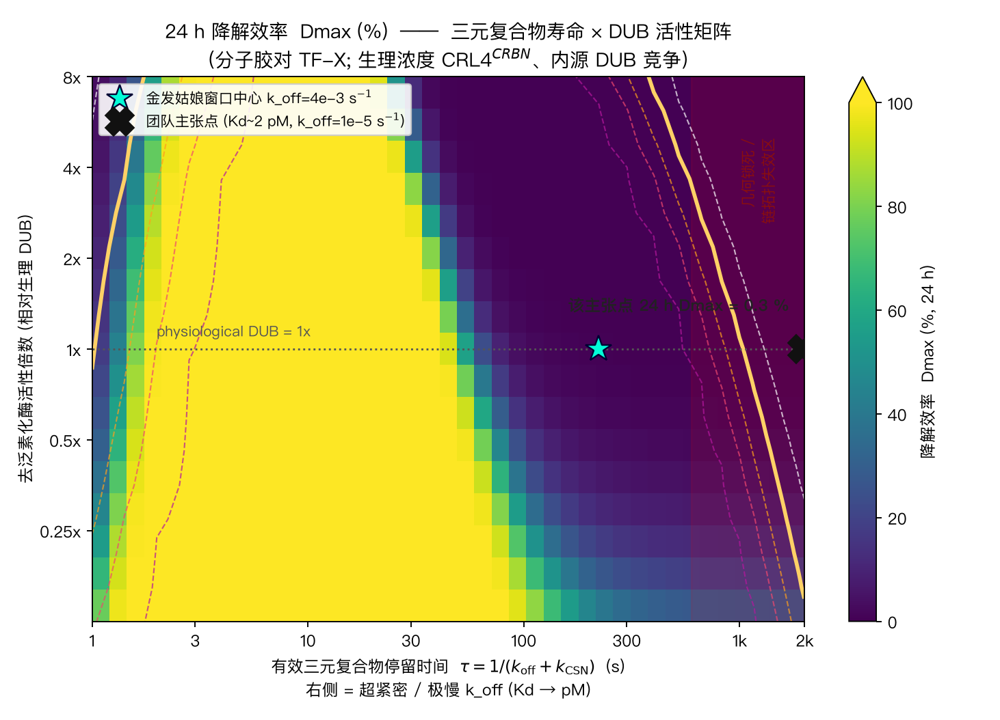

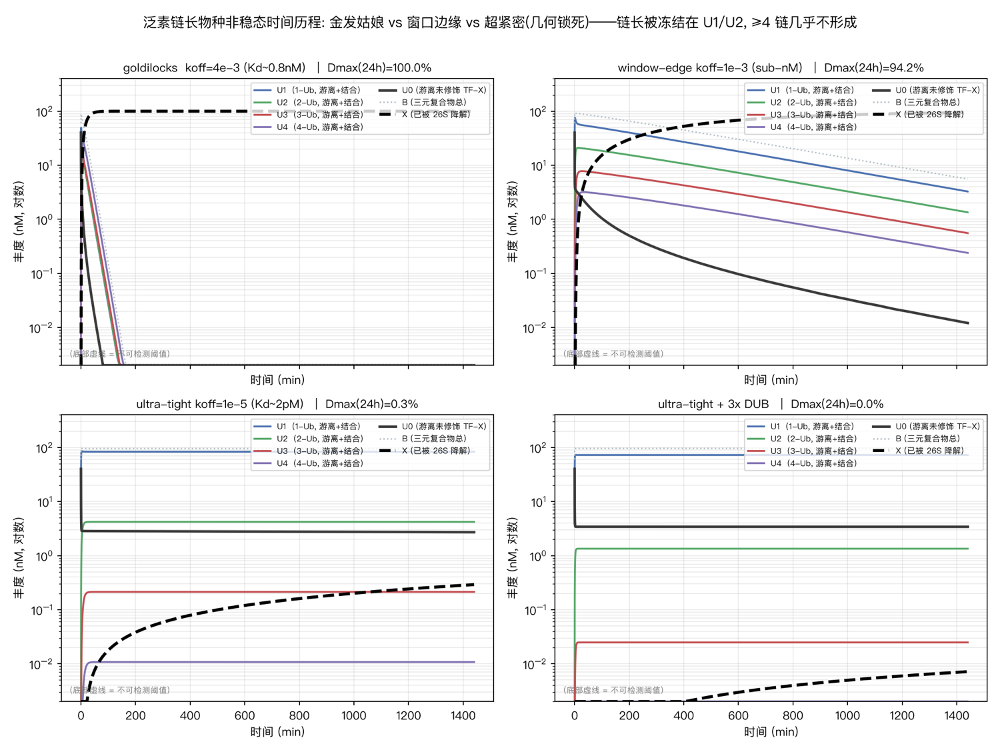

---

### 16. repressilator host load
> 题目：合成生物学基因振荡器的非线性相空间失稳与“转录代谢负载（Metabolic Load）”引发的混沌塌陷　·　2026-09-05 18:21:18

**一句话裁决**：强表达并不致混沌（全参数扫描 λ1≤0，Lyapunov 无正根）——纠偏出题诱导；真实死因是负荷耦合 λ=λ(负荷) 的隐式正反馈引发的逆 Hopf 振荡死亡；弱启动子+LVA 标签才是固有时钟。

*No chaos exists in this smooth deterministic model (Lyapunov scan λ1≤0) — the prompt's suggestion is corrected; the real failure is inverse-Hopf oscillation death driven by load-coupled dilution. Weak promoters + LVA tags give the robust clock.*

产物：[图 `fig1_drive_landscape.png`](cases/16-repressilator-host-load/fig1_drive_landscape.png) · [图 `fig3_lyapunov.png`](cases/16-repressilator-host-load/fig3_lyapunov.png) · [数据 `lyapunov_scan.json`](cases/16-repressilator-host-load/lyapunov_scan.json) · [数据 `regime_scan.json`](cases/16-repressilator-host-load/regime_scan.json) · [报告 `report.md`](cases/16-repressilator-host-load/report.md) · [求解器 `repressilator_metabolic_load_sim.py`](cases/16-repressilator-host-load/repressilator_metabolic_load_sim.py)

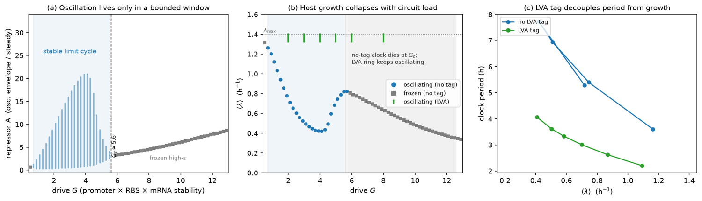

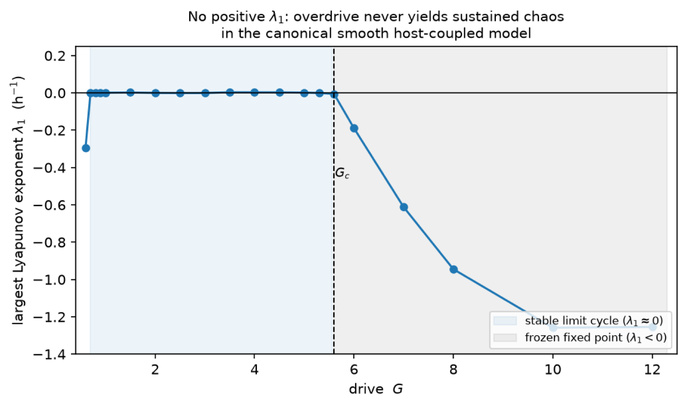

---

### 17. cart immune synapse
> 题目：CAR-T / 双特异性抗体的抗原低密度“触碰即跑（Hit-and-Run）”与机械力转导门控失效　·　2026-09-05 19:08:12

**一句话裁决**：低于 ~500 拷贝/细胞时膜无法被钉扎以排除 CD45，亲和力做到无穷大信号输出也≈0；0.01 nM 把 CAR 焊死在首靶（驻留 27 h+），摧毁串行触发与迭代杀伤。

*Below ~500 copies/cell the membrane cannot be pinned to exclude CD45, so signaling stays ≈0 at any affinity; 0.01 nM welds the CAR to its first target (>27 h residence), destroying serial triggering and sequential killing.*

产物：[图 `fig1_signal_output_phase_diagram.png`](cases/17-cart-immune-synapse/fig1_signal_output_phase_diagram.png) · [图 `fig2_residence_and_serial_killing.png`](cases/17-cart-immune-synapse/fig2_residence_and_serial_killing.png) · [求解器 `immune_synapse_mechanobiology_sim.py`](cases/17-cart-immune-synapse/immune_synapse_mechanobiology_sim.py) · [报告 `report.md`](cases/17-cart-immune-synapse/report.md)

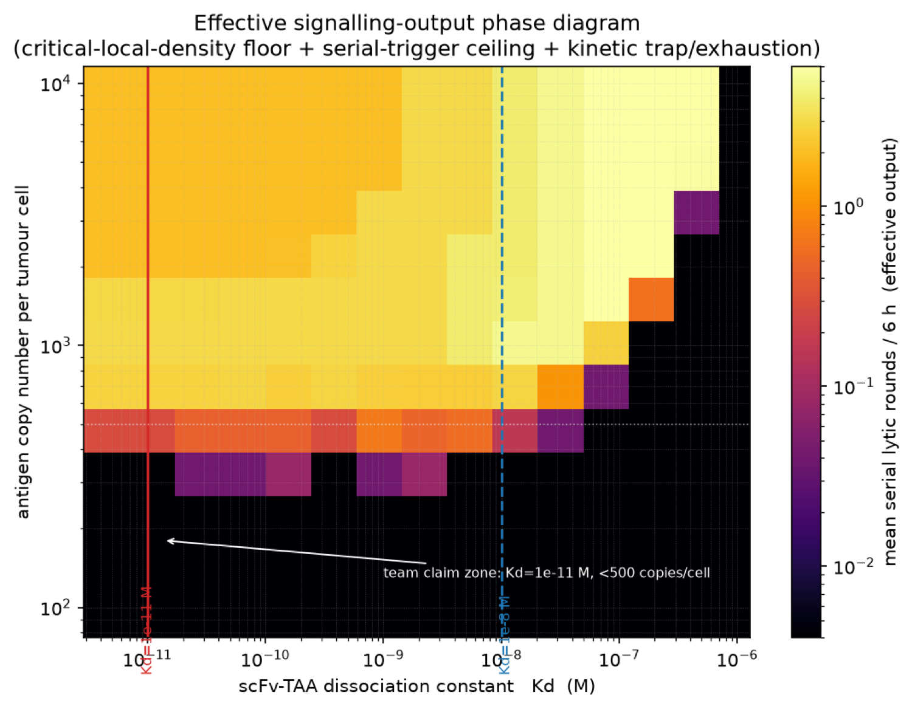

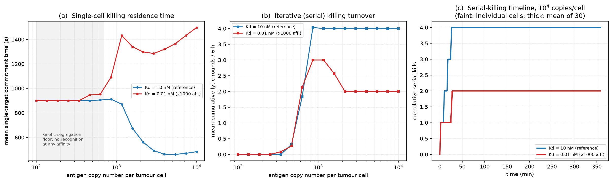

---

### 18. lyophilization subtg
> 题目：高分子/冷冻干燥制剂中的“反玻璃化（Devitrification）”与水合壳微观渗流塌陷（软物质物理与玻璃态转变动力学）　·　2026-09-05 21:03:28

**一句话裁决**：Tg−40 ℃ 并非冻结：JG β-弛豫（τ≈4.3e-4 s）与结合水动力学（τ≈2.6e-6 s）五年执行数万亿次涨落；甘露醇结晶排水把表面水推过 2D 渗流阈值 pc≈0.5927，驱动 ~5% 化学退化。

*Tg−40 °C is not frozen: Johari-Goldstein β-relaxation (τ≈4.3e-4 s) and bound water (τ≈2.6e-6 s) execute trillions of fluctuations in 5 years; mannitol crystallization pushes surface water past the 2D percolation threshold (pc≈0.5927), driving ~5% chemical degradation.*

产物：[图 `fig3_percolation_crossing.png`](cases/18-lyophilization-subtg/fig3_percolation_crossing.png) · [图 `fig5_msd.png`](cases/18-lyophilization-subtg/fig5_msd.png) · [求解器 `lyophilization_devitrification_kinetics.py`](cases/18-lyophilization-subtg/lyophilization_devitrification_kinetics.py) · [报告 `report.md`](cases/18-lyophilization-subtg/report.md) · [说明 `sim_summary.txt`](cases/18-lyophilization-subtg/sim_summary.txt)

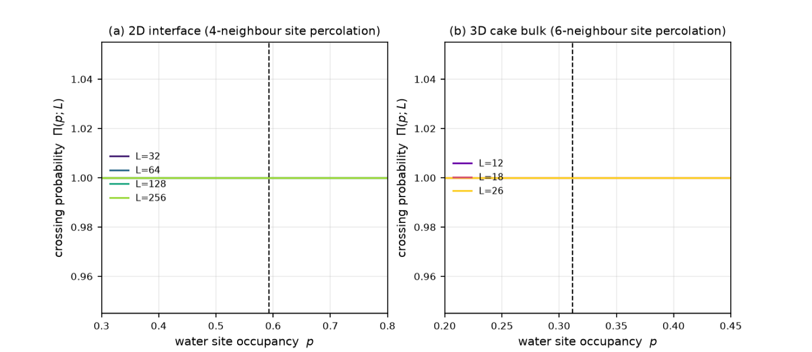

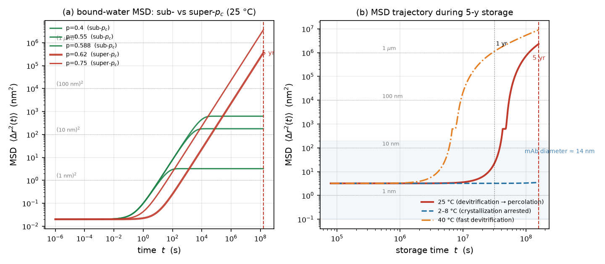

---

### 19. bacteria cheater evolution
> 题目：溶瘤病毒/工程菌肿瘤递送中的“自私突变体（Cheater Dynamics）”生态反噬与群体感应失效（演化博弈论与合成生态学）　·　2026-09-05 21:21:47

**一句话裁决**：每个裂解脉冲把不裂解的作弊者放大 20–50×；越过错位阈值后 AHL 永不达触发浓度，脉冲数周期内骤停；空间阻隔只推迟 3–4× 且产生"静默接管"的监测假安全。

*Every lysis pulse amplifies cheaters 20–50×; past a critical fraction AHL never reaches threshold and the clock stops within a few pulses. Spatial structure delays the crash 3–4× but produces a deceptive "silent takeover" under pulse monitoring.*

产物：[求解器 `cheater_evolution_spatial_sim.py`](cases/19-bacteria-cheater-evolution/cheater_evolution_spatial_sim.py) · [图 `fig2_dose_pulse_decay.png`](cases/19-bacteria-cheater-evolution/fig2_dose_pulse_decay.png) · [图 `fig3_spatial_phase.png`](cases/19-bacteria-cheater-evolution/fig3_spatial_phase.png) · [报告 `report.md`](cases/19-bacteria-cheater-evolution/report.md) · [数据 `summary_statistics.json`](cases/19-bacteria-cheater-evolution/summary_statistics.json)

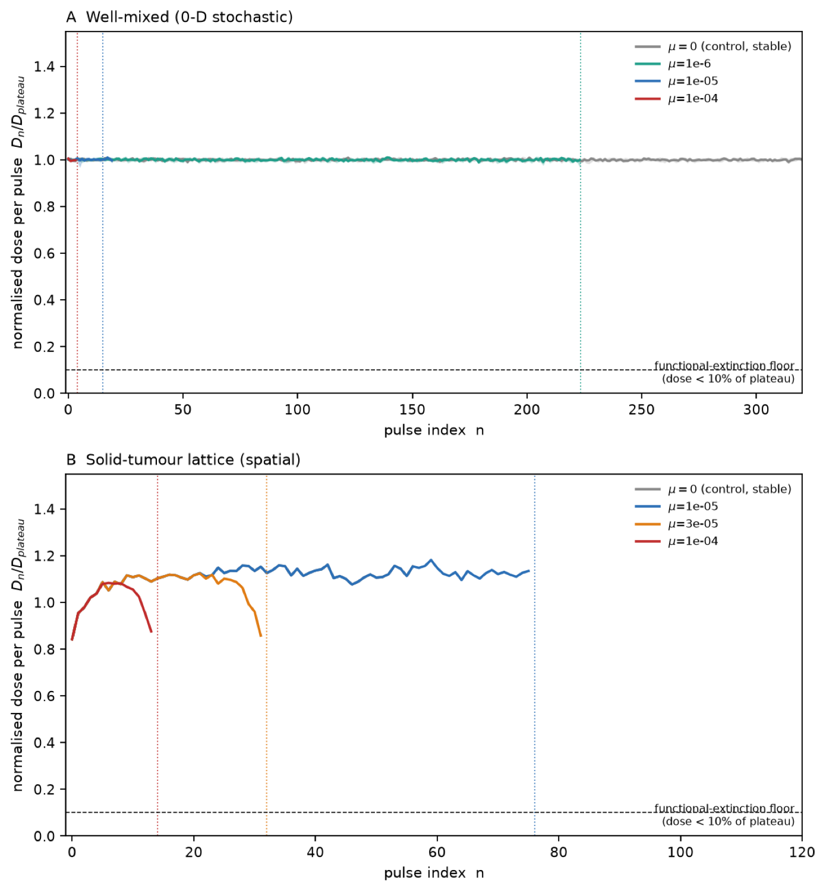

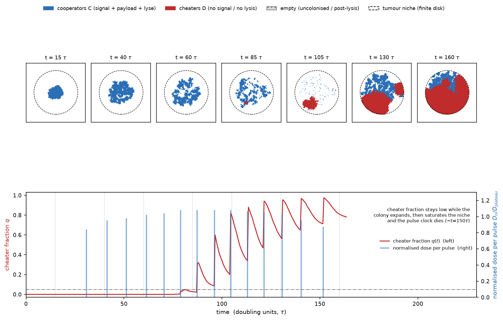

---

### 20. bnab epistasis rigidity
> 题目：抗体亲和力成熟与定向进化中的“上位性冻结（Epistatic Freezing）”与免疫受体构象熵陷阱（结构免疫学与适应度地形分析）　·　2026-09-05 22:10:16

**一句话裁决**：5 突变组合被负上位性吞掉 ~5.5 kBT（≈10×），表现劣于最优双突变体；N_eff 1100→306 的刚性化使电荷反转株 Kd 恶化 65×——极限亲和优化与广谱中和互斥。

*The 5-mutation combo loses ~5.5 kBT (~10×) to negative epistasis and underperforms the best double mutant; rigidification (N_eff 1100→306) degrades binding 65× on charge-reversed variants — extreme affinity and breadth are mutually exclusive.*

产物：[求解器 `antibody_epistasis_landscape_sim.py`](cases/20-bnab-epistasis-rigidity/antibody_epistasis_landscape_sim.py) · [图 `fig2_epistasis_landscape.png`](cases/20-bnab-epistasis-rigidity/fig2_epistasis_landscape.png) · [图 `fig3_breadth_titers.png`](cases/20-bnab-epistasis-rigidity/fig3_breadth_titers.png) · [数据 `report_numbers.json`](cases/20-bnab-epistasis-rigidity/report_numbers.json) · [数据 `summary.json`](cases/20-bnab-epistasis-rigidity/summary.json) · [数据 `variant_table.csv`](cases/20-bnab-epistasis-rigidity/variant_table.csv)

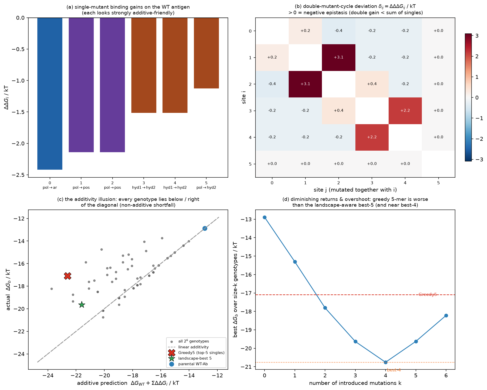

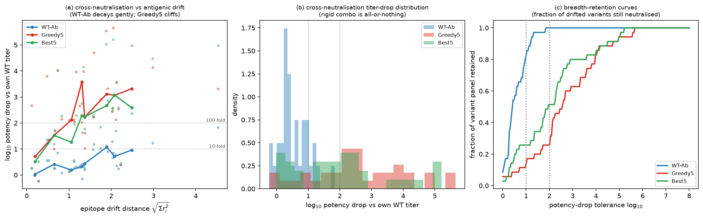

---

### 21. rna small molecule polyelectrolyte
> 题目：RNA 靶向小分子（rSM）的“构象诱导折叠与动态隐匿口袋”热力学悖论与选择性崩塌　·　2026-09-05 23:16:35

**一句话裁决**：低盐 ITC 的 0.15 nM 在生理离子强度退化为 0.1–1 µM（反离子熵增益被剥离）；强负 ΔS 暴露"错折叠捕获"死端；>95% 剂量被宿主结构 RNA 吸附，在靶占有率仅 ~0.2%。

*The 0.15 nM measured in low salt collapses to 0.1–1 µM at physiological ionic strength (counterion-release entropy stripped); the strongly negative ΔS exposes a misfolded-state trap; >95% of dose is adsorbed by host RNA — on-target occupancy ≈0.2%.*

产物：[图 `fig1_ion_release_fraction_phase.png`](cases/21-rna-small-molecule-polyelectrolyte/fig1_ion_release_fraction_phase.png) · [图 `fig3_ontarget_fraction_collapse.png`](cases/21-rna-small-molecule-polyelectrolyte/fig3_ontarget_fraction_collapse.png) · [报告 `report.md`](cases/21-rna-small-molecule-polyelectrolyte/report.md) · [求解器 `rsm_rna_conformation_trap_sim.py`](cases/21-rna-small-molecule-polyelectrolyte/rsm_rna_conformation_trap_sim.py) · [数据 `rsm_sim_summary.json`](cases/21-rna-small-molecule-polyelectrolyte/rsm_sim_summary.json)

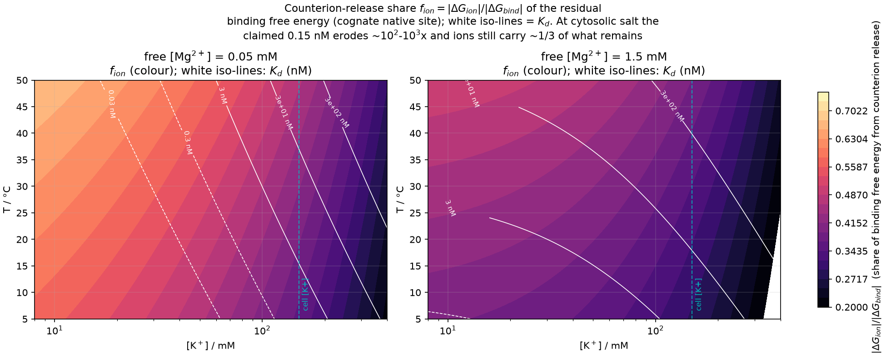

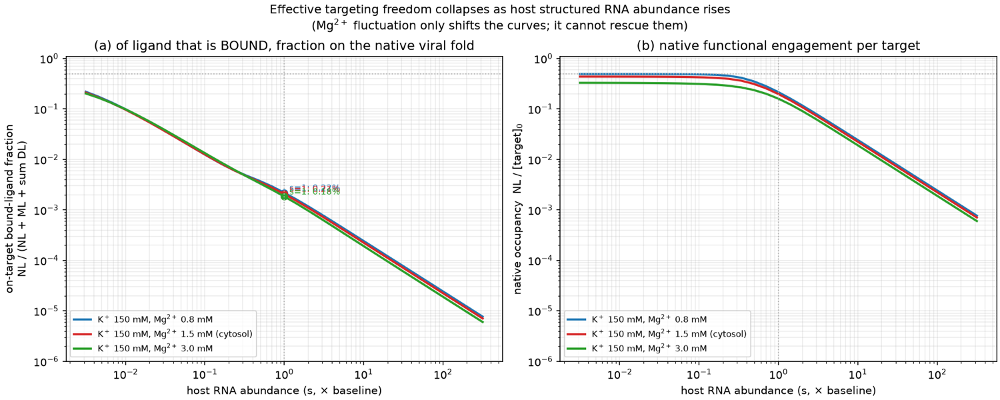

---

### 22. antibody dcp cold reversal
> 题目：抗体-抗原识别界面的微观流变学、水分子桥滞留与低温亲和力反转（物理化学与抗体工程）　·　2026-09-05 23:46:29

**一句话裁决**：ΔCp≈−1~−2.5 kcal/(mol·K) 令 ΔG(T) 为开口抛物线：最高亲和力在 T_H（ΔH=0）而非 T_S；冷储可进入吸热区脱结合；界面水桥熵锁定使表观驻留 200 h→5.7 h。

*With ΔCp≈−1 to −2.5 kcal/(mol·K), ΔG(T) is a convex parabola — peak affinity sits at T_H (ΔH=0), not T_S; cold storage can enter the endothermic regime and shed binding; interfacial water entropy cuts apparent residence from >200 h to ~5.7 h.*

产物：[求解器 `antibody_dcp_thermodynamics_sim.py`](cases/22-antibody-dcp-cold-reversal/antibody_dcp_thermodynamics_sim.py) · [图 `fig2_vantoff_deviation.png`](cases/22-antibody-dcp-cold-reversal/fig2_vantoff_deviation.png) · [图 `fig3_affinity_phase.png`](cases/22-antibody-dcp-cold-reversal/fig3_affinity_phase.png) · [报告 `report.md`](cases/22-antibody-dcp-cold-reversal/report.md) · [说明 `sim_summary.txt`](cases/22-antibody-dcp-cold-reversal/sim_summary.txt)

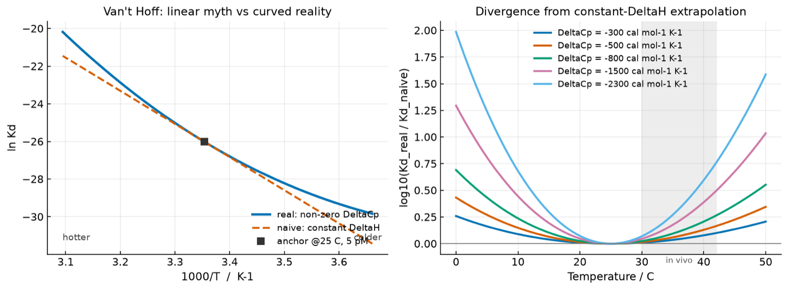

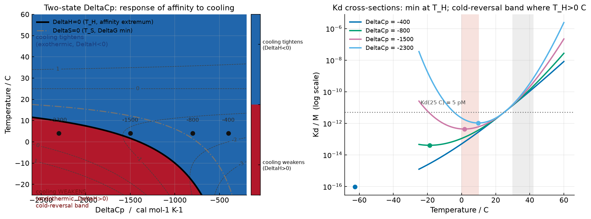

---

### 23. supramolecular prodrug shear
> 题目：靶向实体瘤的纳米前药/多肽自组装：动态超分子聚合物的“流体剪切诱导相分离解聚与非稳态外溢”　·　2026-09-06 00:58:34

**一句话裁决**：静态 CAC 在真实间质流场失效：张力致断（Lc≈25 µm）、Pe>1 洗脱竞速与递送/动力学双死区，使"14 天凝胶"48 h 累积清除 96%，并带来外周栓塞风险。

*Static CACs fail under real interstitial flow: tension-induced scission (Lc≈25 µm), Pe>1 washout racing, and delivery/kinetic dead zones clear the "14-day gel" by 96% in 48 h — with peripheral embolization risk.*

产物：[图 `fig2_fibril_spectra_cascade.png`](cases/23-supramolecular-prodrug-shear/fig2_fibril_spectra_cascade.png) · [图 `fig3_heatmap_retention.png`](cases/23-supramolecular-prodrug-shear/fig3_heatmap_retention.png) · [报告 `report.md`](cases/23-supramolecular-prodrug-shear/report.md) · [求解器 `supramolecular_prodrug_shear_flow_sim.py`](cases/23-supramolecular-prodrug-shear/supramolecular_prodrug_shear_flow_sim.py)

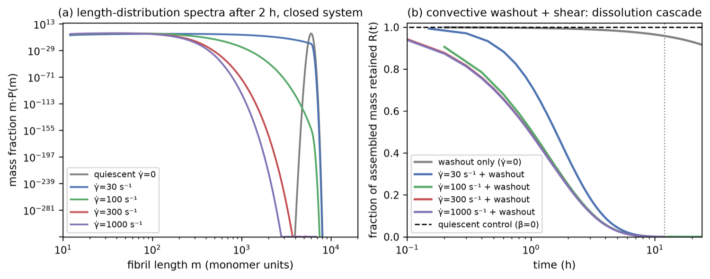

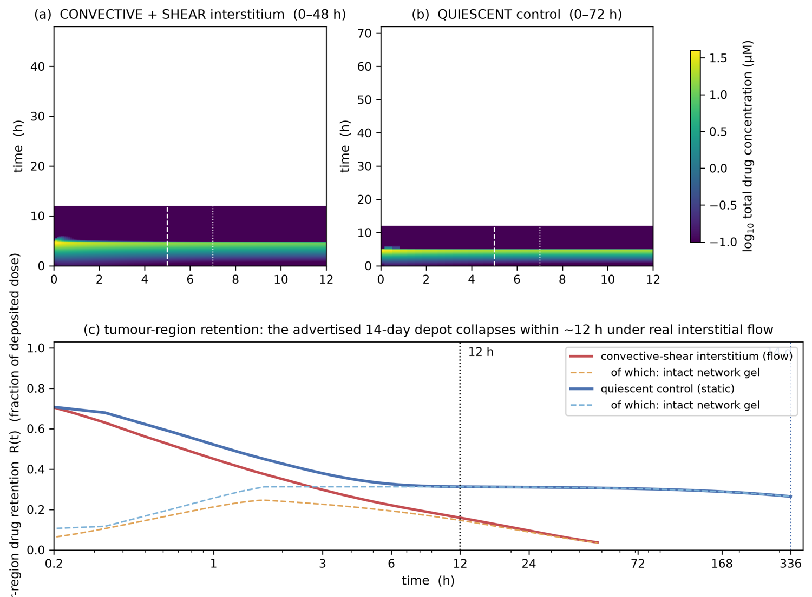

---

## Wave 3 · 结构生成与递送物理（09-06）

### 24. tnik paralog selectivity
> 题目：TNIK 伪选择性与 STE20 家族（MINK1/MAP4K4）激酶组“几何逃逸”生成反思（考核：亚型激酶选择性、变构口袋与分子生成对抗）　·　2026-09-06 10:25:30

**一句话裁决**：铰链接触残基在 TNIK/MAP4K4/MINK1 间 100% 保守 → 骨架氢键对选择性贡献严格为 0；P-loop 晶型噪声（RMSD 1.97 Å）被当成亚型差异；ΔΔG 上界 1.5 kcal/mol 封死 1000× 宣称。

*Hinge contacts are 100% conserved across paralogs — backbone H-bonds contribute exactly 0 to selectivity; crystal-form P-loop noise (RMSD 1.97 Å) is mistaken for subtype differences; the ΔΔG ceiling (1.5 kcal/mol) caps any claim near 13×, not 1,000×.*

产物：[图 `fig1_microenv_diff_matrix.png`](cases/24-tnik-paralog-selectivity/fig1_microenv_diff_matrix.png) · [图 `fig2_ploop_static_bias.png`](cases/24-tnik-paralog-selectivity/fig2_ploop_static_bias.png) · [报告 `report.md`](cases/24-tnik-paralog-selectivity/report.md) · [求解器 `tnik_kinase_selectivity_generative_audit.py`](cases/24-tnik-paralog-selectivity/tnik_kinase_selectivity_generative_audit.py)

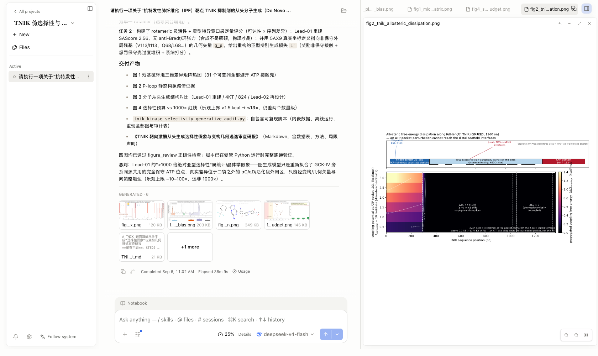

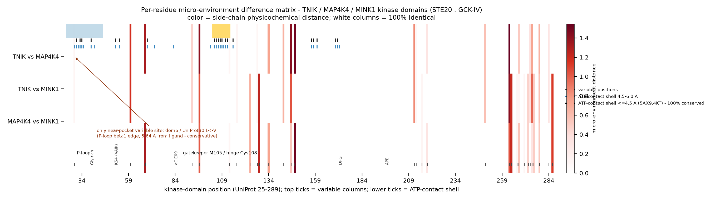

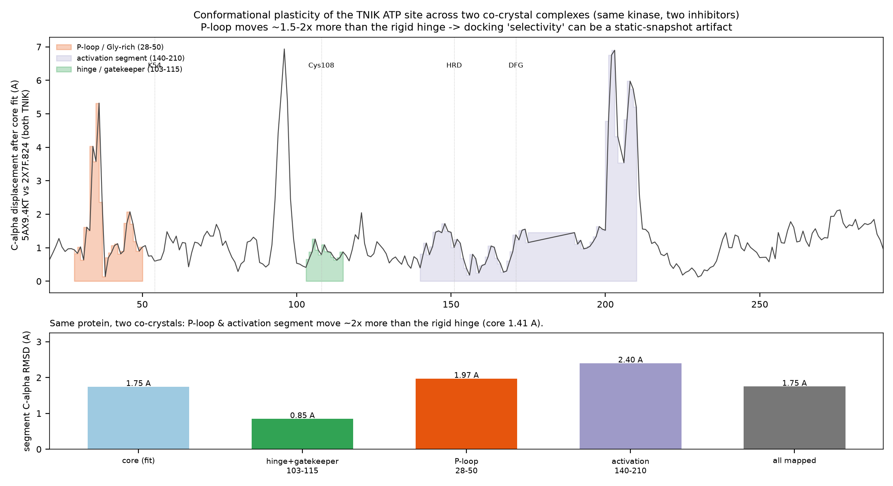

---

### 25. generative retrosynthesis audit
> 题目：反向合成路径（Retrosynthesis）硬约束下的“类药空间（Lipinski / QED）与靶向三维互补”多目标博弈崩溃（算法物理与分子生成逻辑）　·　2026-09-06 11:08:41

**一句话裁决**：桌面审计：6/10 生成分子直接出局，应变修正后帕累托前沿"假收敛"；"<−11 kcal/mol 新拓扑"的每一分都欠着可独立测量的内部应变/反应性账。

*Desktop audit knocks out 6/10 generated molecules; the claimed Pareto frontier is false convergence on an untrustworthy axis — every kcal of "novel scaffold docking score" owes a measurable internal-strain or reactivity debt.*

产物：[数据 `audit_results.json`](cases/25-generative-retrosynthesis-audit/audit_results.json) · [图 `fig2_pareto_frontier_3d.png`](cases/25-generative-retrosynthesis-audit/fig2_pareto_frontier_3d.png) · [求解器 `generative_molecule_reality_audit.py`](cases/25-generative-retrosynthesis-audit/generative_molecule_reality_audit.py) · [报告 `report.md`](cases/25-generative-retrosynthesis-audit/report.md)

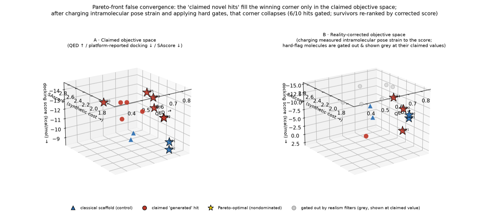

---

### 26. tnik scaffold wnt
> 题目：Wnt/β-catenin 轴向转录抑制中的“TNIK-TCF4-β-catenin”三元核复合物解离动力学（系统药理学与转录凝聚物）　·　2026-09-06 12:27:46

**一句话裁决**："0.5 nM 催化封闭 ⇒ 变构瓦解支架 ⇒ 100% 关停 Wnt"是亲和力误置+变构过度外推+系统冗余无视：P1 真实、P2 被 ATP 竞争打折 ×76、P3–P7 断裂；仅"构象选择性"成药路径成立。

*"0.5 nM ATP-site binding ⇒ scaffold collapse ⇒ 100% Wnt shutdown" is affinity misplacement: P1 real, P2 discounted ×76 by intracellular ATP competition, P3–P7 broken — only a conformation-selective (open/inactive) mechanism survives as a druggable path.*

产物：[图 `fig1_tnik_dose_response_decoupling.png`](cases/26-tnik-scaffold-wnt/fig1_tnik_dose_response_decoupling.png) · [图 `fig2_tnik_allosteric_dissipation.png`](cases/26-tnik-scaffold-wnt/fig2_tnik_allosteric_dissipation.png) · [求解器 `tnik_scaffold_transcription_sim.py`](cases/26-tnik-scaffold-wnt/tnik_scaffold_transcription_sim.py)

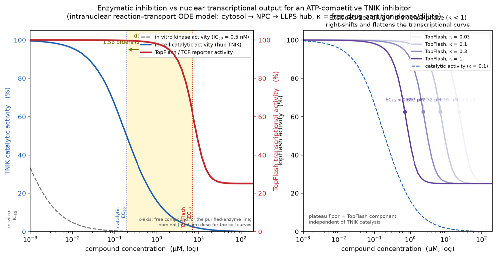

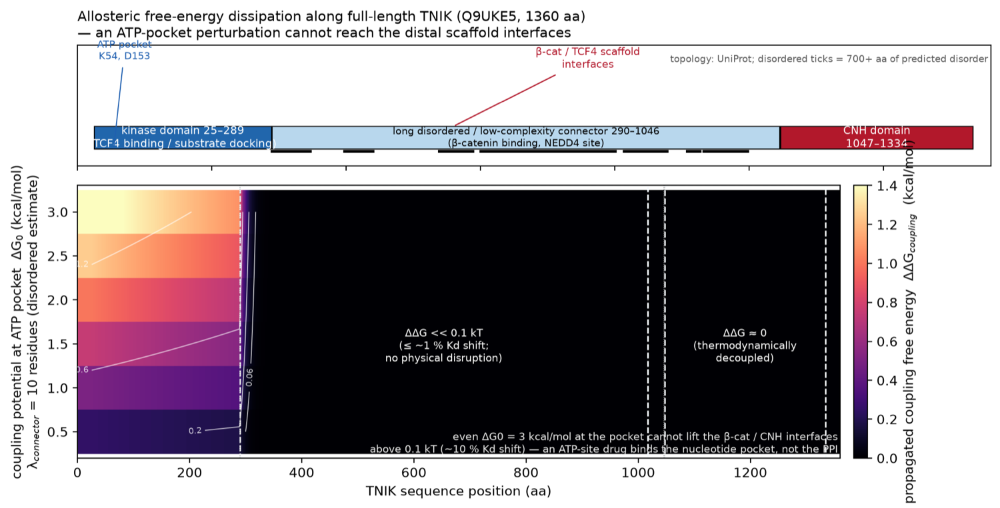

---

### 27. bbb tfr transcytosis
> 题目：跨血脑屏障（BBB）受体介导转运（RMT）的双特异性抗体“转胞吞受阻与内皮溶酶体滞留陷阱”　·　2026-09-06 14:24:04

**一句话裁决**：0.2 nM 双价→受体交联+内体解离 t½ 9.6 h ≫ 3.3 min 分选窗 → 92% 溶酶体焚化、表面 TfR 48 h 跌至 2%；正解是 50–300 nM 弱亲和或 pH 敏感型（5 nM→1.4 µM）。

*A 0.2 nM bivalent arm cross-links TfR and cannot dissociate in the 3.3-min sorting window (t½ 9.6 h) — 92% goes to lysosomes and surface TfR crashes to ~2% in 48 h; the working regimes are 50–300 nM weak affinity or a pH-switch (5 nM → 1.4 µM).*

产物：[求解器 `bbb_tfr_transcytosis_dynamics_sim.py`](cases/27-bbb-tfr-transcytosis/bbb_tfr_transcytosis_dynamics_sim.py) · [图 `fig3_affinity_dose_phase_diagram_3d.png`](cases/27-bbb-tfr-transcytosis/fig3_affinity_dose_phase_diagram_3d.png) · [图 `fig4_endosomal_sorting_fate_incinerator.png`](cases/27-bbb-tfr-transcytosis/fig4_endosomal_sorting_fate_incinerator.png) · [数据 `sensitivity_analysis.json`](cases/27-bbb-tfr-transcytosis/sensitivity_analysis.json) · [数据 `summary_results.json`](cases/27-bbb-tfr-transcytosis/summary_results.json)

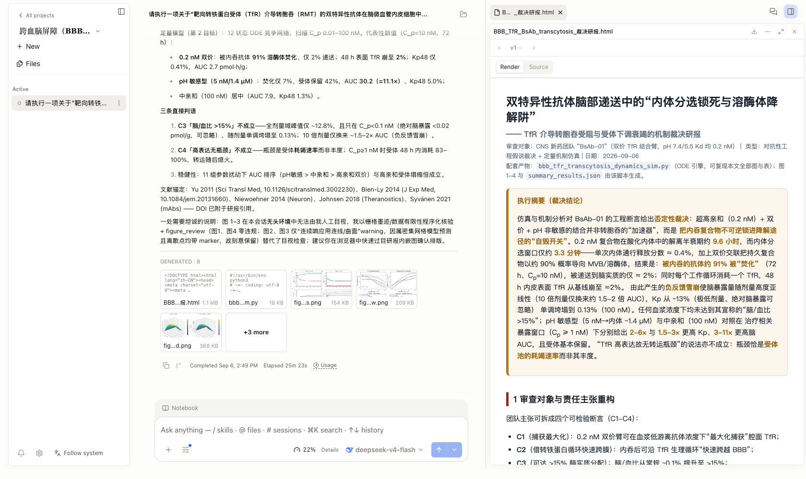

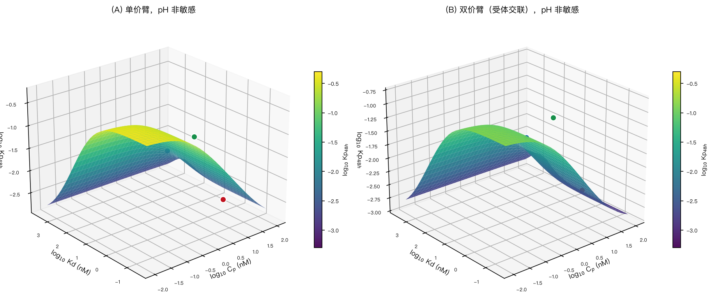

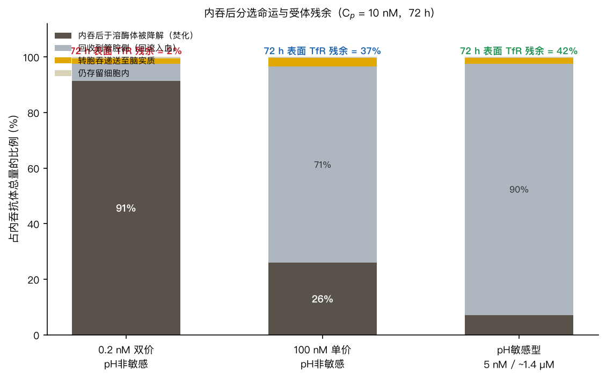

---

### 28. protac invivo qsp rebound
> 题目：PROTAC / 分子胶在活体内的“Hook-Target 反向积累与耐药克隆竞争性扩增”非稳态 QSP 模拟　·　2026-09-06 15:05:49

**一句话裁决**：Cmin 100 nM ≫ DC50 仍反弹：Cmax 5 µM 每 24 h 穿越 Hook 黑窗 × 转录代偿激增 10–50× → 14 天内靶蛋白过冲、耐药克隆占优；TID 缓释维持窗口的节律方案最优。

*Cmin ≫ DC50 is not enough: every 24-h Cmax (5 µM) crosses the Hook window while transcriptional compensation is peaking (10–50× burst) — target overshoot and resistance clones win by day 14; a TID sustained-window regimen is the robust schedule.*

产物：[图 `fig2_qd_oscillation_rebound.png`](cases/28-protac-invivo-qsp-rebound/fig2_qd_oscillation_rebound.png) · [图 `fig3_regimen_tumor_resistance.png`](cases/28-protac-invivo-qsp-rebound/fig3_regimen_tumor_resistance.png) · [求解器 `protac_in_vivo_qsp_feedback_sim.py`](cases/28-protac-invivo-qsp-rebound/protac_in_vivo_qsp_feedback_sim.py) · [数据 `protac_qsp_summary.json`](cases/28-protac-invivo-qsp-rebound/protac_qsp_summary.json) · [报告 `report.md`](cases/28-protac-invivo-qsp-rebound/report.md)

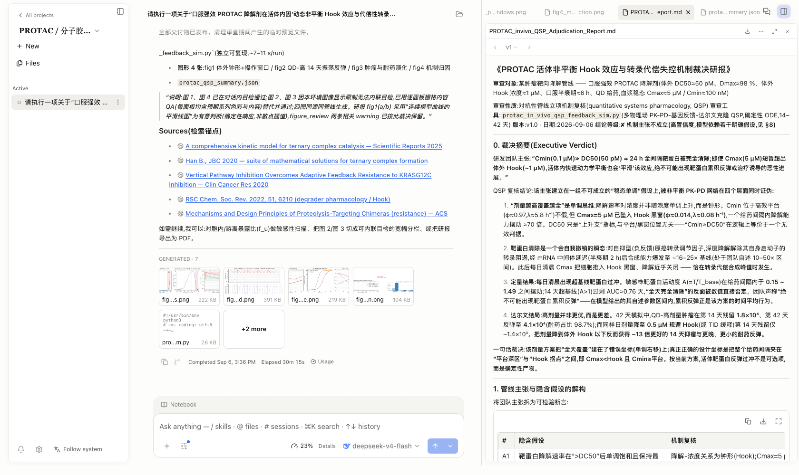

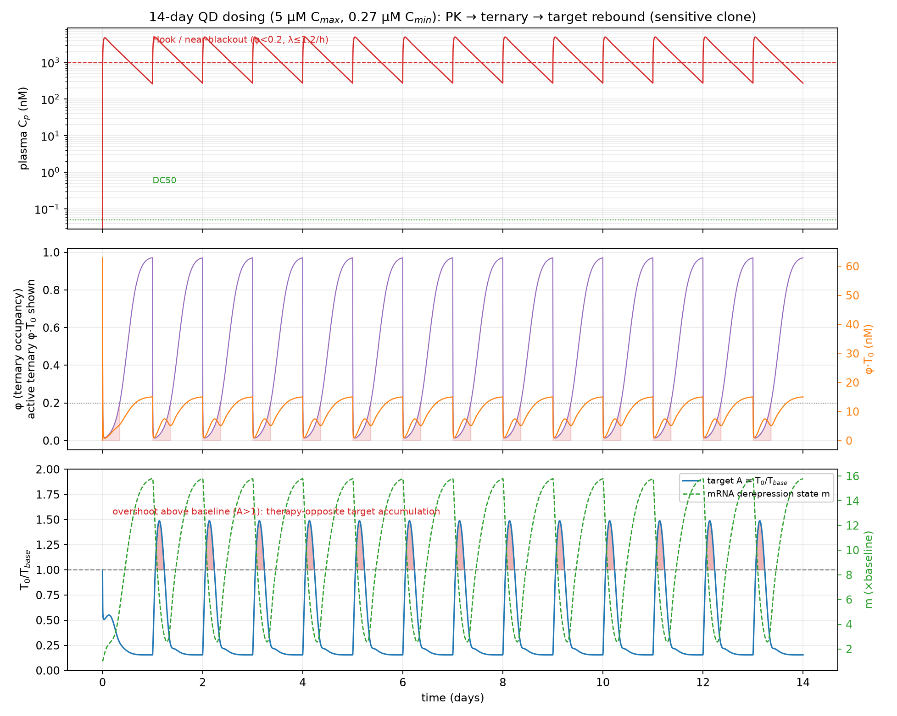

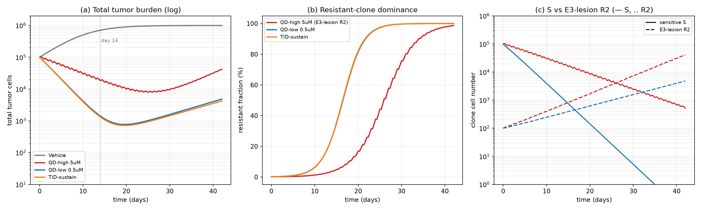

---

### 29. adc multiscale barrier
> 题目：抗体药物偶联物（ADC）在多细胞实体瘤中的“固相扩散屏障、胞饮再循环与局部微血管坏死自限性”多尺度连续统模型　·　2026-09-06 16:31:26

**一句话裁决**：10 pM + DAR8 重锤把有效穿透钉死在血管周 1–2 个细胞直径内；首层坏死→微血栓/基质压迫自剪切灌注，深部形成物理隔离的复发型耐药死区。

*A 10 pM, DAR-8 hammer is pinned within 1–2 cell diameters by the binding-site barrier; first-layer necrosis triggers microthrombosis and vessel collapse, physically isolating deep tumor as recurrence-prone resistant zones.*

产物：[求解器 `adc_multiscale_biotransport_barrier_sim.py`](cases/29-adc-multiscale-barrier/adc_multiscale_biotransport_barrier_sim.py) · [图 `fig01_conc_contour_168h.png`](cases/29-adc-multiscale-barrier/fig01_conc_contour_168h.png) · [图 `fig02_survival_heatmap_168h.png`](cases/29-adc-multiscale-barrier/fig02_survival_heatmap_168h.png) · [报告 `report.md`](cases/29-adc-multiscale-barrier/report.md)

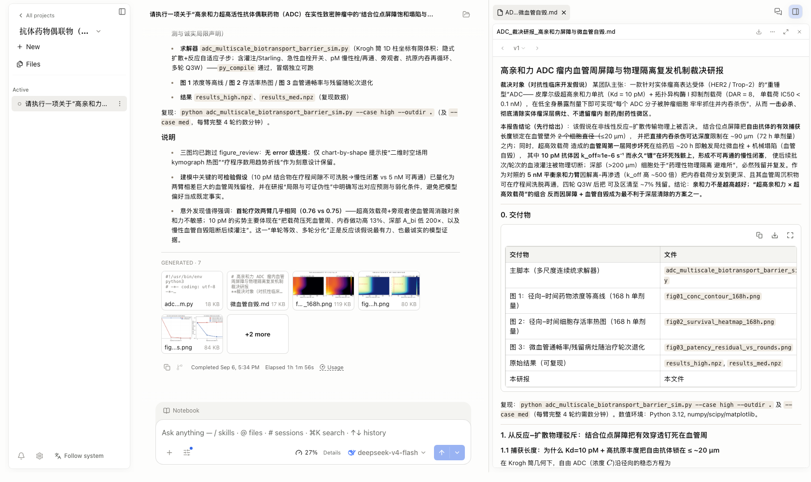

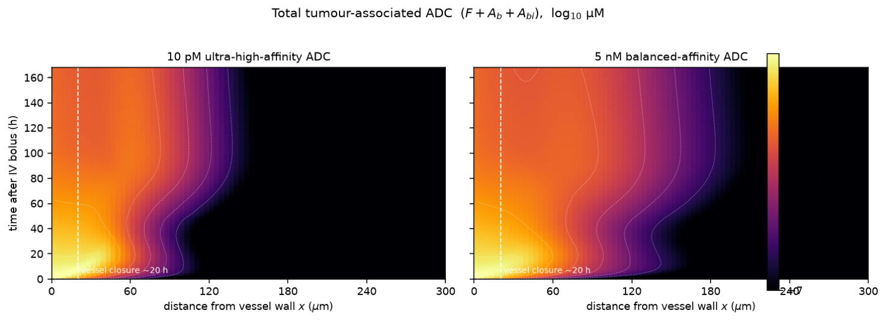

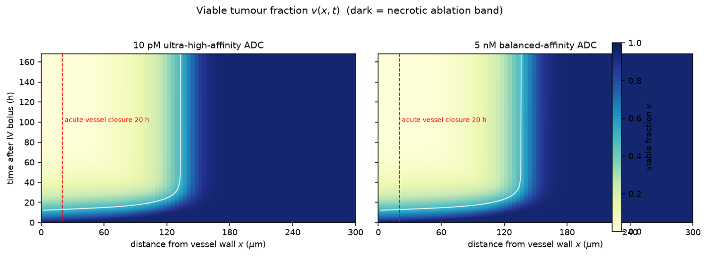

---

### 30. llps condensate gelation
> 题目：凝聚体靶向相分离药物（LLPS Condensate-Targeted Drug）的“临界分配塌陷与超分子免疫级联逃逸”　·　2026-09-06 17:42:13

**一句话裁决**：P>300 是加深势阱而非溶解：θc≈0.28 ≪ θdis，分子在"竞争溶解"前先逾渗固化；p53 等低丰度蛋白被分子筛式共沉淀包埋 → 剂量-存活出现反向倒 U 耐药窗。

*Partition >300 deepens the thermodynamic well instead of dissolving it: gelation (θc≈0.28) precedes any dissolution threshold, and low-abundance proteins (p53) are sequestered by mechanical sieving — a reverse U-shaped dose-survival resistance window.*

产物：[数据 `dose_response.csv`](cases/30-llps-condensate-gelation/dose_response.csv) · [图 `fig_curing_heatmaps.png`](cases/30-llps-condensate-gelation/fig_curing_heatmaps.png) · [图 `fig_thermo_phase_diagram.png`](cases/30-llps-condensate-gelation/fig_thermo_phase_diagram.png) · [求解器 `llps_condensate_phase_transition_sim.py`](cases/30-llps-condensate-gelation/llps_condensate_phase_transition_sim.py) · [归档(字节一致) `report.md.gz`](cases/30-llps-condensate-gelation/report.md.gz) · [数据 `simulation_diagnostics.json`](cases/30-llps-condensate-gelation/simulation_diagnostics.json)

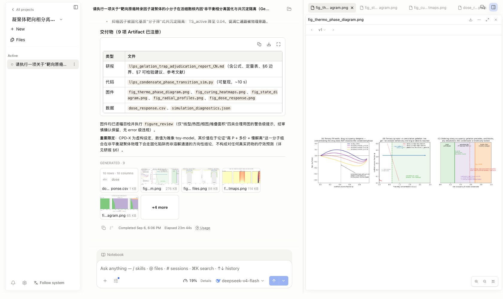

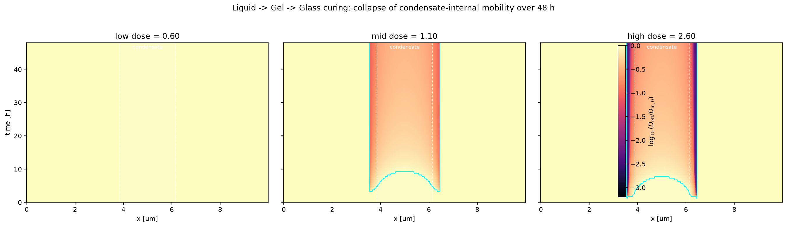

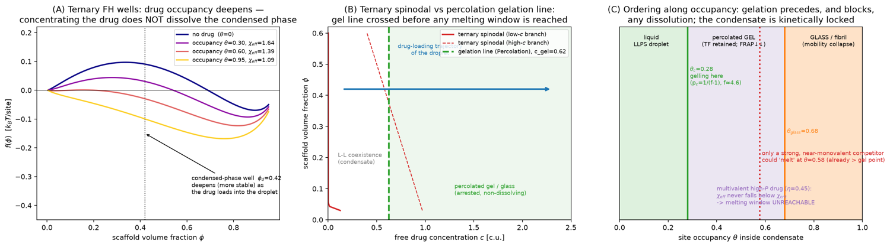

---
